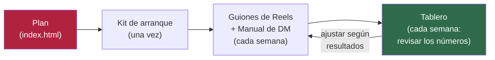

# Pedraza Ilustración — Plan de crecimiento

Repo del plan de crecimiento de **Pedraza Ilustración**: el camino de Instagram a la tienda online, en un sitio de 6 páginas hecho para revisarse desde el celular.

## 1. Qué es este repo

Este repo contiene el sitio del plan de crecimiento de Pedraza Ilustración: cómo llevar gente de Instagram a la tienda online y subir la facturación mensual. El equipo lo usa a diario desde el celular, como una guía de trabajo, no como un documento que se lee una sola vez.

Todo lo que se ve en el sitio (`.html`) sale del trabajo de research y estrategia guardado en `docs/`. Esos documentos son el material de trabajo interno: ahí se piensa y se decide; en las páginas HTML queda el resultado, listo para usar y compartir.

## 2. Mapa del sitio

| Página | Para qué sirve | Cuándo usarla |
|---|---|---|
| `index.html` (Plan) | La estrategia completa: a quién le hablamos, qué prometemos, el embudo Instagram → Tienda y la checklist maestra de tareas. | Punto de partida. Se revisa al empezar y cada vez que hay dudas sobre "por qué hacemos esto". |
| `kit-arranque.html` | Todo lo que hay que dejar listo antes de publicar: bio, destacados, plantillas base. | Una sola vez, al arrancar el plan (y cada vez que algo de la base cambie). |
| `guion-reels.html` | Guiones listos para grabar Reels, con copy real para copiar y pegar. | Cada semana, al planificar y grabar contenido. |
| `sop-dm.html` (Manual de DM) | Cómo responder mensajes directos: qué decir, en qué orden, plantillas por situación. | Cada vez que llega un DM, como manual de consulta rápida. |
| `recursos.html` | El repositorio creativo y comercial del plan: piezas ganadoras (qué contenido funcionó y sus variantes), el programa "cliente embajador" con sus plantillas, los briefs de diseño (portadas de Reels, plantilla de carrusel, ficha de especie) y el calendario comercial anual Chile + EEUU. | Al planificar el mes, y cada vez que una pieza funciona bien y hay que anotarla o crear variantes. |
| `tablero.html` | Los números de la semana: alcance, guardados, seguidores nuevos, pedidos, ingresos. | Cada semana, para ver si el plan está funcionando. |

Flujo típico de uso, semana a semana:



## 3. Cómo publicar el sitio con GitHub Pages

El sitio se publica directo desde este repo, sin pasos técnicos adicionales:

1. En GitHub, entrar a **Settings** (Configuración) del repo.
2. En el menú de la izquierda, ir a **Pages**.
3. En **Source** (Origen), elegir **"Deploy from a branch"**.
4. En **Branch**, elegir la rama principal (`main`) y la carpeta **`/ (root)`**.
5. Hacer clic en **Save** (Guardar).
6. Esperar 1 a 2 minutos mientras GitHub publica el sitio.

La URL final queda con este formato:

```
https://<usuario>.github.io/<repo>/
```

Por ejemplo, para este repo: `https://eguigurenmateo-lamaison.github.io/pedraza-ilustracion/`.

**Cada página se comparte con su propio link directo.** No hace falta enviar siempre la página principal: se puede mandar, por ejemplo, `.../kit-arranque.html` a quien solo necesita revisar eso.

## 4. Cómo funciona el tablero

Los datos de `tablero.html` no se escriben a mano en el sitio: viven en un **Google Sheet** que administra el equipo. El tablero solo los lee — se conecta al Sheet, trae los números y los muestra como gráficos y tarjetas.

En resumen, cada semana hay que:

1. Abrir el Google Sheet del equipo.
2. Agregar una fila nueva con los números de la semana (alcance, guardados, seguidores nuevos, pedidos, ingresos, etc.).
3. Abrir `tablero.html` — se actualiza solo con la fila nueva.

Las instrucciones completas (cómo compartir el Sheet, qué formato deben tener las columnas, cómo configurar el link por primera vez) están dentro de la propia página `tablero.html`, para que quien las necesite las tenga a mano en el momento de usarlas.

## 5. Cómo se actualiza este sitio

- **Las páginas HTML se editan directo.** Cada página (`index.html`, `kit-arranque.html`, etc.) es un archivo autocontenido: todo su código, textos y estilo viven en ese mismo archivo. No hay pasos de compilación ni de armado antes de publicar.
- **Los documentos de `docs/` son la fuente estratégica.** Ahí se define el "por qué" del plan: avatar de cliente, promesa de marca, embudo, pilares de contenido, métricas.
- **Regla de oro:** si cambia la estrategia, primero se actualiza `docs/estrategia-nucleo.md` y después se refleja ese cambio en las páginas HTML correspondientes. La estrategia no vive dos veces por separado.

## 6. Estructura del repo

```
pedraza-ilustracion/
├── README.md                              # este archivo: mapa del repo
├── CLAUDE.md                              # reglas de comunicación y de entregables del proyecto
├── index.html                             # Plan y estrategia (checklist maestra)
├── kit-arranque.html                      # Kit de arranque: bio, destacados, plantillas base
├── guion-reels.html                       # Guiones de Reels listos para grabar
├── sop-dm.html                            # Manual de DM: cómo responder mensajes directos
├── recursos.html                          # Piezas ganadoras, cliente embajador, briefs de diseño, calendario comercial CL+EEUU
├── tablero.html                           # Tablero de KPIs, conectado al Google Sheet del equipo
└── docs/
    ├── estrategia-nucleo.md               # avatar, promesa, embudo, pilares de contenido, KPIs
    ├── design-system.md                   # sistema de diseño compartido de las 6 páginas HTML
    ├── system-prompt-pedraza-ilustracion.md  # instrucciones base del proyecto
    └── research/
        ├── tienda.md                      # research de la tienda online (catálogo, precios, envíos)
        ├── instagram.md                   # research de la cuenta de Instagram
        ├── mercado-tendencias.md          # research de mercado CL, calendario comercial, algoritmo de Instagram y Amazon EEUU
        └── pendientes-operador.md         # lista priorizada de datos que solo el operador puede conseguir
```

## 7. Pendientes del operador

Varios datos del plan todavía están marcados 🟡 (pendientes de verificar o supuestos de trabajo) porque no se pudieron confirmar durante el research. La lista priorizada de qué falta y quién debe conseguirlo está en `docs/research/pendientes-operador.md`.

En el sitio, todo lo que depende de esos datos queda marcado con 🟡 — es la señal de que ese número o supuesto todavía necesita confirmación antes de tomarlo como definitivo.
