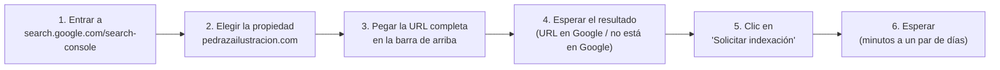

# Blog de Pedraza Ilustración: revisión para buscadores y para ChatGPT

Objetivo del proyecto (llamada con Cote y Felipe, 21-sep-2026): que la marca aparezca cuando alguien le pregunta a Google o a ChatGPT dónde comprar puzzles en Chile. Hoy hay competidores apareciendo antes que Pedraza en varias de esas preguntas.

**Hallazgo principal: los 7 artículos que pidió Mateo ya están escritos y ya están publicados en vivo**, junto con 2 artículos más antiguos. No falta escribir ninguno de la lista. El trabajo real de esta ronda fue auditar lo que ya existe: encontré 1 link roto en vivo, 1 artículo viejo que sí suena a inteligencia artificial (el que probablemente vio Cote en la llamada), 5 artículos con precios y el umbral de envío gratis escritos fijos en el texto que van a quedar mal apenas empiece el Cyber (2–9 oct), y 2 artículos que recomiendan marcas y tiendas competidoras por nombre, algo que puede ser buena estrategia de SEO pero que es una decisión de negocio, no un ajuste de redacción.

🟢 = está bien, sin cambios · 🟡 = ajuste menor, se puede editar dentro de este documento · 🔴 = problema real, necesita acción de Mateo en la tienda

---

## 1. Inventario: qué existe hoy en el blog "Noticias"

La tienda tiene un solo blog, `Noticias` (handle `noticias`), con **10 artículos, los 10 publicados y visibles ahora mismo** en `pedrazailustracion.com/blogs/noticias/`.

| # | Título | Tema de la llamada que cubre | Publicado | Autor (ficha Shopify) | Estado |
|---|---|---|---|---|---|
| 1 | Por qué los puzzles ilustrados son el regalo perfecto | (ninguno directo — es más antiguo) | 4-mar-2025 | Felipe Robinson | 🔴 suena a IA, revisar abajo |
| 2 | Puzzles de Pedraza Ilustración: todos los diseños... | "Los puzzles de Pedraza: todo lo que hay en la tienda" | 21-sep-2026 | María José Pedraza | 🔴 precios fijos, ver sección 5 |
| 3 | Despachos de Pedraza Ilustración: plazos, costos... | "Cuánto se demoran los despachos" | 21-sep-2026 | María José Pedraza | 🔴 precios fijos, ver sección 5 |
| 4 | Puzzle Cetáceos de Chile de 1000 piezas: dónde comprarlo... | "Dónde comprar el puzzle de cetáceos" | 21-sep-2026 | María José Pedraza | 🔴 link roto (2.4) y precios fijos (5) |
| 5 | Regalar un puzzle o una lámina de naturaleza chilena... | "Regalar un puzzle o lámina: guía por persona y presupuesto" | 21-sep-2026 | María José Pedraza | 🔴 precios fijos, ver sección 5 |
| 6 | ¿Qué marcas de puzzles son de buena calidad?... | "Qué hace que un puzzle sea de buena calidad" | 21-sep-2026 | María José Pedraza | 🟡 decisión de negocio, ver 2.6 |
| 7 | ¿Cuánto vale un puzzle de 1000 piezas en Chile?... | (relacionado, no estaba en la lista original) | 21-sep-2026 | María José Pedraza | 🔴 precios fijos, ver sección 5 |
| 8 | Dónde comprar puzzles de 1000 piezas en Chile: guía... | "Dónde comprar puzzles de 1000 piezas en Chile" | 21-sep-2026 | María José Pedraza | 🟡 decisión de negocio, ver 2.6 |
| 9 | ¿Cuánto se demora armar un puzzle de 1000 piezas? | (relacionado, no estaba en la lista original) | 21-sep-2026 | María José Pedraza | 🟡 2 errores de tipeo |
| 10 | Rompecabezas de muchas piezas: 1000, 1500, 2000 y más | "Puzzles de muchas piezas: 1.000, 1.500, 2.000 y más" | 21-sep-2026 | María José Pedraza | 🟢 |

**Los 7 temas que pidió Mateo en la llamada están cubiertos.** El artículo #1 no estaba en la lista de la llamada — es un artículo antiguo (marzo 2025) que quedó de una prueba anterior. Los artículos #7 y #9 tampoco estaban en la lista pero son un complemento lógico (precio y tiempo de armado) que ya escribió quien redactó el resto.

**Sobre la fecha:** los artículos #2 al #10 se crearon el mismo 21-sep-2026, horas antes de la llamada (hora de Chile). Es altamente probable que sean el material que Cote calificó de "demasiado inteligencia artificial" en la reunión. Léelos abajo con eso en mente: en general están mejor de lo que la frase sugiere, salvo el artículo #1, que sí tiene todos los síntomas.

### No hay artículos por escribir

Como los 7 temas ya existen, no escribí artículos nuevos. Si Mateo quiere sumar más temas (competidores, comparación con Amazon, etc.) eso es una ronda aparte.

---

## 2. Revisión frase por frase

### 2.1 — El problema real: "Por qué los puzzles ilustrados son el regalo perfecto" (artículo #1) 🔴

Este es el único de los 10 que de verdad suena a texto genérico de IA, y probablemente el que Cote tuvo en mente al decir "demasiado inteligencia artificial". Motivos concretos:

| Frase original | Por qué está mal | Alternativa |
|---|---|---|
| "En un mundo lleno de regalos predecibles, los puzzles ilustrados destacan como una opción única y especial." | Arranque genérico de blog de IA. No responde nada. Los otros 9 artículos parten respondiendo la pregunta del título en la primera línea — este no. | Partir con el hecho, como el resto: "Un puzzle ilustrado no termina cuando se arma la última pieza: se enmarca y se queda en la pared." |
| Estructura en lista numerada: "1. Una obra de arte en cada pieza", "2. Relajación y mindfulness", "3. Un regalo original y significativo", "4. Una opción sostenible" | Formato de listicle genérico, sin datos de la tienda, sin precios, sin un solo link a un producto real. Es el único de los 10 artículos que no enlaza a ningún producto. | Reemplazar por la tabla "según a quién le regalas" que ya existe en el artículo #5 (que cubre este mismo tema, mejor y con links reales). |
| "nos aseguramos de que nuestros puzles estén hechos con materiales ecológicos y sostenibles" | Dato no verificado. La regla dura del proyecto prohíbe inventar datos. No hay fuente para esta afirmación. | 🟡 VERIFICAR con Cote/Felipe: ¿es cierto? ¿de qué material es el cartón, las tintas? Si no se puede confirmar, se elimina la frase. |
| Resumen del artículo (campo "summary", visible en el listado del blog) trae emojis: "📌 Conclusión: ... 🎨✨" | La voz de Cote prohíbe emojis en el cuerpo de cualquier texto firmado por la marca. | Quitar los emojis, dejar solo el texto. |
| Meta descripción para buscadores: "...¡Encuentra el tuyo aquí!" | Signo de exclamación y llamado a la acción genérico — la voz de Cote dice "casi nunca signos de exclamación" y nunca urgencia de venta. | "Un puzzle ilustrado se arma, se aprende con él y se enmarca al final. Por qué funciona como regalo, según lo que buscas." |
| El artículo entero | Se solapa casi 100% con el artículo #5 ("Regalar un puzzle o una lámina de naturaleza chilena"), que trata el mismo tema con precios reales, tabla por persona, tabla por presupuesto y links a productos. Tener los dos compitiendo por las mismas búsquedas divide el posicionamiento en vez de sumarlo. | 🔴 **REQUIERE MATEO:** decidir entre (a) despublicar este artículo y dejar que el #5 lo reemplace, o (b) reescribirlo para que apunte a una pregunta distinta (por ejemplo, enfocarlo 100% en "por qué enmarcar un puzzle armado"), sin duplicar al #5. |

### 2.2 — Los 9 artículos nuevos (21-sep-2026): revisión general 🟢

Leí el cuerpo completo de los 9. En conjunto están bien escritos para el objetivo:

- **Responden la pregunta en el primer párrafo**, sin rodeos, en los 9 casos. Ejemplo (#7): *"Un puzzle de 1000 piezas en Chile cuesta entre $5.000 y $35.000, según la marca y la calidad."* Eso es exactamente lo que un motor de búsqueda o ChatGPT necesita para citar a Pedraza como fuente.
- **Enlazan a productos reales de la tienda**, no a productos inventados. Revisé cada link contra el catálogo actual en Shopify: de ~20 links a productos y colecciones, solo uno está roto (ver 2.4).
- **No usan jerga prohibida** ("colección cápsula", "drop", "comunidad", "storytelling"), no tienen signos de exclamación, no tienen emojis en el cuerpo. En eso cumplen mejor la voz de Cote que el artículo #1.
- **Tienen un par de gestos de voz propia** que vale la pena mantener y repetir en textos futuros — por ejemplo, en el artículo #8: *"Sí, esta guía la escribimos nosotros, y sí, incluye a otras tiendas."* Es exactamente el tono que pide la voz de Cote: no se pone por encima, no vende con presión.
- **Dónde sí se nota la mano de la IA** (aunque sea leve, vale la pena saberlo): la estructura se repite mucho de artículo a artículo — casi todos abren con una tabla de comparación, cierran con "Ver todos los puzzles de 1000 piezas →" y usan encabezados tipo pregunta ("¿Cuál elegir?", "¿Cuándo vale la pena pagar más?"). Para SEO es una fórmula que funciona, pero si Cote sigue notando "olor a IA" al leerlos seguidos, ese patrón repetitivo es la causa más probable, no una frase puntual.

### 2.3 — Correcciones puntuales por artículo

| Artículo | Problema | Corrección |
|---|---|---|
| #9 "¿Cuánto se demora armar...?" | Typo: "grandes zonass de un mismo color" | "grandes zonas de un mismo color" |
| #9 "¿Cuánto se demora armar...?" | Typo/gramática: "Lo importantes no es la velocidad" | "Lo importante no es la velocidad" |
| #9 y #10 | No tienen un "meta título" (title tag) propio para buscadores, solo meta descripción. Shopify usa el título del artículo como respaldo, así que no es grave, pero para consistencia con el resto conviene setearlo explícito. | Ver títulos sugeridos en la sección 4. |
| #1 | Firmado por "Felipe Robinson" en la ficha de Shopify; el resto de los artículos nuevos están a nombre de "María José Pedraza". No es un error, pero si se decide mantener el artículo #1, conviene unificar el autor visible para que no se note la mezcla de manos. | 🟡 VERIFICAR con Mateo/Cote qué nombre de autor quieren mostrar en el blog. |

### 2.4 — El bug real: un link roto ya en vivo 🔴 REQUIERE MATEO

El artículo **#4 "Puzzle Cetáceos de Chile de 1000 piezas: dónde comprarlo y qué trae"** (ya publicado) tiene este enlace:

```
<a href="/products/lamina-cetaceos-de-chile-copia">Ver Lámina Cetáceos de Chile →</a>
```

Verifiqué el catálogo completo de productos activos en Shopify: el handle correcto es **`lamina-cetaceos-de-chile`**, sin "-copia". El link actual lleva a una página que no existe (error 404). Esto está en vivo ahora mismo y afecta justo al artículo que responde la pregunta "dónde comprar el puzzle de cetáceos" — uno de los 7 temas centrales de la llamada.

**Acción pendiente para Mateo:** en el admin de Shopify, editar el artículo `puzzle-cetaceos-de-chile-donde-comprar` y cambiar ese link a `/products/lamina-cetaceos-de-chile`. No lo cambié yo porque la regla del proyecto prohíbe modificar algo que ya está en vivo — pero es un arreglo de un minuto.

Todos los demás links a productos y colecciones que revisé (unos 20 en total, incluyendo `/collections/puzzles-1000-piezas`, que sí existe y agrupa 29 productos) apuntan a páginas reales.

### 2.5 — Verificación pendiente sobre el menú del footer 🟡 VERIFICAR

Confirmé por la API que el blog está enlazado en un menú llamado **"Footer Submenú (Astucia - En desarrollo)"** (handle `footer-submenu-astucia-en-desarrollo`), con un ítem "Blog" que apunta a `/blogs/noticias`. Esto coincide con lo que describió Mateo (el blog va en el pie de página, no en el menú principal). Pero el nombre del menú dice "en desarrollo", lo que sugiere que podría no ser el menú que el tema realmente está usando como footer visible en la tienda publicada. 🟡 **REQUIERE MATEO:** confirmar en el editor de temas que ese menú es el que efectivamente se ve al pie de la tienda en vivo.

### 2.6 — Decisión de negocio, no de redacción: nombrar marcas y tiendas competidoras (artículos #6 y #8) 🟡 DECISIÓN DE COTE Y FELIPE

En la primera pasada marqué los artículos #6 y #8 como 🟢 porque, como redacción, están bien escritos. Pero al revisarlos de nuevo hay algo que no es un tema de estilo: los dos recomiendan explícitamente a la competencia, publicado en el blog con la firma de la marca.

- **Artículo #6** ("¿Qué marcas de puzzles son de buena calidad?"): la meta descripción dice textual *"Ravensburger, Clementoni, Heye, Trefl y Educa son las marcas más confiables en Chile"* — cinco marcas internacionales nombradas antes que la propia, tanto en el cuerpo como en lo que Google muestra en el resultado de búsqueda.
- **Artículo #8** ("Dónde comprar puzzles de 1000 piezas en Chile: guía de tiendas"): lista con nombre, sitio web y qué ofrece cada una a **Puzzled, Puzzle Smile, Toyng, Kolken, La Puzzlera, Creado en Chile, La Pipa Flor, Falabella, Paris, Ripley, Jumbo, Lider, Mercado Libre y Mirax Hobbies** — 14 competidores directos e indirectos con detalle de por qué comprarles.

Esto no lo puedo decidir yo ni es un ajuste de tono: es una apuesta de SEO (responder la pregunta completa, con todas las opciones, para que Google y ChatGPT citen a Pedraza como la fuente más completa y confiable del tema) contra el riesgo de mandar clientes a comprarle a otro. Lo que gana y lo que arriesga la marca con cada uno:

| | Qué gana la marca dejándolo así | Qué arriesga |
|---|---|---|
| **Artículo #6** | Responde la pregunta completa ("qué marca es buena") sin sesgo aparente, lo que a Google y a ChatGPT les gusta citar como fuente confiable — y al final del artículo posiciona a Pedraza como "la opción con identidad chilena y guía de especies", no como una marca más de la lista. | Alguien busca "marcas de puzzles buenas" sin pensar todavía en Pedraza, y el primer nombre que lee es Ravensburger, no la suya. |
| **Artículo #8** | Es exactamente el tipo de página que capta al buscador de "dónde comprar puzzles en Chile" — el objetivo #1 del proyecto — y esa cobertura completa es difícil de igualar por un competidor que no se atreva a mencionar a otros. Pedraza aparece en su propia lista, con link directo a la tienda. | Es una guía de compra que manda tráfico real a Falabella, Mercado Libre y tiendas especializadas — quien llega a este artículo puede terminar comprando en cualquiera de las 14, no en Pedraza. |

**REQUIERE MATEO (con Cote y Felipe):** confirmar a sabiendas si dejan ambos artículos como están, si los recortan para nombrar menos competidores directos (por ejemplo, sacar Falabella/Mercado Libre pero mantener las marcas de diseño chileno, que no compiten tan directo por el mismo comprador), o si los reescriben para que Pedraza aparezca primero y con más espacio que el resto. No es una corrección de texto: es una decisión que toca la estrategia comercial del Cyber.

---

## 3. Paquete de revisión para Cote y Felipe

Todo lo que necesitan mirar, en una tabla por artículo: título, descripción para buscadores (meta description), la dirección web y a qué enlaza cada uno por dentro. Nada de esto requiere tocar la tienda — es solo para que aprueben o pidan cambios.

| # | Título del artículo | Meta descripción (para Google) | Dirección web | Enlaza a (productos/colecciones/otros artículos) |
|---|---|---|---|---|
| 2 | Puzzles de Pedraza Ilustración: todos los diseños de aves, cetáceos, hongos y mariposas | Pedraza Ilustración tiene cuatro puzzles de 1000 piezas: Aves y flores, Cetáceos, Hongos y Mariposas y escarabajos de Chile. Conoce cada diseño. | `/blogs/noticias/puzzles-pedraza-ilustracion-todos-los-disenos` | 4 puzzles de 1000 piezas, Puzzle Naturaleza 60p, Pack 2 y Pack 3, colección Láminas, Juego de naipes, colección "todos los productos", colección puzzles-1000-piezas |
| 3 | Despachos de Pedraza Ilustración: plazos, costos y si envían al extranjero | Despachamos a todo Chile, gratis sobre $50.000. Los pedidos salen en 1 a 2 días hábiles. No despachamos al extranjero. | `/blogs/noticias/despachos-pedraza-ilustracion` | Política de cambios y devoluciones |
| 4 | Puzzle Cetáceos de Chile de 1000 piezas: dónde comprarlo y qué trae | El puzzle Cetáceos de Chile de 1000 piezas se compra en pedrazailustracion.com a $27.990, con despacho a todo Chile. 50 × 70 cm, con guía. | `/blogs/noticias/puzzle-cetaceos-de-chile-donde-comprar` | Puzzle Cetáceos (producto), Lámina Cetáceos ⚠️ link roto (ver 2.4), artículo de despachos, artículo "todos los diseños", colección puzzles-1000-piezas |
| 5 | Regalar un puzzle o una lámina de naturaleza chilena: guía por persona y presupuesto | Ideas para regalar un puzzle o una lámina de naturaleza chilena según a quién le regalas y tu presupuesto. Aves, cetáceos, hongos y más. | `/blogs/noticias/regalo-puzzle-lamina-naturaleza-chilena` | Los 4 puzzles de 1000 piezas, Puzzle Naturaleza 60p, naipes, libreta, postales, colección Láminas, Pack 2, Pack 3, artículo de despachos, política de cambios |
| 6 | ¿Qué marcas de puzzles son de buena calidad? Guía para comprar en Chile | Ravensburger, Clementoni, Heye, Trefl y Educa son las marcas más confiables en Chile. Qué define un buen puzzle y qué marcas chilenas existen. | `/blogs/noticias/marcas-de-puzzles-de-buena-calidad` | Colección puzzles-1000-piezas |
| 7 | ¿Cuánto vale un puzzle de 1000 piezas en Chile? Precios y qué explica la diferencia | Un puzzle de 1000 piezas en Chile cuesta entre $5.000 y $35.000. Los tres rangos de precio, qué cambia entre uno barato y uno caro. | `/blogs/noticias/cuanto-vale-un-puzzle-de-1000-piezas` | Los 4 puzzles, Pack 2, Pack 3, artículo "marcas de buena calidad", colección puzzles-1000-piezas |
| 8 | Dónde comprar puzzles de 1000 piezas en Chile: guía de tiendas | Tiendas especializadas, tiendas con diseño chileno, retail y marketplaces: dónde comprar puzzles de 1000 piezas en Chile según lo que buscas. | `/blogs/noticias/donde-comprar-puzzles-1000-piezas-chile` | Colección propia de puzzles, artículo "marcas de buena calidad", artículo "cuánto vale", colección puzzles-1000-piezas |
| 9 | ¿Cuánto se demora armar un puzzle de 1000 piezas? *(sugerido: agregar meta título "Cuánto se demora armar un puzzle de 1000 piezas")* | Armar un puzzle de 1000 piezas toma entre 5 y 15 horas en varias sesiones. Qué lo hace más rápido o más lento, y un método para avanzar mejor. | `/blogs/noticias/cuanto-se-demora-armar-un-puzzle-de-1000-piezas` | Colección puzzles-1000-piezas |
| 10 | Rompecabezas de muchas piezas: 1000, 1500, 2000 y más *(sugerido: agregar meta título "Rompecabezas de muchas piezas: 1000, 1500 y 2000")* | Dónde encontrar rompecabezas de 1000, 1500 y 2000 piezas en Chile, qué cambia entre formatos, cuánto espacio necesitas y por dónde partir. | `/blogs/noticias/rompecabezas-de-muchas-piezas` | Puzzle Aves y flores, artículo "dónde comprar 1000 piezas", colección puzzles-1000-piezas |
| 1 | Por qué los puzzles ilustrados son el regalo perfecto ⚠️ ver sección 2.1 | Actual (con problemas, ver 2.1): "...¡Encuentra el tuyo aquí!" | `/blogs/noticias/puzzles-ilustrados-regalo-perfecto` | Solo enlaza al artículo #5 — ningún producto |

Nota: las direcciones web (URLs) de los 9 artículos nuevos ya están definidas y en vivo — no hay nada que "sugerir", solo confirmar que a Cote y Felipe les parecen bien tal como están.

---

## 4. Cómo pedirle a Google que revise las páginas nuevas

Google Search Console ya está configurado con acceso de propietario para Mateo (dos propiedades: el dominio y la cuenta de Instagram). Esto se hace una vez por cada artículo nuevo o cada vez que se le hace un cambio importante a uno. Toma menos de un minuto por página.



**Paso a paso:**

1. Entra a [search.google.com/search-console](https://search.google.com/search-console) con la cuenta de Google que tiene acceso.
2. Arriba a la izquierda, asegúrate de tener seleccionada la propiedad del dominio `pedrazailustracion.com` (no la de Instagram).
3. En la barra de búsqueda de arriba (dice "Inspeccionar cualquier URL"), pega la dirección completa del artículo. Por ejemplo: `https://pedrazailustracion.com/blogs/noticias/puzzles-pedraza-ilustracion-todos-los-disenos`
4. Google te muestra si esa página ya está en su índice o no. Da lo mismo el resultado — el siguiente paso se hace igual.
5. Haz clic en el botón **"Solicitar indexación"** (o "Solicitar rastreo"). Google va a revisar la página en vivo antes de responder.
6. Espera. Puede tardar desde minutos hasta un par de días en que Google la revise. No hay que repetir el paso si no responde de inmediato.
7. Repite los pasos 3 a 6 para cada artículo nuevo o cada artículo al que le hiciste un cambio grande (por ejemplo, después de arreglar el link roto del artículo #4).

**Un límite a tener en cuenta:** Google pone un tope diario a cuántas solicitudes de este tipo se pueden hacer (no es un número fijo, pero ronda las 10 por día). Con 10 artículos, alcanza sin problema en una sola sesión.

**Extra recomendado, no urgente:** si la tienda tiene un archivo `sitemap.xml` (la mayoría de las tiendas Shopify lo generan solo), se puede subir una sola vez en la sección "Sitemaps" del menú lateral de Search Console. Eso ayuda a que Google encuentre solo los artículos nuevos en el futuro, sin tener que pedirlo uno por uno. 🟡 VERIFICAR si ya está subido — si Mateo no lo ha hecho, es un paso de 2 minutos que cubre todo el sitio de una vez.

---

## 5. Precios y envío gratis escritos fijos en el texto: qué hacer durante el Cyber (2–9 oct) 🔴 REQUIERE MATEO

Revisé el cuerpo completo de los 10 artículos buscando cada precio y cada mención del umbral de envío gratis. **5 de los 10 artículos (#2, #3, #4, #5 y #7) tienen precios y/o el umbral de $50.000 escritos como texto fijo.** Durante el Cyber (2 al 9 de octubre), con todos los productos al 25% de descuento y el envío gratis bajando a compras sobre $40.000, esas frases van a decir un precio distinto al que se ve en la tienda — justo en las páginas que responden "dónde comprar" y "cuánto vale", que son las que más tráfico de búsqueda reciben. Los artículos #1, #6, #8, #9 y #10 no tienen ningún precio propio escrito y no necesitan cambios.

**Importante sobre los montos "Cyber" de esta tabla:** los calculé aplicando el 25% de descuento exacto sobre el precio actual. No son el precio final oficial — ese sale de la planilla del Cyber (`scratchpad/cyber.py`) y puede tener un redondeo distinto (por ejemplo, terminación ".990"). Por eso cada celda de la columna "Cyber" trae el cálculo exacto entre paréntesis: Mateo o Felipe deben confirmar el redondeo final contra la planilla antes de pegar.

### 5.1 — Precios de producto individual (mismo valor, se repite en varios artículos)

| Precio actual (en el texto hoy) | Aparece en | Texto para la ventana del Cyber (2–9 oct) | Texto para revertir el 9 de octubre |
|---|---|---|---|
| $27.990 (los 4 puzzles de 1000 piezas) | #2, #4, #5, #7 | $20.990 *(25% off exacto: $20.992,5 — confirmar redondeo)* | Volver a $27.990 |
| $18.990 (Puzzle Naturaleza 60 piezas) | #2, #5 | $14.240 *(25% off exacto: $14.242,5 — confirmar redondeo)* | Volver a $18.990 |
| $23.990 (lámina 33×50 cm) | #2, #4, #5 | $17.990 *(25% off exacto: $17.992,5 — confirmar redondeo)* | Volver a $23.990 |
| $36.990 (lámina 42×60 cm) | #2, #4, #5 | $27.740 *(25% off exacto: $27.742,5 — confirmar redondeo)* | Volver a $36.990 |
| $22.990 (Juego de naipes Aves de Chile) | #5 | $17.240 *(25% off exacto: $17.242,5 — confirmar redondeo)* | Volver a $22.990 |
| $16.990 (Libreta Aves) | #5 | $12.740 *(25% off exacto: $12.742,5 — confirmar redondeo)* | Volver a $16.990 |
| $11.990 (Pack 8 postales) | #5 | $8.990 *(25% off exacto: $8.992,5 — confirmar redondeo)* | Volver a $11.990 |
| $5.990 (Pins) | #5 | $4.490 *(25% off exacto: $4.492,5 — confirmar redondeo)* | Volver a $5.990 |
| $7.990 (Llaveros) | #5 | $5.990 *(25% off exacto: $5.992,5 — confirmar redondeo)* | Volver a $7.990 |
| $9.990 (Calcetines) | #5 | $7.490 *(25% off exacto: $7.492,5 — confirmar redondeo)* | Volver a $9.990 |
| $15.290 (Bolso Aves) | #5 | $11.470 *(25% off exacto: $11.467,5 — confirmar redondeo)* | Volver a $15.290 |
| $17.990 (Bolso de playa) | #5 | $13.490 *(25% off exacto: $13.492,5 — confirmar redondeo)* | Volver a $17.990 |

Además, el artículo #5 tiene tres rangos de presupuesto en sus encabezados ("Menos de $15.000", "Entre $15.000 y $25.000", "Más de $25.000") que agrupan productos por precio. Con el 25% de descuento, varios productos cambian de rango (por ejemplo, el puzzle de 1000 piezas pasa de "más de $25.000" a "menos de $25.000"). 🔴 **Este es el cambio más delicado del lote: no es solo reemplazar un número, es revisar qué producto va en qué categoría durante el Cyber.** Recomiendo que Mateo o Felipe rearmen esos tres bloques a mano una vez que la planilla tenga los precios finales, en vez de hacer un reemplazo automático.

### 5.2 — El umbral de envío gratis: $50.000 → $40.000

| Artículo | Frase actual | Texto para la ventana del Cyber (2–9 oct) | Texto para revertir el 9 de octubre |
|---|---|---|---|
| #3 (Despachos) | "el envío es **gratis en compras sobre $50.000**" | "el envío es **gratis en compras sobre $40.000** durante el Cyber (2 al 9 de octubre); el resto del año, desde $50.000" | "el envío es **gratis en compras sobre $50.000**" |
| #3 (Despachos), tabla de costos | Fila "Sobre $50.000 → Gratis, a todo Chile" | Agregar fila temporal: "Sobre $40.000 (2 al 9 de octubre) → Gratis, a todo Chile" | Quitar la fila temporal, dejar solo "Sobre $50.000 → Gratis" |
| #3 (Despachos), FAQ | "¿Desde qué monto el despacho es gratis? Desde $50.000, a todo Chile." | "Desde $40.000 durante el Cyber (2 al 9 de octubre). El resto del año, desde $50.000." | "Desde $50.000, a todo Chile." |
| #2 (Todos los diseños) | "como supera los $50.000, **el despacho es gratis a todo Chile**" | Mismo texto, pero verificar que el pack siga superando el nuevo umbral de $40.000 (con el 25% de descuento del Cyber, igual lo supera) | Sin cambios — la frase ya es correcta fuera del Cyber |
| #4 (Puzzle Cetáceos) | "Si compras sobre $50.000, **el despacho es gratis a todo Chile**" | "Si compras sobre $40.000 durante el Cyber (2 al 9 de octubre), o sobre $50.000 el resto del año, el despacho es gratis a todo Chile" | "Si compras sobre $50.000, el despacho es gratis a todo Chile" |
| #5 (Regalar) | "como supera los $50.000, el despacho es gratis a todo Chile" | Mismo texto — con el 25% de descuento el Pack 3 sigue superando el umbral de $40.000, no hace falta tocarlo | Sin cambios |
| #7 (Cuánto vale) | "El despacho es gratis a todo Chile en compras sobre $50.000." | "El despacho es gratis a todo Chile en compras sobre $40.000 durante el Cyber (2 al 9 de octubre); el resto del año, sobre $50.000." | "El despacho es gratis a todo Chile en compras sobre $50.000." |

### 5.3 — Precios de los packs y montos de ahorro: no calculé estos, hay que sacarlos de la planilla 🔴 VERIFICAR

Los packs (Pack 2 puzzles $44.790, Pack 3 puzzles $65.490) y las cifras de "ahorro" que los acompañan ($16.380 de ahorro en el pack de 3, comparaciones "$44.790 en vez de $55.980", "$65.490 en vez de $81.870") dependen de un mecanismo especial durante el Cyber: según la memoria del proyecto, el descuento automático del pack **se apaga** y en su lugar el pack recibe el mismo 25% plano que los productos sueltos. Eso significa que el precio Cyber del pack no es simplemente "precio actual × 0,75" — depende de cómo quede configurado el descuento en la tienda. **No inventé estos números.** Aparecen en los artículos #2, #3, #4, #5 y #7. Antes del 2 de octubre, alguien (Felipe o Mateo) debe sacar el precio Cyber real de cada pack desde la planilla o desde la tienda ya configurada, y aplicar el mismo criterio de esta tabla (frase actual → frase Cyber → frase de reversión) a mano.

### 5.4 — Lo que NO hay que tocar: los rangos de precio de mercado del artículo #7

El artículo #7 también tiene precios como "$5.000 y $35.000", "$5.000 – $12.000", "$10.000 – $30.000" y "$24.000 – $34.000" en su tabla de "Los tres rangos de precio". **Estos no son precios de Pedraza, son precios generales del mercado chileno de puzzles** (genéricos, marcas internacionales, diseño chileno de autor) — no cambian durante el Cyber y no hay que tocarlos. Solo cambian, en ese mismo artículo, los precios de la tabla final "Precios de nuestros puzzles" (cubiertos en 5.1) y la frase de envío gratis (cubierta en 5.2).

---

## Cierre

**Revisé:** los 10 artículos del blog completos (cuerpo, resumen, meta descripción), contra la voz de Cote y contra si responden la pregunta de frente; verifiqué cada link interno contra el catálogo real de productos y colecciones en Shopify.

**Escribí:** nada nuevo — los 7 temas de la llamada ya estaban cubiertos. Escribí sí las correcciones línea por línea del artículo #1 y las alternativas de texto, más el paquete de revisión (tabla 3) y el procedimiento de Search Console (sección 4).

**Necesita a Mateo:**
1. 🔴 Arreglar el link roto del artículo #4 (`lamina-cetaceos-de-chile-copia` → `lamina-cetaceos-de-chile`) — 1 minuto, en vivo ahora.
2. 🔴 Antes del 2 de octubre: pegar los cambios de la sección 5 en los artículos #2, #3, #4, #5 y #7 (precios al 25% y envío gratis desde $40.000), confirmando antes el redondeo final contra la planilla del Cyber. Volver a la versión normal el 9 de octubre.
3. 🔴 Con Cote y Felipe: decidir a sabiendas qué hacer con los artículos #6 y #8, que recomiendan marcas y tiendas competidoras por nombre (sección 2.6) — puede ser buena estrategia de SEO, pero es una decisión de negocio, no algo que yo deba resolver solo.
4. 🔴 Decidir con Cote/Felipe qué hacer con el artículo #1 (despublicar o reescribir) — se solapa con el #5 y es el que más suena a IA.
5. 🟡 Confirmar con Felipe si "materiales ecológicos y sostenibles" (artículo #1) es un dato real o hay que sacarlo.
6. 🟡 Confirmar en el editor de temas que el menú del footer que trae el link al blog es el que está realmente publicado.
7. Hacer el paso a paso de Search Console (sección 4) sobre los 10 artículos — requiere el login de Mateo, no lo puedo hacer yo.
