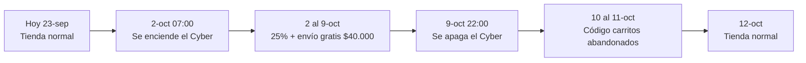

# Configuración de la tienda para el Cyber — Pedraza Ilustración (2–9 oct 2026)

Preparado 23-sep-2026 con datos en vivo de Shopify (conectado vía MCP). Todo lo que
sigue es la foto de la tienda **hoy**. No se cambió ni se activó nada en la tienda: la
única excepción es el código de carritos abandonados del punto 5, que quedó creado
pero **programado y apagado** (se enciende solo el 10 de octubre).

Todo lo que dice **🔴 REQUIERE MATEO** es un cambio en vivo que solo tú (o Felipe) deben
hacer, con el clic exacto escrito al lado.

---

## 1. Inventario de la tienda hoy

### 1.1 Productos activos, precio y stock

27 productos están **activos** (visibles y comprables) hoy — conteo verificado directo
en Shopify. De esos, 22 tienen una sola variante y 5 (las láminas) tienen 2 tamaños
cada una, lo que daría 22 + 10 = 32 filas si se listaran todos. La tabla de abajo
muestra **31 filas porque se dejó fuera a propósito "Lámina San Pedro de Atacama"**
(el producto 27): está activo pero sin precio ni foto cargada (es un borrador a medio
hacer) y no debería aparecer en ningún lado del Cyber. La Botella Térmica Aves sí está
en la tabla, activa pero **sin stock** (0 unidades) — confirma lo que dijeron en la
llamada, queda fuera del Cyber. El "Pack Botella Térmica Aves y Hongos" también quedó
en 0 porque incluye la de Aves. De los 26 productos de la tabla, solo **24 entran a la
tabla de precios del Cyber** (punto 2) — se excluyen los 2 sin stock.

| Producto | Precio hoy | Precio de comparación hoy | Stock |
|---|---|---|---|
| Puzzle Aves y flores | $27.990 | (sin precio de comparación) | 80 🟢 |
| Puzzle Cetáceos | $27.990 | (sin precio de comparación) | 18 🟡 |
| Puzzle Hongos | $27.990 | (sin precio de comparación) | 20 🟡 |
| Puzzle Mariposas y escarabajos | $27.990 | (sin precio de comparación) | 10 🟡 |
| Puzzle 60 piezas niños | $18.990 | (sin precio de comparación) | 34 🟢 |
| Pack 2 puzzles (Aves+Flores · Cetáceos) | $44.790 | $55.980 | 18 🟡 |
| Pack 3 puzzles (Aves, Hongos, Cetáceos) | $65.490 | $81.870 | 18 🟡 |
| Pack 8 postales Aves | $11.990 | (sin precio de comparación) | 13 🟡 |
| Pack Botella Térmica Aves y Hongos | $47.580 | $55.980 | **0** — fuera del Cyber |
| Lámina Aves 33x50 | $23.990 | (sin precio de comparación) | 20 🟡 |
| Lámina Aves 42x60 | $36.990 | (sin precio de comparación) | 8 🟡 |
| Lámina Cetáceos 33x50 | $23.990 | (sin precio de comparación) | 1 🔴 |
| Lámina Cetáceos 42x60 | $36.990 | (sin precio de comparación) | 6 🟡 |
| Lámina Escarabajos 33x50 | $23.990 | (sin precio de comparación) | **0** — agotado |
| Lámina Escarabajos 42x60 | $36.990 | (sin precio de comparación) | 1 🔴 |
| Lámina Flores 33x50 | $23.990 | (sin precio de comparación) | **0** — agotado |
| Lámina Flores 42x60 | $36.990 | (sin precio de comparación) | 5 🟡 |
| Lámina Hongos 33x50 | $23.990 | (sin precio de comparación) | **0** — agotado |
| Lámina Hongos 42x60 | $36.990 | (sin precio de comparación) | 6 🟡 |
| Botella térmica Hongos | $27.990 | (sin precio de comparación) | 28 🟢 |
| Botella térmica Aves | $27.990 | (sin precio de comparación) | **0** — fuera del Cyber |
| Juego Naipes Aves | $22.990 | (sin precio de comparación) | 77 🟢 |
| Bolso Aves | $15.290 | (sin precio de comparación) | 16 🟢 |
| Bolso playa Aves y Flores | $17.990 | (sin precio de comparación) | 31 🟢 |
| Calcetín Aves Gris | $9.990 | (sin precio de comparación) | 1 🔴 |
| Libreta Aves | $16.990 | (sin precio de comparación) | 6 🟡 |
| Llavero Carpintero | $7.990 | (sin precio de comparación) | 10 🟡 |
| Llavero Martín Pescador | $7.990 | (sin precio de comparación) | 17 🟢 |
| Pin Loica | $5.990 | (sin precio de comparación) | 5 🟡 |
| Pin Martín Pescador | $5.990 | (sin precio de comparación) | 2 🔴 |
| Pin Sietecolores | $5.990 | (sin precio de comparación) | 10 🟡 |

🟢 stock holgado (16+) · 🟡 stock ajustado (2 a 15) · 🔴 stock crítico (0 a 1 unidad)

**Nota importante:** casi ningún producto tiene hoy un "precio de comparación" (el
precio tachado que muestra el descuento). Para que el 25% se vea en la tienda durante
el Cyber, hay que escribirlo — está en el punto 4 (encendido), con el número exacto
para cada producto.

### 1.2 Productos que vendieron bien en el último Cyber pero ya no están a la venta

Estos productos aportaron el 29% de las unidades vendidas en el Cyber de octubre 2025
y hoy están en **borrador** (no se pueden comprar): Calcetines Aves Azul, Calcetines
Aves Beige, Calcetines Carpintero Negro, Libreta Flores de Chile, Bolso Flores de
Chile, Lámina Mariposas de Chile. No es algo que haya que arreglar para el Cyber (fue
una decisión anterior), pero significa que la demanda de este Cyber se va a concentrar
más en los puzzles y las láminas que en octubre 2025 — ver el punto 3.

### 1.3 Descuentos automáticos vigentes hoy

| Descuento | Qué hace | Estado |
|---|---|---|
| **Pack 3 puzzles · 20%** | 20% de descuento al comprar 3 o más de los 5 puzzles elegibles | 🟢 Activo — **se pausa el 2-oct** (punto 4) |
| Envío gratis en compras sobre $50.000 | Envío gratis automático desde $50.000 | 🟢 Activo — **se baja a $40.000 el 2-oct** (punto 4) |
| Descuento láminas (compra 1, la 2ª al 20%) | 20% en la 2ª lámina | 🟢 Activo, sin fecha de fin — **ver alerta abajo** |
| Descuento 3 láminas (compra 1, 2ª y 3ª al 20%) | 20% en la 2ª y 3ª lámina | 🟢 Activo, sin fecha de fin — **ver alerta abajo** |

🔴 **Alerta que no estaba en la lista de la llamada:** estos dos descuentos de láminas
combinan con descuentos de producto (`combinesWith.productDiscounts: true`). Si el
25% del Cyber se aplica bajando el precio del producto (que es como se hizo con el
resto), estos dos descuentos **se van a sumar igual** porque para Shopify no son "otro
descuento" sino un precio nuevo. Resultado: alguien que compre 2 o 3 láminas en el
Cyber pagaría la 2ª y 3ª con 25% + 20% adicional, muy por encima del tope acordado con
Felipe. Ninguno de los dos estaba en la lista que se pausa según la llamada del 21-sep
— **falta que Mateo decida si también se pausan** el 2-oct junto con el del pack.

### 1.4 Códigos de descuento activos hoy (no vencidos)

Conteo verificado en Shopify (revisado dos veces tras un recuento inicial mal hecho):
**20 códigos de descuento están activos hoy**. De esos, 2 son los del quiz que ya
están en el plan de pausa (PACKNATURA10, SETNATURA20). Quedan **18 códigos que no se
mencionaron en la llamada** y que la regla dura no me deja tocar. Como el 25% del
Cyber se aplica bajando el precio (no como un descuento de Shopify), **cualquiera de
estos 18 se puede sumar** si un cliente lo escribe en el checkout:

| Código | Qué da | Dónde se ve hoy |
|---|---|---|
| EGRATIS | Envío gratis desde $35.000 | Pop-up de bienvenida del sitio |
| SECRETO | $2.777 de descuento desde $10.000 | Pop-up de bienvenida del sitio |
| BIENVENIDO10 | 10% en 49 colecciones | Pop-up de bienvenida del sitio |
| 37HOY | Compra X, obtén Y gratis | Pop-up de bienvenida del sitio |
| PINGRATIS | Compra X, obtén un pin gratis | — |
| LLAVEROGRATIS | Compra X, obtén un llavero gratis | — |
| PEDRAZA10 | 10% desde $30.000 | — |
| GRACIAS5 | $5.000 de descuento desde $30.000 | — |
| GRACIAS10 | $10.000 de descuento desde $30.000 | — |
| GRACIAS12 | $12.000 de descuento desde $30.000 | — |
| GRACIAS15 | $15.000 de descuento desde $35.000 | — |
| DESCUENTO65K | $6.500 desde $40.000 | — |
| SECRETOAGOSTO | $2.000 en 21 productos | — |
| PAPA10 | 10% en 16 productos | — |
| PUZZAVE2 | $1.395 en puzzles | — |
| dsctopuzzle | $3.000 en 3 productos | — |
| PLATOS15 | $14.000 en el set de platos (producto ya no se vende) | — |
| plato5 | $5.000 en el set de platos (producto ya no se vende) | — |

Los cuatro primeros (EGRATIS, SECRETO, BIENVENIDO10, 37HOY) son los que hoy muestran
los pop-ups a cualquier visitante nuevo, así que son los de mayor riesgo real de uso
durante el Cyber. PLATOS15 y plato5 no son un riesgo real porque el producto al que
aplican ya no se vende. **Falta que Mateo decida** cuáles de estos 18 se pausan
también el 2-oct (empezando por los cuatro del pop-up) o si se dejan correr igual.

---

## 2. Tabla de precios del Cyber (25% con precio de comparación)

Precio con 25% = precio de hoy × 0,75. El margen usa el costo cargado en Shopify
(precio de venta menos costo, dividido por el precio de venta). Donde no hay costo
cargado, dice "sin dato" — no se inventó ningún número.

### Puzzles

| Producto | Precio hoy | Precio Cyber (25%) | Precio de comparación a dejar | Margen con el 25% |
|---|---|---|---|---|
| Puzzle Aves y flores | $27.990 | **$20.993** | $27.990 | 🟢 64,6% |
| Puzzle Cetáceos | $27.990 | **$20.993** | $27.990 | 🟢 64,6% |
| Puzzle Hongos | $27.990 | **$20.993** | $27.990 | 🟢 64,6% |
| Puzzle Mariposas y escarabajos | $27.990 | **$20.993** | $27.990 | 🟢 64,6% |
| Puzzle 60 piezas niños (si entra al Cyber) | $18.990 | **$14.243** | $18.990 | 🟡 sin dato de costo |

### Packs — 🔴 necesitan una decisión antes de tocarlos (ver alerta abajo)

| Producto | Precio hoy | Precio Cyber (25% sobre el precio de hoy) | Precio de comparación a dejar | Margen estimado |
|---|---|---|---|---|
| Pack 2 puzzles | $44.790 | **$33.593** | $44.790 (❗no $55.980) | 🟡 ~55,8% (estimado con el costo de los puzzles sueltos) |
| Pack 3 puzzles | $65.490 | **$49.118** | $65.490 (❗no $81.870) | 🟡 ~54,7% (estimado con el costo de los puzzles sueltos) |

🔴 **Alerta de los packs:** ambos ya tienen hoy un precio de comparación cargado
($55.980 y $81.870) que es más alto que el precio de venta actual — o sea, ya se están
mostrando "en oferta". Si el 25% del Cyber se calcula sobre el precio de hoy (como en
la tabla de arriba, que es lo mismo que ya usó el equipo que preparó los correos), el
precio de comparación **también tiene que cambiar** a $44.790 y $65.490. Si se deja el
precio de comparación viejo ($55.980 / $81.870), la tienda va a mostrar un descuento
de casi 40%, no de 25%, y se rompe el tope acordado con Felipe. **Falta que Mateo
confirme esta base de cálculo** antes de tocar el precio de los packs.

### Láminas (mismo costo, $6.720, en todas)

| Tamaño | Precio hoy | Precio Cyber (25%) | Precio de comparación a dejar | Margen |
|---|---|---|---|---|
| 33x50 cm (todas las temáticas) | $23.990 | **$17.993** | $23.990 | 🟢 62,7% |
| 42x60 cm (todas las temáticas) | $36.990 | **$27.743** | $36.990 | 🟢 75,8% |

Aplica igual a Aves, Cetáceos, Escarabajos, Flores y Hongos. Ojo con el stock: 33x50
de Escarabajos, Flores y Hongos están en 0 (agotadas) y Cetáceos 33x50 tiene 1 sola
unidad — revisar antes de anunciarlas.

### Otros productos

| Producto | Precio hoy | Precio Cyber (25%) | Precio de comparación a dejar | Margen |
|---|---|---|---|---|
| Pack 8 postales Aves | $11.990 | **$8.993** | $11.990 | 🟡 sin dato de costo |
| Bolso Aves | $15.290 | **$11.468** | $15.290 | 🟢 52,0% |
| Bolso playa Aves y Flores | $17.990 | **$13.493** | $17.990 | 🟡 sin dato de costo |
| Botella térmica Hongos | $27.990 | **$20.993** | $27.990 | 🟡 sin dato de costo |
| Juego Naipes Aves | $22.990 | **$17.243** | $22.990 | 🟡 sin dato de costo |
| Calcetín Aves Gris | $9.990 | **$7.493** | $9.990 | 🟡 sin dato de costo |
| Libreta Aves | $16.990 | **$12.743** | $16.990 | 🟢 68,1% |
| Llavero Carpintero | $7.990 | **$5.993** | $7.990 | 🟢 56,6% |
| Llavero Martín Pescador | $7.990 | **$5.993** | $7.990 | 🟢 56,6% |
| Pin Loica | $5.990 | **$4.493** | $5.990 | 🟢 59,9% |
| Pin Martín Pescador | $5.990 | **$4.493** | $5.990 | 🟡 sin dato de costo |
| Pin Sietecolores | $5.990 | **$4.493** | $5.990 | 🟢 59,9% |

**Ningún producto con costo cargado en Shopify cae en zona de margen problemático con
el 25%** — el más ajustado es Bolso Aves con 52%, que sigue siendo un margen sano. Los
marcados 🟡 no tienen costo cargado en Shopify (no es que estén mal, es que no hay
dato para calcular el margen): Pack 8 postales, Bolso playa, Botella Hongos, Naipes,
Calcetín Gris, Pin Martín Pescador y Puzzle 60 niños. Si Felipe quiere ver el margen
real de esos siete, hay que cargarles el costo en Shopify (Productos → [producto] →
sección Precios → "Costo por artículo").

Botella Térmica Aves y el Pack que la incluye quedan **fuera de la tabla y fuera del
Cyber** por no tener stock, tal como se acordó.

---

## 3. ¿Alcanza el inventario para vender $20.000.000?

**Resumen corto: con la mezcla de productos del último Cyber, no.** Sobra stock en
algunos productos (Naipes, Puzzle Aves y flores) pero faltan unidades serias en los
puzzles de Cetáceos, Hongos y Mariposas, y en casi todas las láminas.

### Cómo se calculó

El Cyber de octubre 2025 (4 días, 6 al 9 de oct) vendió $2.090.440 netos, con 109
unidades vendidas entre todos los productos. La meta de este Cyber es $20.000.000, es
decir **9,6 veces más** que el Cyber de octubre pasado. Si la mezcla de productos se
repite en la misma proporción, cada producto necesitaría vender 9,6 veces las unidades
que vendió en esa fecha.

Esto es una aproximación (asume que la gente compra los mismos productos en la misma
proporción, y no cuenta la demanda que antes se iba a los productos que hoy están de
baja — punto 1.2). El objetivo no es un número exacto, es mostrar dónde está el
problema real de stock.

### Unidades que harían falta vs. stock disponible hoy

| Producto | Se vendió en el Cyber oct-2025 (4 días) | Unidades que harían falta ahora (×9,6) | Stock hoy | ¿Alcanza? |
|---|---|---|---|---|
| Puzzle Hongos | 14 | 134 | 20 | 🔴 Faltan ~114 |
| Puzzle Cetáceos | 8 | 77 | 18 | 🔴 Faltan ~59 |
| Puzzle Mariposas y escarabajos | 5 | 48 | 10 | 🔴 Faltan ~38 |
| Puzzle Aves y flores | 9 | 87 | 80 | 🟡 Faltan ~7, muy ajustado |
| Lámina Flores (ambos tamaños) | 7 | 67 | 5 | 🔴 Faltan ~62 |
| Pack 8 postales Aves | 7 | 67 | 13 | 🔴 Faltan ~54 |
| Lámina Aves (ambos tamaños) | 7 | 67 | 28 | 🔴 Faltan ~39 |
| Bolso Aves | 5 | 48 | 16 | 🔴 Faltan ~32 |
| Lámina Hongos (ambos tamaños) | 4 | 38 | 6 | 🔴 Faltan ~32 |
| Lámina Cetáceos (ambos tamaños) | 3 | 29 | 7 | 🔴 Faltan ~22 |
| Lámina Escarabajos (ambos tamaños) | 2 | 20 | 1 | 🔴 Faltan ~19 |
| Libreta Aves | 2 | 20 | 6 | 🔴 Faltan ~14 |
| Pin Loica | 1 | 10 | 5 | 🟡 Faltan ~5 |
| Juego Naipes Aves | 3 | 29 | 77 | 🟢 Sobra stock |

### El cuello de botella, en una frase

**Los puzzles sueltos y las láminas son el corazón del Cyber (el pack de 3, el quiz y
"Arma tu pack" están armados alrededor de ellos) y son justo donde menos stock hay.**
Cetáceos y Mariposas tienen menos de la cuarta parte del stock que necesitarían; casi
todas las láminas están por debajo de la mitad. Si no se repone antes del 2 de
octubre, el techo real de venta lo va a poner la bodega, no la demanda — por buena que
sea la campaña, no se puede vender lo que no hay.

Dos preguntas quedan abiertas para Felipe, fuera del alcance de esta revisión:
- ¿Hay tiempo y proveedor para reponer Puzzle Cetáceos, Puzzle Mariposas y las láminas
  antes del 2-oct?
- Cuando se vende el Pack 3 puzzles o el Pack 2 puzzles, ¿ese pedido descuenta el
  stock de los puzzles sueltos en Shopify, o son inventarios separados que alguien
  arma a mano? Esto cambia cuánto stock real queda disponible para vender suelto.

---

## 4. Procedimiento de encendido y apagado

Todas las horas son de Chile. El encendido queda listo antes del primer correo del
Cyber (vie 2-oct 09:00, ya coordinado en `correos-cyber.md`).

### Encendido — viernes 2 de octubre

Hacer los 24 productos del punto 2 uno por uno (abrir la ficha, escribir 2 campos,
guardar, volver a la lista) toma 2 a 3 minutos reales por producto: **entre 50 minutos
y 1 hora y 15** en total, no los 30 minutos que decía la versión anterior de este
documento. La forma de hacerlo en 20-25 minutos es el **editor masivo de Shopify**:

Shopify Admin → Productos → tildar el casillero de los 24 productos del Cyber →
botón **"Editar productos"** (arriba a la derecha) → se abre una grilla tipo planilla
→ botón **"Agregar columnas"** → activar **"Precio"** y **"Precio de comparación"** →
escribir los dos valores de la tabla del punto 2 en cada fila (se puede pegar desde
una planilla preparada de antemano) → **Guardar**, todo en una sola pasada.

La noche anterior (1-oct) conviene dejar listas dos cosas que **no tocan Shopify y no
activan nada todavía**: (1) una planilla con los 24 productos y sus dos valores
(precio y precio de comparación) listos para copiar y pegar en el editor masivo, y
(2) la decisión sobre el puzzle de niños. El cambio real en Shopify se hace recién la
mañana del 2-oct, para no dejar los precios del Cyber visibles antes de tiempo.

| Hora | Qué se activa | 🔴 REQUIERE MATEO — el clic exacto |
|---|---|---|
| 07:00 | Cambiar precio y precio de comparación de los 24 productos | Editor masivo de Shopify (pasos arriba) usando la planilla preparada la noche anterior — calcular 20 a 30 minutos |
| 07:30 | Bajar el umbral de envío gratis | Shopify Admin → Descuentos → "Envío gratis en compras sobre $50.000" → Editar → cambiar el mínimo de $50.000 a $40.000 → Guardar |
| 07:33 | Pausar el descuento automático del pack | Shopify Admin → Descuentos → "Pack 3 puzzles · 20%" → Desactivar |
| 07:36 | Pausar los códigos del quiz | Shopify Admin → Descuentos → buscar "PACKNATURA10" → Desactivar. Repetir con "SETNATURA20" |
| 07:39 | (Pendiente decisión) Pausar Descuento láminas / Descuento 3 láminas | Shopify Admin → Descuentos → "Descuento laminas" → Desactivar. Repetir con "Descuento 3 laminas" |
| 07:42 | (Pendiente decisión) Pausar EGRATIS, SECRETO, BIENVENIDO10, 37HOY del pop-up | Shopify Admin → Descuentos → buscar cada código → Desactivar. Si se pausan, avisar a quien administra los pop-ups del sitio para que no los siga mostrando |
| 08:00 | Verificar en la tienda (en una ventana de incógnito, no logueado) | Abrir 3 productos distintos y el carrito: confirmar que se ve el precio tachado, el precio nuevo, y que agregando $40.000 aparece "envío gratis" |
| 08:20 | Margen de reserva para corregir algo si la verificación encontró un error | — |
| 09:00 | Sale el primer correo del Cyber | (ya coordinado, no es un cambio en la tienda) |

Si el 2-oct amanece con poco tiempo y hay que elegir, priorizar primero los productos
con más peso en el punto 3 (los cuatro puzzles sueltos, los dos packs y las láminas
33x50/42x60 de Aves y Cetáceos) y dejar el resto de accesorios (llaveros, pines,
libreta, calcetín) para después de las 09:00 — esos pesan poco en la meta de $20M.

### Apagado — viernes 9 de octubre, en la noche

| Hora | Qué se revierte | 🔴 REQUIERE MATEO — el clic exacto |
|---|---|---|
| 22:00 | Devolver cada producto a su precio normal | Shopify Admin → Productos → [producto] → Precios → volver el "Precio" al valor de la columna "Precio hoy" del punto 1.1/2, y borrar el precio de comparación (dejarlo vacío) — aplica a todos **menos los dos packs**, ver la fila siguiente |
| 22:00 | 🔴 Decisión pendiente: precio de comparación de los packs | El punto 2 marcó que $55.980 y $81.870 son precios de comparación **viejos, de antes del Cyber**, que ya mostraban casi 40% de descuento todo el año — no es un problema que crea el Cyber, ya existía. Restaurarlos tal cual el 9-oct en la noche devuelve ese mismo problema. **Mateo debe elegir uno de los dos antes del 9-oct:** (a) restaurar $55.980 y $81.870 tal como estaban, o (b) dejar los dos packs sin precio de comparación (vacío) hasta resolver ese precio "de siempre" con Felipe. Se hace en Shopify Admin → Productos → Pack 2 / Pack 3 → Precios |
| 22:15 | Volver el envío gratis a $50.000 | Shopify Admin → Descuentos → "Envío gratis en compras sobre $50.000" → Editar → cambiar el mínimo de $40.000 a $50.000 → Guardar |
| 22:15 | Reactivar el descuento del pack | Shopify Admin → Descuentos → "Pack 3 puzzles · 20%" → Activar |
| 22:15 | Reactivar los códigos del quiz (si el test sigue corriendo) | Shopify Admin → Descuentos → "PACKNATURA10" → Activar. Repetir con "SETNATURA20" |
| 22:15 | Reactivar lo que se haya pausado en la sección "pendiente decisión" del encendido | Mismo camino, botón Activar en cada uno |
| 23:59 | Verificación final | Revisar la tienda en incógnito: precios normales, sin tachado, envío gratis solo desde $50.000 |
| 10-oct 00:00 | El código de carritos abandonados se enciende solo | No requiere ninguna acción — ver punto 5 |

---

## 5. Código post-Cyber para carritos abandonados — ya creado, apagado

Quedó creado en Shopify y **programado**, no activo: hoy aparece como "Programado"
(`SCHEDULED`) en el panel de Descuentos, no como activo. Se va a encender solo, sin
que nadie tenga que tocar nada.

| Dato | Valor |
|---|---|
| Código | `VUELVE12` |
| Descuento | 12% en toda la tienda (punto medio del rango 10–15% que se acordó en la llamada) |
| Empieza | 10-oct-2026, 00:00 (Chile) — automático |
| Termina | 11-oct-2026, 23:59 (Chile) — automático |
| A quién llega | A todo el que lo reciba — Shopify no tiene forma de restringir un código solo a "carritos abandonados": esa restricción es operativa, no técnica. El código solo debe ir en el correo/flujo de carrito abandonado (ya está contemplado en `correos-cyber.md`, pieza 7) y **no debe publicarse en ningún otro lugar** (redes, pop-ups, anuncios) |

🔴 **REQUIERE MATEO, antes del 10-oct:** confirmar si el 12% es el número correcto, o
si prefieres 10% o 15% (el rango que dieron en la llamada). Se cambia en Shopify Admin
→ Descuentos → "Post-Cyber · Carritos abandonados 12%" → Editar → cambiar el
porcentaje. Como todavía no está activo, cambiarlo ahora no afecta nada en vivo.

---

## Cierre

**Verificado:** 27 productos activos (31 filas de precio en la tabla, sin contar la
lámina de San Pedro de Atacama que no tiene precio cargado; 24 de esos productos
entran a la tabla de precios del Cyber), 4 descuentos automáticos y 20 códigos de
descuento vigentes (18 sin contar PACKNATURA10 y SETNATURA20 del quiz — el código
EGRATIS de envío gratis en $35.000 ya está contado ahí), envío gratis automático hoy
en $50.000, y el margen de cada producto de la tabla del Cyber con el costo cargado en
Shopify.

**Dejado creado e inactivo:** el código `VUELVE12` (12%, post-Cyber, programado para
encenderse solo el 10-oct a medianoche y apagarse el 11-oct a las 23:59).

**Cambios que requieren a Mateo antes del 2-oct:**
1. Bajar el envío gratis de $50.000 a $40.000.
2. Pausar el descuento automático "Pack 3 puzzles · 20%" y los códigos PACKNATURA10 / SETNATURA20.
3. Confirmar la base de cálculo del 25% en los dos packs (sobre precio de hoy, no sobre el precio de comparación viejo) y corregir su precio de comparación.
4. Decidir si también se pausan "Descuento laminas", "Descuento 3 laminas" y los códigos EGRATIS/SECRETO/BIENVENIDO10 del pop-up (pueden sumarse al 25%).
5. Escribir precio y precio de comparación en cada producto de la tabla del punto 2.
6. Decidir si el puzzle de 60 piezas para niños entra o no (ambos escenarios ya están listos en la tabla).
7. Revisar con Felipe si hay tiempo de reponer Puzzle Cetáceos, Puzzle Mariposas y las láminas antes del 2-oct — es el cuello de botella real para llegar a los $20M.
