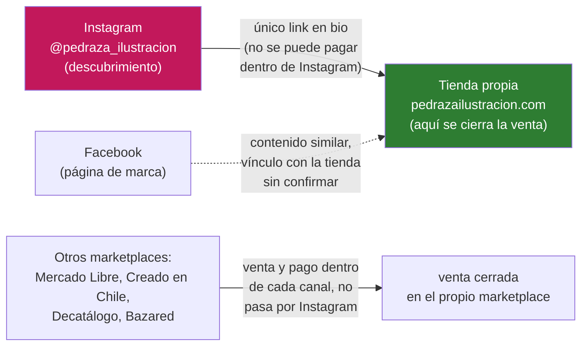
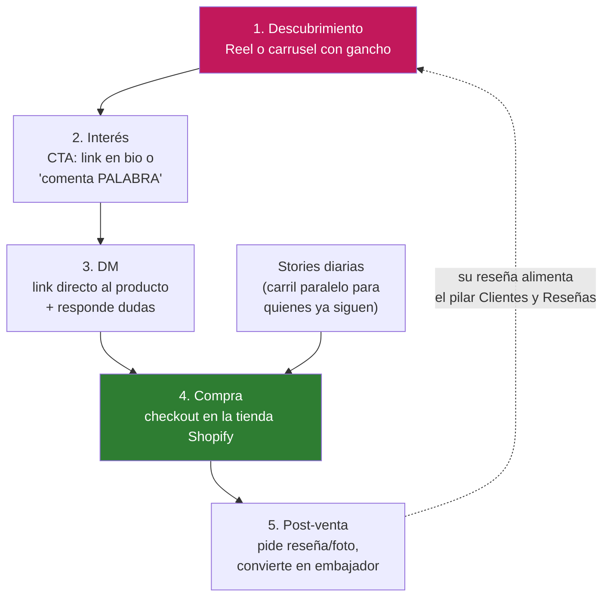
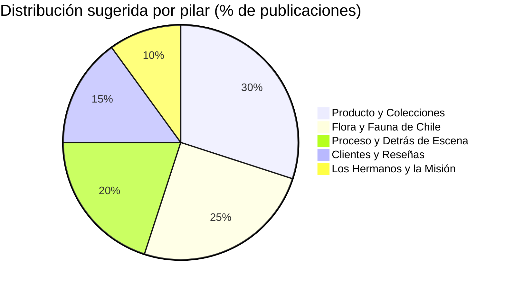
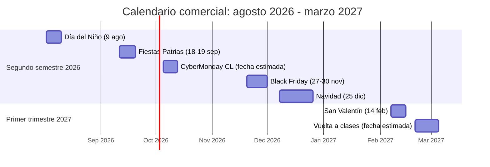
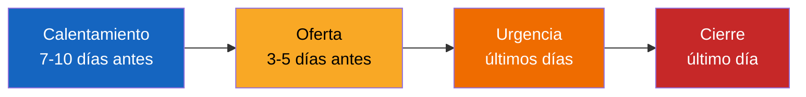
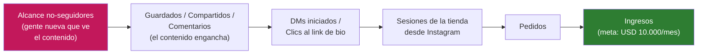

# Estrategia núcleo — Pedraza Ilustración

Fase 1 del plan de crecimiento en Instagram para escalar la tienda de Pedraza Ilustración. Este documento es la base de todo lo que viene después: define a quién le hablamos, qué prometemos, cómo se conecta Instagram con la venta, qué se publica y cómo se mide el avance.

**Fecha de referencia:** 23 de julio de 2026.

**Cómo leer los marcadores de este documento:** 🟢 dato confirmado con fuente citada · 🟡 dato pendiente de verificar o supuesto de trabajo (heredado del research, no se convierte en hecho por aparecer aquí).

---

## 1. Diagnóstico en una página

### A favor (lo que la marca ya tiene)

- **Historia y propósito genuinos.** Pedraza Ilustración la llevan dos hermanos chilenos: María José Pedraza (ilustradora y fotógrafa) y Felipe Robinson (ingeniero comercial). El propósito declarado en el propio sitio es dar a conocer la flora y fauna de Chile y "educar y concientizar sobre la importancia de proteger el entorno natural" — no es un mensaje de marketing inventado para este plan, ya está en la página "Quiénes somos" de la tienda. *(research/tienda.md, sección 4)*
- **La educación ya viene incluida en el producto, no solo en el discurso.** Los puzzles traen una guía con el nombre común y científico de cada especie, y varias láminas hacen lo mismo. *(research/tienda.md, secciones 2 y 4)*
- **Catálogo organizado en series repetibles** por especie o grupo — aves, flores, mariposas y escarabajos, hongos, cetáceos — que se repiten entre lámina, puzzle, plato y calcetín. Es una base natural para hacer contenido y venta cruzada. *(research/tienda.md, sección 1)*
- **Argumento de calidad real, no solo de marketing.** Impresión Giclée (una técnica de impresión de alta calidad, con tintas especiales) sobre papel Hahnemühle (marca de papel premium reconocida en arte) para las láminas, loza apta para microondas y lavavajillas. *(research/tienda.md, sección 2)*
- **Demanda ya validada fuera de Instagram.** La marca vende en su sitio propio y también en Mercado Libre, Creado en Chile, Decatálogo y Bazared. *(research/tienda.md, sección 3)*
- **El ángulo "flora y fauna + educación" ya está validado por otros.** El Ministerio del Medio Ambiente y CONAF usan la ilustración como herramienta central en sus propias campañas de conservación — esto no es competencia, es una señal de que el terreno de contenido funciona. *(research/mercado-tendencias.md, sección A.3)*
- **Existe un competidor directo que probó que el nicho escala en Instagram.** Bendito (bendito.cl), con un ángulo muy similar ("la tienda de los pajaritos"), tendría cerca de 45.000 seguidores 🟡 (dato de fuente indexada, sin verificación directa). *(research/mercado-tendencias.md, sección A.2)*
- **María José ya es cara visible de la marca**, lo que coincide con la tendencia de que el contenido con cara humana de quien crea rinde mejor que el contenido "de catálogo" puro. *(research/mercado-tendencias.md, sección C.2.5)*
- **El feed ya tiene una base de contenido**: storytelling de origen, revelación de producto y campañas estacionales (Cyber, Navidad) — no se parte de cero. *(research/instagram.md, sección 1)*
- 🟢 **La cuenta ya tiene una audiencia grande: 62.500 seguidores confirmados.** Dato confirmado por el operador (jul-2026). Lectura estratégica: el plan corre con **dos motores a la vez**, no uno en lugar del otro (de acuerdo con Felipe, cliente, jul-2026). Motor 1 — **activar la base que ya existe**: Stories diarias y venta directa a quien ya sigue, porque con 62.500 personas activarlas pesa más que en una cuenta chica. Motor 2 — **salir a buscar audiencia nueva**: Reels, la sub-línea "conciencia 1" (ver sección 5) y todo lo que genera compartidos, para que gente que todavía no sigue la cuenta descubra la marca. No son excluyentes: el mismo calendario semanal (sección 6) alimenta a los dos motores al mismo tiempo — más abajo se explica cuál contenido empuja cuál motor.
- 🟢 **Ya se sabe quién responde los mensajes: Cote es María José.** Confirmado por el operador (jul-2026) — es ella quien contesta hoy los mensajes directos y correos detrás de cote@pedrazailustracion.com. Ver sección 9 para la implicancia práctica en los roles del equipo.
- 🟢 **Envío gratis: umbral confirmado en $50.000 CLP.** Confirmado por Felipe (cliente, jul-2026) — el $30.000 CLP que aparecía en una ficha de producto era una versión cacheada (una copia vieja guardada por el navegador) del sitio, no el dato real. Deja de ser una brecha: se puede comunicar el umbral con confianza en cualquier pieza de contenido.

### Lo que falta (brechas a resolver)

- 🟡 Todavía falta confirmar el texto completo de la bio y la cadencia real de publicación en Instagram (los seguidores ya están confirmados: 62.500, ver arriba) — no aparecieron en ninguna fuente pública consultada. *(research/instagram.md, secciones 1 y 7)*
- 🟡 El ticket promedio (AOV — lo que gasta una persona en una compra) hoy se trabaja con la referencia del operador, de memoria, ~$60.000 CLP (por confirmar con Shopify) — no un dato real de Shopify. *(research/tienda.md, sección 6)*
- No se encontró presencia de marca en TikTok, Pinterest ni YouTube — puede que no existan o simplemente no estén indexadas. *(research/instagram.md, sección 3)*
- 🟡 Los roles de María José y Felipe en el día a día siguen siendo un supuesto de trabajo en su mayor parte — ya se sabe que María José (Cote) responde los mensajes (confirmado), pero falta confirmar el detalle de qué hace Felipe.

### Mapa del estado actual



La compra se cierra siempre en la tienda propia: así funciona Instagram para tiendas chilenas. El checkout dentro de la app (pagar sin salir de Instagram) nunca estuvo disponible fuera de Estados Unidos, así que para Chile esto no es una pérdida ni un cambio reciente — siempre funcionó así. El punto que sí hay que cuidar: como no existe pago dentro de Instagram, hay que diseñar bien todo el camino desde el contenido hasta la tienda (link en bio, DM con el link directo al producto, etc.). *(research/mercado-tendencias.md, sección C.3.1)*

Este plan se enfoca en el camino **Instagram → Tienda propia** (la línea roja-verde de arriba). Los otros marketplaces siguen su propio canal de venta y quedan fuera del alcance de este plan.

---

## 2. Avatar (cliente ideal)

### Por qué este recorte, y no "gente que ama el arte"

Se define el cliente ideal por **cuándo y por qué gasta dinero**, no por gusto estético general, porque hay evidencia concreta de que ese es el patrón de compra más rentable para este catálogo:

- La categoría **"Juguetes, juegos y regalos" es la 3ª en facturación** del e-commerce chileno (CLP $722.293.168 en 2025), impulsada justamente por picos en fechas comerciales puntuales, no por compra constante. *(research/mercado-tendencias.md, sección A.1)*
- En Día de la Madre 2026, el **gasto promedio en regalos fue de $25.329 CLP** a nivel país (segmento ABC1: $43.447; segmento DE: $18.793). La referencia del operador para el ticket de la tienda (~$60.000 CLP 🟡, dato de memoria por confirmar) queda muy por sobre ese promedio nacional, e incluso por sobre el segmento de mayor gasto (ABC1). Lectura simple: el comprador actual de Pedraza gasta como el segmento de mayor gasto, y/o el carrito lleva más de un producto por compra — las series por especie facilitan llevar, por ejemplo, una lámina más una libreta de la misma serie. Esto no cambia la conclusión sobre quién es el avatar (quien regala o decora con intención), pero refuerza dos cosas: posicionar como regalo premium con significado, sin competir por precio, y empujar carritos de varios productos (packs y series). *(research/mercado-tendencias.md, sección B.2; research/tienda.md, sección 6)*
- La tendencia de diseño de interiores 2026 hacia motivos botánicos y "biophilic design" (decoración inspirada en la naturaleza) confirma que también hay una segunda motivación de compra fuera de las fechas de regalo: decorar el propio hogar. *(research/mercado-tendencias.md, sección D.1.1)*

Conclusión: el cliente que más vale la pena perseguir es **quien regala o decora con intención**, valorando lo chileno, la naturaleza y el diseño de autor (no cualquiera "a quien le guste el arte" en general).

### Avatar principal

| | |
|---|---|
| **Nombre** | Javiera, 34 años — "Regala con sentido" |
| **Quién es** | Vive en una ciudad chilena, trabaja, tiene un círculo cercano (familia, amigas, colegas) para quienes busca regalos en fechas puntuales. |
| **Qué la gatilla** | Se acerca una fecha comercial (Día de la Madre, un cumpleaños, Navidad, Día del Niño si tiene sobrinos o hijos) y no quiere repetir lo obvio — perfumería y chocolates son las categorías top en regalos de Día de la Madre, y ella busca algo distinto, con más significado. |
| **Qué compra** | Láminas, libretas, calcetines: productos con diseño reconocible y una historia breve para contar al regalar ("es de una marca de hermanos chilenos que dibuja aves nativas"). |
| **Cuánto gasta** | ~$60.000 CLP según referencia del operador 🟡 (posiblemente en un carrito con más de un producto). |
| **Dónde se le encuentra** | Instagram, buscando ideas de regalo o descubriendo la marca por un Reel que "le hace sentido" mandarle a alguien. |

### Avatares secundarios (máximo 2)

| | Secundario 1 | Secundario 2 |
|---|---|---|
| **Nombre** | Constanza, 29 años — "Decora su depto con identidad chilena" | Fernanda, 38 años — "Educa jugando" |
| **Quién es** | Recién independizada o remodelando su espacio, busca decoración con estilo pero no genérica. | Madre, tía o abuela de niños entre 5 y 12 años. |
| **Qué la gatilla** | Se muda, redecora, o simplemente ve un plato o lámina que le encanta en su feed. | Día del Niño (9 de agosto), un cumpleaños, o busca un regalo "que enseñe algo" y no solo entretenga. |
| **Qué compra** | Loza (el set más caro del catálogo, $69.990 CLP), láminas grandes, botellas — ticket más alto que el avatar principal. | Puzzles con guía de especies (nombre común y científico incluido) — la función educativa es el argumento de venta. |
| **Por qué importa** | El diseño de interiores 2026 apunta a motivos botánicos y naturaleza — ella ya está buscando ese estilo. *(mercado-tendencias.md, D.1.1)* | Conecta directo con el ángulo educativo de la marca y con una fecha comercial cercana y concreta (9 de agosto 2026). *(tienda.md, sección 2; mercado-tendencias.md, sección B.1)* |

---

## 3. Posicionamiento y promesa de marca

### La promesa de marca

> Pedraza Ilustración transforma la flora y fauna de Chile en objetos para regalar y decorar. Cada pieza, hecha por dos hermanos chilenos, enseña algo nuevo sobre la naturaleza que retrata.

Esta promesa combina los tres elementos que ya diferencian a la marca según el research: **arte propio** (ilustración original, no contenido de terceros — algo que además Instagram ahora premia, ya que penaliza a las cuentas que viven de repostear trabajo ajeno, *mercado-tendencias.md sección C.1.3*), **educación sobre flora y fauna chilena** (nombre común y científico integrado al producto, *tienda.md sección 2 y 4*), y **hecho por hermanos chilenos** (historia real y verificable, no un discurso corporativo, *tienda.md sección 4*).

### Dirección de bio para Instagram

La bio de Instagram debe tener exactamente estos 4 elementos, en este orden:

1. **Promesa concreta** — qué hace la marca, en pocas palabras (arte original de flora y fauna de Chile).
2. **Para quién** — quien busca regalar o decorar con identidad chilena.
3. **Un solo link** — a la tienda. El link en bio es el único lugar donde Instagram permite un link clickeable fijo (fuera de las historias), así que no conviene repartirlo entre varios destinos a la vez (por ejemplo, un Linktree con diez opciones): cada destino extra es un paso más de fricción antes de llegar a la compra.
4. **Nombre de perfil buscable** — la palabra clave debe estar en el nombre visible del perfil, no solo en el @usuario. Hoy el @usuario ya incluye "ilustracion"; conviene que el nombre visible sume la palabra que falta, por ejemplo **"Pedraza | Flora y Fauna Chile"**. El campo Nombre de Instagram acepta alrededor de 30 caracteres (conviene confirmarlo al editar el perfil, la propia app lo indica ahí); esta versión corta cabe justo y conserva la palabra clave "flora y fauna". La versión larga con el nombre completo de la marca sirve para canales sin ese límite, como Facebook. Esto ayuda a que la cuenta aparezca en búsquedas dentro de Instagram. *(research/mercado-tendencias.md, sección C.1.7)*

### Versión de referencia de bio

Esta es una versión lista para usar como punto de partida — las 3 a 5 variantes finales para probar se van a definir en la Fase 2, en `kit-arranque.html`:

```
Pedraza Ilustración 🦋🌿
Arte original de flora y fauna de Chile — hecho por 2 hermanos chilenos
Para regalar y decorar con identidad
👇 compra aquí
[link a la tienda]
```

---

## 4. Embudo Instagram → tienda

Un embudo es el camino que recorre una persona desde que ve el contenido hasta que compra, y lo que pasa después de esa compra. Este es el embudo canónico del plan: los mismos 5 pasos y las mismas etiquetas se van a repetir tal cual en el resto de los documentos y en el sitio del plan.

### Los 5 pasos

1. **Descubrimiento** — Reel o carrusel con un gancho (los primeros segundos que hacen que alguien se detenga a mirar).
2. **Interés** — CTA (la invitación a hacer algo, como "compra aquí") hacia el link en bio, o "comenta [PALABRA]" directamente en el post.
3. **DM** — se entrega el link directo al producto y se responden dudas. Parte con **respuestas guardadas nativas de Instagram** (mensajes ya escritos que se insertan con un atajo, gratis e incluidas en cuentas Business/Creator), y solo se sube a una herramienta como ManyChat si el volumen de mensajes lo justifica (la referencia de práctica es más de ~20 DM diarios). *(research/mercado-tendencias.md, sección C.3.4)*
4. **Compra** — el pago se completa en la tienda Shopify. Así funciona Instagram para tiendas chilenas: no existe botón de pago dentro de la app (nunca estuvo disponible fuera de Estados Unidos), por eso hay que diseñar bien el camino del contenido a la tienda. *(research/mercado-tendencias.md, sección C.3.1)*
5. **Post-venta** — se pide una reseña o una foto del producto, y esa persona se convierte en embajadora: su contenido alimenta el pilar "Clientes y Reseñas".

**Stories diarias como carril paralelo**: mientras corre este embudo, cada día se publican historias pensadas para la gente que ya sigue la cuenta, con venta más directa — a quien ya sigue no hay que "descubrirlo", solo recordarle.



### El punto único de fallo: el link en bio

El link en bio es el único lugar clickeable fijo del perfil. Si está roto, desactualizado, o apunta a una colección sin stock, se corta toda la cadena entre "vio el Reel" y "compró" — sin importar cuán bien haya funcionado todo lo anterior en el embudo.

Cómo cuidarlo:

- Revisar que el link cargue y lleve a donde dice el CTA del post, al menos una vez por semana.
- Si un Reel habla de un producto puntual, considerar que el link en bio apunte a ESE producto mientras el Reel esté activo, no siempre al home general.
- Usar parámetros UTM (una forma de "etiquetar" el link para poder ver después, en las estadísticas de la tienda, cuánta gente llegó desde Instagram). *(research/mercado-tendencias.md, sección C.3.3)*
- No repartir el link en bio entre múltiples destinos — cada opción extra es fricción antes de la compra.

---

## 5. Pilares de contenido

Cinco pilares, con nombres canónicos que se van a reutilizar en el calendario editorial y en el resto de los documentos del plan.

**Cómo se reparten entre los dos motores de audiencia (ver sección 1):** no son pilares distintos para cada motor, son los mismos cinco leídos con dos lentes. **Flora y Fauna de Chile** (con su sub-línea "conciencia 1") y **Proceso y Detrás de Escena** empujan sobre todo el Motor 2 — audiencia nueva, porque son los formatos con más alcance a gente que todavía no sigue la cuenta. **Clientes y Reseñas** y las Stories diarias que acompañan a **Producto y Colecciones** empujan sobre todo el Motor 1 — activar y convertir a quien ya sigue. **Los Hermanos y la Misión** aporta a los dos a la vez: genera descubrimiento y fidelización al mismo tiempo.

### Producto y Colecciones

**Qué es:** contenido centrado en mostrar el producto — revelaciones, detalles, cómo se ve en uso.
**Por qué existe:** el reveal de producto ya es parte de lo que la cuenta publica hoy. *(research/instagram.md, sección 1)*
🟢 **Los lanzamientos de producto son parte de este pilar.** Antes no eran posibles por los tiempos de Cote (María José); ahora, trabajando junto a Felipe, sí lo son — confirmado por Felipe (cliente, jul-2026). El detalle de cómo se planifica un lanzamiento está en la sección 7.
**Ejemplos:** revelación de una lámina nueva, video de un puzzle armándose, la loza puesta en una mesa, el lanzamiento de un producto nuevo.
**Apunta a:** Descubrimiento e Interés (pasos 1-2 del embudo).

### Proceso y Detrás de Escena

**Qué es:** cómo se hace cada pieza — boceto, ilustración, producción, empaque.
**Por qué existe:** los videos de proceso y el ASMR de empaque (grabar el sonido de armar un pedido: papel, cinta, sello) están entre los formatos más citados como efectivos y baratos de producir para negocios chicos. *(research/mercado-tendencias.md, secciones C.2.1 y C.2.2)*
**Ejemplos:** time-lapse de una ilustración terminándose, ASMR empacando un pedido, boceto comparado con la lámina terminada.
**Apunta a:** Descubrimiento (genera guardados y compartidos que amplían el alcance).

### Flora y Fauna de Chile — el diferencial

**Qué es:** contenido educativo puro sobre las especies que ilustra la marca: nombre común y científico, datos curiosos, estado de conservación.
**Por qué existe:** es el ángulo que ya está impreso en el producto (guías de especies en puzzles y láminas) y que instituciones como el Ministerio del Medio Ambiente y CONAF validan como terreno de comunicación eficaz. *(research/tienda.md, secciones 2 y 4; research/mercado-tendencias.md, sección A.3)* Es también la mejor fuente para generar **compartidos** (que alguien mande el post por DM a otra persona), la señal que Instagram más pesa hoy en su algoritmo. *(research/mercado-tendencias.md, sección C.1.1)*
**Ejemplos:** "3 datos que no sabías sobre el chucao", ficha ilustrada de una especie en categoría de conservación, mención del proceso de clasificación de especies del MMA abierto a la ciudadanía.
**Apunta a:** Descubrimiento (alcance a gente que todavía no sigue la cuenta).

#### Sub-línea dentro de este pilar: Naturaleza y vida cotidiana (conciencia 1)

No es un sexto pilar — vive dentro de "Flora y Fauna de Chile" y no cambia la distribución de publicaciones de más abajo. "Conciencia 1" quiere decir: la persona que todavía no piensa en comprar nada, solo le gusta la naturaleza o quiere vivir mejor. Es el primer escalón, antes de que le interese la marca o el producto.

**Qué es:** temas universales del día a día — dormir bien, tomar agua, salir a caminar, calma, mentalidad — conectados con la naturaleza chilena e ilustrados con el estilo de la marca. No habla de producto ni de la marca: habla de la vida de cualquiera.
**Por qué existe:** es el contenido con mayor potencial de alcance y compartidos, porque cualquiera lo entiende y cualquiera se lo puede mandar a alguien, sin necesitar conocer la marca ni estar pensando en comprar. 🟡 Referencia observada por el operador (capturas de pantalla, jul-2026, no verificada por esta investigación): la cuenta @mattelsa publica carruseles de este tipo — frases sobre hábitos y mentalidad, ilustración simple, un tema por lámina — con entre 30 y 58 mil "me gusta" por pieza.
**Ejemplos adaptados a Pedraza:**
- Carrusel "Dormir mejor, según la naturaleza chilena" — con datos de cómo duermen distintos animales nativos.
- "Toma agua" — una acuarela de un ave bebiendo, como recordatorio simple del hábito.
- "5 sonidos del sur de Chile que calman" — láminas o clips cortos de sonidos de la naturaleza chilena.
- "Un minuto afuera" — invitación a salir a caminar un rato, con una especie chilena como protagonista.
**Apunta a:** puro Descubrimiento. Esta sub-línea no vende — atrae. De ahí, el resto de los pilares se encarga de convertir a esa persona en interesada y después en compradora.

### Clientes y Reseñas

**Qué es:** fotos y videos de clientes reales usando o recibiendo el producto, reseñas, testimonios.
**Por qué existe:** es el paso 5 del embudo (post-venta) devuelto al inicio — cierra el ciclo y da la confianza que necesita alguien que todavía no compró.
**Ejemplos:** repost de una foto de cliente (con su permiso), captura de una reseña destacada, video de unboxing hecho por un cliente.
**Apunta a:** Interés y DM (baja la fricción para decidir comprar).

### Los Hermanos y la Misión

**Qué es:** contenido con María José y Felipe: la historia de por qué existe la marca, su compromiso con la conservación.
**Por qué existe:** el contenido con cara humana de quien crea genera mejor recordación que el contenido "sin cara" *(research/mercado-tendencias.md, sección C.2.5)*, y el propósito declarado de la marca — educar y proteger el entorno — es parte central de su identidad. *(research/tienda.md, sección 4)*
**Ejemplos:** reel de "por qué nació Pedraza Ilustración", un día en el estudio de María José, por qué Felipe se sumó al proyecto.
**Apunta a:** Descubrimiento y fidelización de quienes ya siguen.

### Distribución sugerida de publicaciones



---

## 6. Formatos y cadencia

### El filtro 5-50: la prueba obligatoria antes de producir

Regla del plan: antes de grabar o diseñar cualquier pieza (Reel, carrusel, story, lo que sea), pasarla por esta prueba de dos partes:

- 👶 **Prueba de 5 años:** un niño de 5 años debería poder decir de qué trata la pieza.
- 👥 **Prueba de 50-50:** si se les muestra a 100 personas al azar, al menos 50 deberían entender el 50% inicial de la pieza (los primeros segundos de un Reel, o la primera lámina de un carrusel).

Por qué importa, en una frase: si hay que pensar para entender, no se comparte — y compartir es la métrica que más pesa (ver sección 8).

### Jerarquía de formatos

1. **Reels = descubrimiento.** El formato con más alcance orgánico hoy. Rango recomendado: **15-45 segundos** — los Reels de menos de 3 minutos llegan mejor a gente que todavía no sigue la cuenta; los más largos casi no salen del círculo de seguidores actuales. *(research/mercado-tendencias.md, sección C.1.5)*
2. **Carruseles = profundidad y guardados.** Segundo formato en importancia. Agregarles audio (música o sonido) los hace elegibles para aparecer también en el feed de Reels, lo que amplía su alcance más allá del feed clásico. *(research/mercado-tendencias.md, sección C.1.6)*
3. **Stories = uso diario.** 3 a 7 historias por día, con venta directa a quienes ya siguen la cuenta.
4. **Trial Reels = laboratorio sin riesgo.** Son Reels que Instagram muestra primero solo a gente que no sigue la cuenta; si funcionan bien, recién ahí se comparten con los seguidores actuales y quedan en la grilla del perfil. Sirven para probar un gancho nuevo sin "gastar" ese formato experimental frente a los seguidores actuales. *(research/mercado-tendencias.md, sección C.1.4)*

### Cadencia con rampa

- **Semanas 1-2 (sostenible):** 2-3 Reels/semana + 1 carrusel/semana + Stories 3-4 veces por semana. El objetivo de esta etapa es instalar el hábito de grabar y publicar sin quemar al equipo.
- **Desde la semana 3:** 4-7 Reels/semana + 2-3 carruseles/semana + Stories todos los días (3-7 historias).

### Golden hour: por qué importa la primera hora

Cuando se publica un Reel, Instagram lo prueba primero con un grupo chico de gente que no sigue la cuenta. Si ese grupo responde bien (comenta, comparte, lo ve completo), el contenido se empuja a audiencias cada vez más grandes; si responde mal, la distribución se frena antes incluso de llegar a los propios seguidores. *(research/mercado-tendencias.md, sección C.1.2, descrito como "sistema de prueba")*

🟡 No existe una cifra oficial de Instagram que diga exactamente "los primeros 30-60 minutos", pero de esa lógica se desprende la práctica recomendada: **responder comentarios y mensajes directos apenas se publica**, dentro de la primera media hora a hora, para que las señales iniciales se vean fuertes antes de que el algoritmo decida cuánto empujar el contenido.

### Calendario semanal (desde semana 3)

| Día | Formato | Pilar sugerido |
|---|---|---|
| Lunes | Reel | Producto y Colecciones |
| Martes | Carrusel (con audio) | Flora y Fauna de Chile |
| Miércoles | Reel | Proceso y Detrás de Escena |
| Jueves | Reel | Flora y Fauna de Chile |
| Viernes | Carrusel (con audio) | Clientes y Reseñas |
| Sábado | Reel o Trial Reel | Producto y Colecciones |
| Domingo | Reel | Los Hermanos y la Misión |

**Todos los días:** 3-7 Stories. Ajustar el número total de Reels de la semana (entre 4 y 7) según la capacidad real de grabación del equipo.

**Este mismo calendario alimenta los dos motores de audiencia (ver sección 1) a la vez, sin duplicar trabajo:** los Reels de martes, jueves y sábado (Flora y Fauna, Proceso) empujan el Motor 2 — audiencia nueva; las Stories diarias y los recordatorios de venta directa empujan el Motor 1 — activar la base de 62.500 seguidores. No hace falta separar la planificación en dos calendarios: es un solo plan leído con dos lentes.

---

## 7. Calendario comercial como columna vertebral

Cada fecha comercial es una oportunidad de venta con fecha fija (o casi fija). El contenido y las promociones se planifican alrededor de estas fechas, no al revés.

### Línea de tiempo (agosto 2026 – marzo 2027)



### Estado de cada fecha

| Fecha comercial | Cuándo | Estado |
|---|---|---|
| Día del Niño | domingo 9 de agosto de 2026 | 🟢 confirmada |
| Fiestas Patrias | 18-19 de septiembre de 2026 | 🟢 confirmada (feriados fijos) |
| CyberMonday Chile | ventana esperada inicios de octubre 2026 | 🟡 fecha exacta no anunciada aún (se espera el anuncio a fines de septiembre) |
| Black Friday | 27 al 30 de noviembre de 2026 | 🟡 rango confirmado; pequeña discrepancia entre fuentes sobre el día exacto de inicio (27 vs. 28 de noviembre) |
| Navidad | 25 de diciembre | 🟢 fecha fija |
| San Valentín | 14 de febrero de 2027 | 🟢 fecha fija |
| Vuelta a clases | inicios de marzo de 2027 (referencia: en 2026 fue el 2-4 de marzo) | 🟡 fecha exacta 2027 aún no publicada por el Ministerio de Educación |

*(research/mercado-tendencias.md, sección B.1)*

### Mini-campaña estándar por fecha

La misma estructura de 4 fases se repite para cada fecha comercial de la lista de arriba:



| Fase | Qué se publica |
|---|---|
| Calentamiento | Contenido de los pilares "Flora y Fauna de Chile" o "Proceso y Detrás de Escena" — construye interés, todavía sin vender. |
| Oferta | Se anuncia la promoción concreta (pilar "Producto y Colecciones"). |
| Urgencia | Recordatorios en Stories: quedan pocos días o poco stock. |
| Cierre | Último llamado a comprar, con horario límite si aplica. |

### Lanzamientos: la fecha comercial que la marca crea

Todas las fechas de la línea de tiempo de arriba las pone un calendario externo (Día del Niño, Fiestas Patrias, Cyber, Navidad, etc.). Hay una fecha más que la marca puede crear ella misma: el día en que lanza —o relanza— un producto.

🟢 Antes esto no era posible por los tiempos de Cote (María José); ahora, trabajando junto a Felipe, sí lo es, y la idea es aprovecharlo para ampliar el portafolio con productos ganadores. *(Felipe, cliente, jul-2026)*

Un lanzamiento usa la MISMA mini-campaña de 4 fases de arriba — calentamiento → oferta → urgencia → cierre. Lo único que cambia es quién pone la fecha: no el comercio, la marca.

**Recomendación:** 1 lanzamiento (o relanzamiento/restock de un producto agotado) por trimestre, ubicado entre las fechas comerciales grandes de la línea de tiempo — así la marca no depende solo del calendario externo para tener motivos de venta.

**Qué lanzar:** lo guía el repositorio de piezas ganadoras (`recursos.html`, sección "Repositorio de ganadores") — los productos que ya demostraron tracción en contenido o en venta son la primera fuente de ideas para el próximo lanzamiento o relanzamiento.

---

## 8. KPIs y metas

### Métrica norte

La métrica norte es la que resume si el plan está funcionando de verdad: **ventas e ingresos de la tienda**, hoy en ~USD 5.000/mes con meta de **USD 10.000/mes**, más las **sesiones desde Instagram** (cuánta gente entra a la tienda viniendo de Instagram).

### Métricas líder

Son las métricas que se mueven antes que la venta — sirven de alerta temprana de que algo está funcionando (o no):

- **Guardados** — cuando alguien guarda el post para volver a verlo después; señal de que el contenido vale la pena.
- **Compartidos** — cuando alguien manda el contenido por DM a otra persona; es la señal a la que Instagram le da más peso hoy en su algoritmo. *(research/mercado-tendencias.md, sección C.1.1)*
- **Comentarios** — conversación real bajo el post.
- **DMs iniciados** — mensajes directos que llegan pidiendo información o el link.
- **Clics al link de bio** — cuánta gente toca el link hacia la tienda.
- **Alcance de no-seguidores** — cuánta gente nueva, que todavía no sigue la cuenta, vio el contenido.

### Métrica reina por formato

Regla del plan: para leer resultados día a día, cada formato tiene UNA métrica que manda por sobre las demás. Los 12 KPIs del tablero (más abajo) no cambian — esto es solo el criterio para leerlos rápido, sin abrir toda la planilla.

| Formato | Métrica reina | Por qué |
|---|---|---|
| 🎬 Reels | **Compartidos** | Es la señal a la que Instagram le da más peso en su algoritmo hoy (ver arriba). |
| 🖼️ Carruseles | **Compartidos** | Misma lógica: si alguien lo manda a otra persona, Instagram entiende que vale la pena mostrarlo más. |
| 📄 Posts del feed | **Compartidos** | Igual razón que Reels y carruseles. |
| ⭕ Historias | **Interacciones ÷ Visualizaciones** | Respuestas, toques en stickers y reacciones, divididas por cuánta gente vio la historia — mide qué tan bien conecta el contenido con quienes ya siguen. |

### Los 12 KPIs exactos del tablero

Esta es la lista que va a usar el tablero de seguimiento (`tablero.html`, Fase 2) — no debe cambiar de nombre ni de orden en los siguientes documentos:

1. Alcance
2. Alcance no-seguidores
3. Reproducciones de Reels
4. Guardados
5. Compartidos
6. Comentarios
7. Seguidores nuevos
8. DMs iniciados
9. Clics al link de bio
10. Sesiones de la tienda desde IG
11. Pedidos
12. Ingresos

### Las 4 métricas derivadas

| Métrica derivada | Cómo se calcula | Qué dice |
|---|---|---|
| Tasa de guardado | Guardados ÷ Alcance | Qué tan "guardable" es lo que se publica. |
| Tasa de descubrimiento | Alcance no-seguidores ÷ Alcance total | Cuánta gente nueva está llegando, no solo los que ya siguen. |
| Clic → pedido | Pedidos ÷ Clics al link de bio | De la gente que llega a la tienda desde Instagram, cuántos terminan comprando. |
| AOV (ticket promedio) | Ingresos ÷ Pedidos | Cuánto gasta en promedio cada persona por compra. |

### Camino: de la métrica líder a la métrica norte



🟡 **Importante:** casi ninguno de estos 12 KPIs tiene hoy una línea base confirmada (no hay alcance ni sesiones desde IG verificados; los seguidores totales sí — 62.500, ver sección 1 — pero falta una foto de partida del resto). Antes de poder medir avance, el primer paso es capturar una foto de partida de cada uno. *(research/instagram.md, sección 7; research/pendientes-operador.md, ítems 2.1-2.3 y 1.9)*

---

## 9. Roles

🟢 **Confirmado por el operador (jul-2026):** Cote es María José — la duda de quién responde los mensajes queda resuelta. 🟡 El resto de la división de tareas (el detalle de qué hace Felipe día a día) sigue siendo un supuesto de trabajo, todavía no confirmado.

| Quién | Qué hace cada semana |
|---|---|
| **María José (Cote)** | Crea el contenido: graba y fotografía en un lote de grabación semanal (un bloque de tiempo fijo donde se graba varias piezas de una sola vez, para no depender de grabar todos los días). Aparece en cámara, especialmente para el pilar "Los Hermanos y la Misión". 🟢 Responde hoy los mensajes directos y comentarios — es ella quien está detrás de cote@pedrazailustracion.com (confirmado por el operador, jul-2026). |
| **Felipe** 🟡 | Opera la cuenta: programa las publicaciones y revisa las métricas cada semana contra la meta de ventas. Supuesto de trabajo, todavía sin confirmar en detalle. |

**Recomendación práctica:** ya que María José es quien responde los mensajes hoy, tiene sentido que el Golden hour tras publicar (responder rápido apenas sale el contenido, ver sección 6) quede en sus manos — ella ya está ahí, respondiendo. Felipe puede tomar la revisión semanal de números contra la meta de ventas. Esto es un punto de partida razonable, ajustable en cuanto María José y Felipe confirmen la división definitiva de tareas.

> 🟢 **Cierre definitivo: lunes 27 de julio de 2026, 10:00 (hora de Chile).** La tabla de arriba es la propuesta de trabajo, todavía no la versión final. La definición cerrada de roles —qué hace cada uno, qué se va a hacer y cómo se va a medir— queda para esa reunión, junto con la entrega de accesos a Shopify y Meta. *(Felipe, cliente, jul-2026)*

---

## 10. Anexo: Rampa EEUU (resumen ejecutivo)

Todo lo siguiente es **fase posterior** al objetivo #1 (llegar a USD 10.000/mes en la tienda chilena). Se deja documentado como hoja de ruta para cuando ese objetivo esté encaminado, no como tarea inmediata.

1. **Registro de marca "Pedraza Ilustración"** — 🟢 Chile (INAPI) ya registrada; 🟡 [PRIORIDAD] falta EEUU (USPTO). Confirmado por Felipe (cliente, jul-2026): la marca ya está registrada en Chile ante INAPI, y la decisión ya está tomada de iniciar el registro en Estados Unidos ante la USPTO (la oficina de marcas de EEUU). Sigue siendo la acción prioritaria de este anexo: el trámite puede demorar meses y es el requisito base para todo lo demás en Amazon (sin marca registrada o en trámite en EEUU, no hay Brand Registry). 🟡 Verificar si la marca ya registrada en Chile sirve de puente (por ejemplo, para pedir prioridad o acelerar el trámite en EEUU) mientras avanza el registro en la USPTO. *(research/pendientes-operador.md, ítem 3.1; research/mercado-tendencias.md, sección D.2.6)*
2. **Seller Central plan Professional + Brand Registry** — no Amazon Handmade, porque la producción se terceriza con un proveedor y Handmade exige fabricación manual propia del vendedor. *(research/mercado-tendencias.md, secciones D.2.1 y D.2.5)*
3. **A+ Content y Amazon Store** — contenido de marca gratuito dentro de Amazon una vez con Brand Registry. Amazon Posts ya no existe: el programa se discontinuó por completo en julio de 2025. *(research/mercado-tendencias.md, sección D.3)*
4. **Amazon Attribution + Brand Referral Bonus** — para medir y aprovechar el tráfico que llegue desde Instagram hacia el listing de Amazon, con devolución de hasta ~10% en comisiones sobre esa venta (crédito, no efectivo directo). *(research/mercado-tendencias.md, secciones D.4.1 y D.4.2)*
5. **Ventana BFCM** (Black Friday-Cyber Monday EEUU, 27 al 30 de noviembre de 2026) con inventario ingresado en octubre-noviembre — la fecha de mayor impacto comercial en EEUU más próxima desde hoy. *(research/mercado-tendencias.md, sección D.5)*
6. **Contenido bilingüe selectivo** — adaptar al inglés el mismo storytelling que ya funciona en Instagram (flora y fauna chilena, historia de los hermanos) para usar en la Amazon Store. *(research/mercado-tendencias.md, sección D.3.2)*

---

## 11. Supuestos a confirmar

Lista corta de los 🟡 más críticos heredados del research, porque afectan directamente esta estrategia:

- 🟡 **[PRIORIDAD]** AOV real, número de pedidos al mes y mix de productos vendidos — hoy se trabaja con la referencia del operador (~$60.000 CLP, dato de memoria, "tal vez sea menos ahora"), que implica ~75-80 pedidos/mes; falta confirmar con Shopify. *(research/tienda.md, sección 6; research/pendientes-operador.md, ítem 1.2)*
- 🟢 Seguidores actuales: 62.500 (confirmado por el operador, jul-2026) — este punto ya está resuelto. 🟡 **[PRIORIDAD]** Todavía falta confirmar el texto completo de la bio y la cadencia real de publicación en Instagram. *(research/instagram.md, secciones 1 y 7; research/pendientes-operador.md, ítems 2.1-2.4 y 2.6)*
- 🟢 Quién es "Cote" ya está resuelto: es María José, y es quien responde los mensajes directos y comentarios hoy (confirmado por el operador, jul-2026). 🟡 Todavía falta confirmar el detalle de qué hace Felipe día a día (opera, programa y mide es, por ahora, un supuesto de trabajo).
- 🟢 Chile (INAPI) ya registrada. 🟡 **[PRIORIDAD]** EEUU (USPTO) pendiente — registro de marca "Pedraza Ilustración". Confirmado por Felipe (cliente, jul-2026); falta iniciar y avanzar el trámite en EEUU (ver sección 10 para el detalle). *(research/pendientes-operador.md, ítem 3.1)*
- 🟢 Umbral de envío gratis resuelto: $50.000 CLP. Confirmado por Felipe (cliente, jul-2026) — el $30.000 CLP de una ficha de producto era una versión cacheada del sitio, no el dato real. *(research/tienda.md, sección 5; research/pendientes-operador.md, ítem 1.3)*

---

## 12. Frentes fuera de este plan (fase siguiente)

Felipe preguntó por precios, stock, CRO (la optimización de la tasa de conversión: lograr que más personas de las que visitan la tienda terminen comprando) y anuncios pagados (publicidad que se paga para aparecer) en Meta (Instagram/Facebook) y en Google. El operador sumó un frente más a esta lista: email marketing (correos a quienes ya compraron o dejaron su correo). Quedan fuera de este documento a propósito, no por descuido.

Este plan cubre, a propósito, la fase 1: crecimiento orgánico de Instagram (contenido, sin pagar por publicidad). Los frentes de abajo son la fase siguiente, y se van a definir DESPUÉS de la reunión del lunes 27 de julio de 2026 (10:00 Chile) y de la entrega de accesos (Shopify, Meta), con su propio checklist del operador — igual que este plan lo tiene en `research/pendientes-operador.md`. La razón es simple: sin los datos reales de la tienda ni esos accesos, cualquier plan de precios o de anuncios pagados sería un plan inventado, no uno basado en la realidad del negocio.

| Frente | Qué es, en simple | Cuándo se define |
|---|---|---|
| Precios y surtido | Qué precio tiene cada producto y qué tan amplio es el catálogo (stock, qué se agrega y qué se saca). | Fase siguiente, con datos reales de Shopify. |
| CRO | Cambios en la tienda para que más visitantes terminen comprando (por ejemplo, en la ficha de producto o en el checkout). | Fase siguiente, con datos reales de Shopify. |
| Meta Ads | Anuncios pagados en Instagram y Facebook. | Fase siguiente, con accesos a Meta entregados. |
| Google Ads | Anuncios pagados en buscador y red de Google. | Fase siguiente, con accesos entregados. |
| Email marketing | Correos a quienes ya compraron o dejaron su correo: novedades, lanzamientos, carritos abandonados (cuando alguien deja productos sin pagar). | El enfoque de las campañas ya está definido (ver nota abajo). La herramienta de envío, las listas y el calendario exacto: fase siguiente, tras la reunión del 27-jul y los accesos. |

*(Precios, stock, CRO, Meta Ads y Google Ads: Felipe, cliente, jul-2026. Email marketing: sumado por el operador, jul-2026.)*

> 🟢 **Enfoque de las campañas de email ya definido (operador, jul-2026).** Van a ser **3 campañas por semana**. Todas siguen la misma estructura: primero una historia breve, después esa historia se conecta con un producto.
>
> | Historia (el gancho) | Se conecta con |
> |---|---|
> | La historia detrás de la lámina del chucao: qué pájaro es y por qué se eligió para ilustrarlo | el pack de láminas con el chucao |
> | Cómo se empaca un pedido a mano: el papel, la cinta, el sello | la colección completa de la tienda |
>
> El link exacto de cada producto se toma directo de la tienda al armar cada campaña.
>
> La herramienta de envío, las listas de correos y el calendario exacto de cada campaña se definen en la fase siguiente (ver tabla arriba). La cadencia de 3 por semana no queda fija para siempre: se revisa con los datos reales de las primeras semanas — cuántas personas abren los correos y cuántas piden dejar de recibirlos (las "bajas" de la lista) — y se ajusta según lo que digan esos números.
