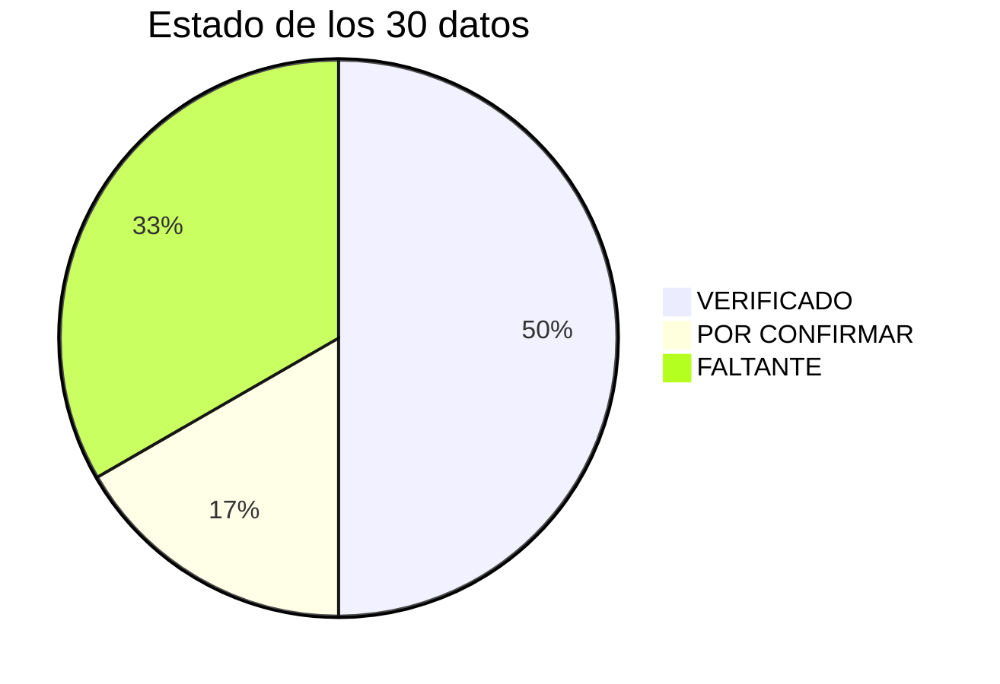

# Hoja de hechos oficial — Pedraza Ilustración

**Revisión del sitio:** 21 de septiembre de 2026, sobre pedrazailustracion.com en vivo (portada, 9 páginas, 59 colecciones, 27 productos publicados y políticas).
**Uso:** fuente única para reescribir el sitio. Solo lo marcado VERIFICADO se puede publicar tal cual.

**Estados:**
- 🟢 **VERIFICADO:** está publicado hoy en pedrazailustracion.com.
- 🟡 **POR CONFIRMAR:** lo afirmó un motor de IA o un tercero, sin respaldo propio. También entra aquí lo que el equipo dijo en reuniones y no está publicado.
- 🔴 **FALTANTE:** nadie lo dice en ninguna parte.

> 🟡 **Pendiente:** faltan las respuestas de ChatGPT, Perplexity, Gemini y Copilot. Cuando estén, sus afirmaciones se suman a esta tabla como POR CONFIRMAR.



## Tabla

| DATO | ESTADO | FUENTE |
|---|---|---|
| **Nombre legal:** "Pedraza Fotografía y Diseño Spa" | 🟢 VERIFICADO | [Términos del servicio](https://pedrazailustracion.com/policies/terms-of-service), punto 1 |
| RUT de la sociedad | 🔴 FALTANTE | No aparece en el sitio |
| Marca "Pedraza Ilustración" registrada en INAPI | 🟡 POR CONFIRMAR | Lo dijo Felipe en jul-2026. El sitio no lo menciona. No tenemos número de registro |
| Año de fundación | 🔴 FALTANTE | El sitio no lo dice. Hay dos pistas, ninguna con año: una colección llamada "Aniversario 5 años" y un [post de Instagram](https://www.instagram.com/pedraza_ilustracion/p/DHBROd9xahA/) que dice "Hace aproximadamente cinco años…" |
| **Fundadores:** María José Pedraza (ilustradora y fotógrafa) y Felipe Robinson (ingeniero comercial), hermanos | 🟢 VERIFICADO | [Quiénes somos](https://pedrazailustracion.com/pages/sobre-mi) |
| Qué hace cada uno hoy | 🟡 POR CONFIRMAR | El sitio solo dice la profesión de cada uno. Lo que sabemos por conversaciones: Cote responde los mensajes y Felipe lleva los números |
| **Técnica:** acuarela, hecha a mano | 🟢 VERIFICADO | [Quiénes somos](https://pedrazailustracion.com/pages/sobre-mi) ("parte a mano, desde el trazo inicial con acuarela") y la [colección de puzzles de 1000 piezas](https://pedrazailustracion.com/collections/puzzles-1000-piezas) ("pintadas en acuarela") |
| Si hay algún paso digital (retoque, armado de la composición) | 🔴 FALTANTE | La frase "parte a mano" deja abierta la duda |
| **Colecciones por especie:** Aves de Chile, Flores de Chile, Cetáceos, Escarabajos, Mariposas de Chile, Hongos | 🟢 VERIFICADO | [Portada](https://pedrazailustracion.com/), bloque "Colecciones por especies" |
| Lista oficial de colecciones activas | 🔴 FALTANTE | La tienda tiene 59 colecciones. 8 están vacías y muchas son de temporadas pasadas (Black, Cyber, Navidad 2024). Nadie dice cuáles cuentan como oficiales |
| **Categorías del menú:** Puzzles y naipes, Botellas, Láminas, Accesorios | 🟢 VERIFICADO | Menú principal de la [portada](https://pedrazailustracion.com/) |
| **Lo que está a la venta hoy:** puzzles, naipes, láminas, botellas térmicas, calcetines, bolso y totebag, pins, llaveros, libreta, postales, packs | 🟢 VERIFICADO | Los 27 productos publicados en la tienda |
| Mantas, platos/loza, tazones, clases, acuarelas originales | 🟡 POR CONFIRMAR | El pie de página nombra "mantas" y existen colecciones con estos nombres. Pero hoy ninguno tiene un producto publicado |
| **Puzzle Aves y flores de Chile:** 1000 piezas, 50×70 cm, 68 especies, $27.990, trae lámina guía | 🟢 VERIFICADO | [Ficha del producto](https://pedrazailustracion.com/products/puzzle-1000-piezas-aves-flores-chilenas) |
| **Puzzle Mariposas y escarabajos:** 1000 piezas, 50×70 cm, 57 especies, $27.990, trae lámina guía | 🟢 VERIFICADO | [Ficha del producto](https://pedrazailustracion.com/products/puzzle-1000-piezas-escarabajos-mariposas-chilenas) |
| **Puzzle Cetáceos de Chile:** 1000 piezas, 50×70 cm, $27.990, trae lámina guía | 🟢 VERIFICADO | [Ficha del producto](https://pedrazailustracion.com/products/puzzle-1000-piezas-cetaceos-chilenos) |
| **Puzzle Hongos de Chile:** 1000 piezas, 50×70 cm, $27.990, trae lámina guía | 🟢 VERIFICADO | [Ficha del producto](https://pedrazailustracion.com/products/puzzle-ilustrado-hongos-de-chile-1000-piezas) |
| Número de especies de Cetáceos y de Hongos | 🔴 FALTANTE | Las dos fichas dicen "diversas especies", sin número |
| **Puzzle Naturaleza:** 60 piezas grandes, 42×30 cm, 63 especies, $18.990, trae lámina guía, para niñas y niños | 🟢 VERIFICADO | [Ficha del producto](https://pedrazailustracion.com/products/puzzle-naturaleza-60-piezas) |
| **Packs:** 2 puzzles a $44.790 (antes $55.980) y 3 puzzles a $65.490 (antes $81.870) | 🟢 VERIFICADO | [Portada](https://pedrazailustracion.com/) y fichas de los packs |
| Material y grosor de las piezas, tamaño de la caja, edad recomendada | 🔴 FALTANTE | No aparece en ninguna ficha |
| **Despacho en Chile:** sale en 1 a 2 días hábiles. Santiago $3.500, resto de Chile $5.990. Gratis sobre $50.000 | 🟢 VERIFICADO | [Despachos](https://pedrazailustracion.com/pages/despachos) y la barra de arriba de la portada |
| Despacho al extranjero | 🔴 FALTANTE | El sitio solo vende en pesos chilenos y no dice nada de otros países. Existe una página "Pedraza Ilustracion" (`/pages/pedraza-ilustracion-us`), pero está vacía |
| Venta de regalos corporativos | 🟢 VERIFICADO (solo la mención) | El pie de página dice "Regalos corporativos", como texto sin enlace |
| Condiciones del regalo corporativo (mínimo, descuento, personalización, plazos, contacto) | 🔴 FALTANTE | No están en ninguna parte |
| Clientes corporativos y hoteles | 🟡 POR CONFIRMAR | Lo dijo Felipe el 1-ago-2026 ([correcciones-felipe-2026-08-01.md](correcciones-felipe-2026-08-01.md)). No está publicado |
| Postulación de otras tiendas para vender la marca | 🟢 VERIFICADO (solo la mención) | El pie de página dice "Véndenos en tu tienda", sin enlace ni condiciones. La [colección de 1000 piezas](https://pedrazailustracion.com/collections/puzzles-1000-piezas) dice que la tienda oficial es el sitio |
| **Revendedores autorizados:** Creado en Chile, BazarED, Decatálogo, Mercado Libre | 🟡 POR CONFIRMAR | Terceros: [Creado en Chile](https://creadoenchile.cl/) vende naipes a $23.990. [BazarED](https://www.bazared.cl/products/puzzle-ilustrado-cetaceos-de-chile-1000-piezas) vende Cetáceos a $27.290 (dato del 10-ago-2026). Las otras dos salen en el [research de julio](research/mercado-tendencias.md) |
| Tiendas NO autorizadas | 🔴 FALTANTE | Nadie lo dice |
| Colaboraciones con otras marcas (año y qué se hizo) | 🔴 FALTANTE | El sitio no menciona ninguna. Hotel Unai y Ladera Sur aparecen en los correos de Cote, pero no dice si fueron colaboraciones |

## Errores del sitio que hay que arreglar en la reescritura

- 🔴 **La [política de privacidad](https://pedrazailustracion.com/policies/privacy-policy) dice "Jo Jiménez"** en vez de Pedraza. Parece un resto de una plantilla copiada de otra tienda.
- 🔴 **Hay tres correos de contacto distintos:** `cote@pedrazailustracion.com` (portada y despachos), `info@pedrazailustracion.com` (política de envío) y `pedrazailustracion@gmail.com` (contacto y devoluciones).
- 🟡 **Los envíos no cuadran entre páginas:**
  - "Despachos" da tarifas fijas.
  - La [política de envío](https://pedrazailustracion.com/policies/shipping-policy) dice que el costo "se calcula al finalizar tu compra".
  - La misma política promete salida esa misma tarde si compras antes de mediodía, mientras "Despachos" dice 1 a 2 días hábiles.
- 🟡 **Hay un producto publicado a $0:** la "Lámina San Pedro de Atacama" (publicada el 14-sep-2026, marcada como agotada).
- 🟡 **Hay una página publicada llamada "ZZ Preview Arma tu pack (borrar)".**
- 🟡 **El pack de 2 puzzles dice "Stock limitado – Asegura el tuyo antes de que se agoten".** Choca con la forma en que vende Cote.
- 🟡 **"Regalos corporativos" y "Véndenos en tu tienda" están en el pie de página sin enlace.** Quien hace clic no llega a ninguna parte.

## Preguntas para Cote (listas para WhatsApp)

```
Hola Cote. Estamos armando una hoja con los datos oficiales de la marca para reescribir el sitio. Te dejo las preguntas que nos faltan. Puedes responder por número, con audio o texto, como te acomode.

EMPRESA
1. ¿La marca "Pedraza Ilustración" está registrada en INAPI? Si tienes el número de registro o el certificado, mándame una foto.
2. ¿Cuál es el RUT de Pedraza Fotografía y Diseño SpA? ¿Es la misma empresa que vende todo?
3. ¿En qué año partió la marca? ¿Hay algún hito que marque el inicio (primera venta, primer producto, primer post)?

PERSONAS
4. Hoy, ¿qué hace cada uno? Tú y Felipe, en una o dos frases cada uno. ¿Hay alguien más en el equipo que deba aparecer?

TÉCNICA
5. ¿Tus ilustraciones son 100% acuarela en papel, o después pasan por el computador (retoque, armar la composición, color)? Cuéntame cómo es el proceso de principio a fin.

PRODUCTOS
6. ¿Cuáles son las colecciones oficiales hoy? En la portada aparecen: Aves, Flores, Cetáceos, Escarabajos, Mariposas y Hongos. ¿Falta o sobra alguna?
7. ¿Siguen vendiendo mantas, platos, tazones, clases o acuarelas originales? En el sitio aparecen nombradas, pero no hay ninguna a la venta.
8. ¿Cuántas especies trae el puzzle de Cetáceos? ¿Y el de Hongos?
9. De qué material son las piezas de los puzzles, cuánto mide la caja y desde qué edad recomiendas el de 1000 piezas.

DESPACHOS
10. ¿Estos son los valores correctos hoy? Santiago $3.500, resto de Chile $5.990, gratis sobre $50.000, sale en 1 a 2 días hábiles.
11. ¿Envían al extranjero? Si es así, ¿a qué países y cómo se cobra?
12. ¿Cuál correo quieres que aparezca como contacto oficial: cote@, info@ o el de gmail?

EMPRESAS Y TIENDAS
13. ¿Venden regalos para empresas? Si es así: ¿desde cuántas unidades?, ¿con qué descuento?, ¿se puede poner el logo de la empresa?, ¿con cuánta anticipación hay que pedir? y ¿a quién tienen que escribir?
14. ¿Qué tiendas están autorizadas para vender tus productos? Encontramos a Creado en Chile, BazarED, Decatálogo y Mercado Libre. ¿Son todas oficiales? ¿Hay otras?
15. ¿Sabes de alguna tienda que venda tus productos sin permiso?
16. Si una tienda quiere vender tus productos, ¿a quién le escribe y qué requisitos hay?

COLABORACIONES
17. ¿Con qué marcas o lugares han trabajado juntos? Por cada uno: el nombre, el año y qué hicieron. Por ejemplo, ¿Hotel Unai o Ladera Sur fueron colaboraciones?

Gracias, Cote.
```
