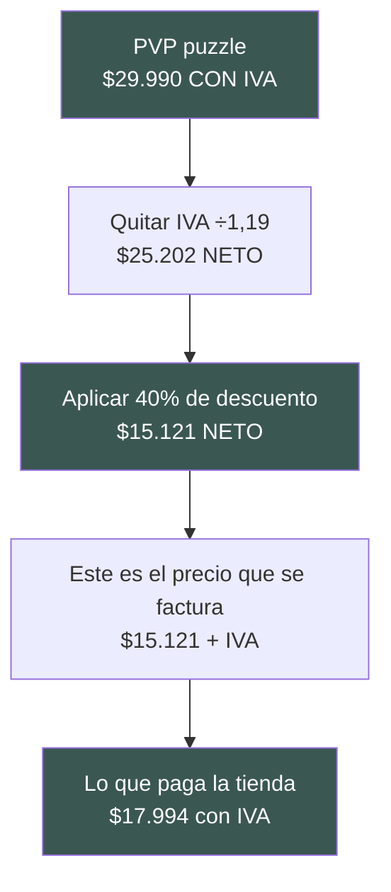
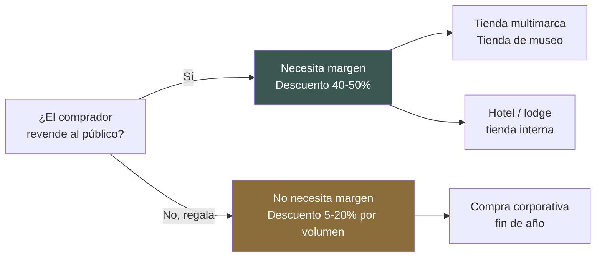
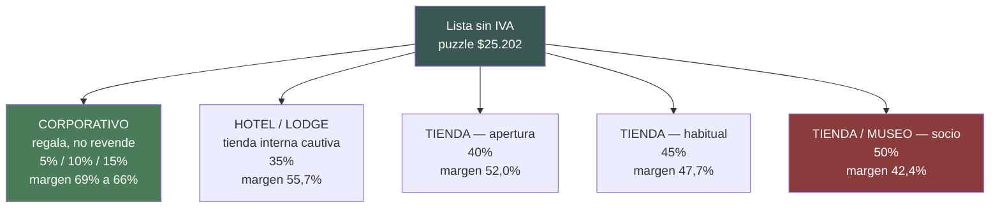
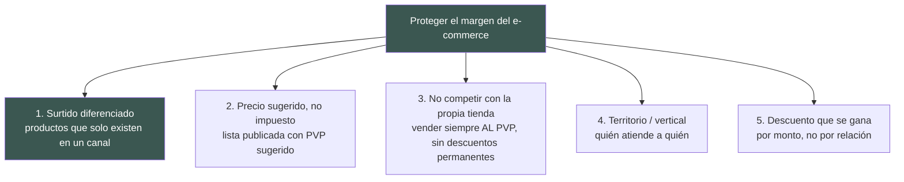

# Canal B2B — Cómo estructurar el precio mayorista

**Fecha del análisis:** 10 de agosto de 2026
**Marca:** Pedraza Ilustración (Chile) — ilustración de flora y fauna nativa
**Punto de partida:** el canal mayorista es el 32,7% de la venta y margina 52,5%; el e-commerce margina 78,9%.

---

## ⚠️ Antes de leer: dos advertencias sobre el método

**1. Solo pude leer resúmenes de buscador, no las páginas completas.**
El entorno bloqueó la descarga directa de páginas web (todas las llamadas a sitios devolvieron `EGRESS_BLOCKED`). Todo lo que sigue viene de resultados de búsqueda con su URL. Las cifras están citadas tal como aparecieron en esos resultados. **Antes de usar cualquier número en una negociación real, hay que abrir la URL y confirmarlo.** Lo dejo anotado en la sección 6.

**2. La regla del IVA, que es donde todo el mundo se equivoca.**

En Chile la ley obliga a mostrar al consumidor el **precio final con IVA incluido** ([SERNAC, Ley 19.496](https://www.sernac.cl/portal/604/w3-article-62710.html)). Entre empresas, en cambio, se cotiza y factura **en valores netos, y el IVA se suma aparte** (la convención "+ IVA" es estándar en el comercio mayorista chileno — ver [Compras Aquí](https://comprasaqui.cl/), [Chile por Mayor](https://www.chilepormayor.cl/), que publican mínimos "+ IVA").

Esto significa que **un mismo "40% de descuento" da tres números distintos** según sobre qué se calcule. Es el error que arruina el cálculo:

🔴 **Regla dura propuesta para Pedraza:** el descuento mayorista se calcula **siempre sobre el precio de lista SIN IVA**, y la lista mayorista se publica **en neto, con la leyenda "+ IVA"**. Si se calcula sobre el precio con IVA y después se le suma IVA otra vez, la marca regala un 19%.

Para el puzzle, el precio de lista sin IVA es:
$29.990 ÷ 1,19 = **$25.202 neto**

---

## 1. Convención de descuento mayorista en el rubro regalo / diseño / papelería

### La convención central: "keystone"

La regla base del retail de regalo se llama **keystone**: la tienda compra a la mitad del precio al público y vende al doble de lo que pagó.

| Cómo se dice | Qué significa |
|---|---|
| "Wholesale = 50% del retail" | La tienda compra a la mitad |
| "Markup 100%" | Sobre el costo, la tienda le suma otro tanto |
| "Margen 50%" | Sobre lo que vende, la mitad le queda a la tienda |

Los tres dicen **exactamente lo mismo**. Markup y margen se miden distinto: el markup se suma sobre el costo, el margen se mide sobre el precio de venta ([Catalist, 2026](https://catalistai.com/wholesale-markup-percentage/); [Eightx](https://eightx.co/blog/what-is-keystone-markup)).

### Rangos documentados

| Fuente | Cifra | Sobre qué precio | URL |
|---|---|---|---|
| LNH31, "US Wholesale Pricing Strategy 2025" | Descuentos mayoristas **40% a 60% sobre MSRP**, según categoría y el margen que exige la tienda | Sobre precio sugerido al público (MSRP), sin IVA en EEUU | [lnh31.com](https://www.lnh31.com/blog/us-wholesale-pricing-strategy-msrp-map) |
| LNH31 | Tiendas independientes de especialidad (**regalo, boutique, tiendas naturistas**) exigen **50% de margen** → el precio mayorista debe ser **50% del MSRP o menos** | Sobre MSRP | [lnh31.com](https://www.lnh31.com/blog/us-wholesale-pricing-strategy-msrp-map) |
| Craftybase (productos hechos a mano) | Fórmula estándar: **costo × 2 = mayorista**, **costo × 4 = retail** | — | [craftybase.com](https://craftybase.com/blog/pricing-handmade-products-wholesale) |
| WholesaleSuite | El precio al público suele ser **2 a 2,5 veces** el precio mayorista (ej.: mayorista USD 5,50 → góndola USD 11 a 14) | Sobre precio mayorista | [wholesalesuiteplugin.com](https://wholesalesuiteplugin.com/wholesale-price/) |
| LiveAbout / Altosight | El rubro regalo es justamente donde el keystone se aplica; categorías de alto valor percibido (**regalo, moda, belleza**) suelen ir **por encima** del keystone | Sobre costo de la tienda | [liveabout.com](https://www.liveabout.com/keystone-pricing-in-retail-2890192) · [altosight.com](https://altosight.com/keystone-pricing-tactics-examples/) |
| Neoteric Brands (proveedor de gift shops y hoteles) | Tiendas de regalo independientes apuntan a un **margen mezclado de 50% a 55%**; keystone es el punto de partida tradicional | Sobre precio de venta | [neotericbrands.com](https://www.neotericbrands.com/blogs/general/wholesale-gifts-gift-shop-hotel-gift-supplier) |
| Faire (marketplace mayorista) | El keystone estándar deja el mayorista en **50% bajo el MSRP**, lo que permite a la tienda "duplicar su plata" | Sobre MSRP | ([Faire](https://www.faire.com/blog/for-brands/wholesale-basics-for-brands-makers-and-artists/), citado vía buscador) |

### Un escalón más abajo: distribuidores

Si algún día entra un distribuidor (alguien que revende a tiendas, no al público), el descuento es mayor porque hay dos márgenes que financiar:

| Figura | Descuento típico sobre MSRP | Fuente |
|---|---|---|
| Tienda minorista | 50% | [Medium — Art of Discount](https://medium.com/@realScofield/art-of-discount-distribution-discount-b9f741740c36) |
| Distribuidor | 60% | ídem |
| Consolidador | 65% | ídem |
| Distribuidor (rango amplio) | 50% a 70% bajo MSRP | [DealHub](https://dealhub.io/glossary/distributor-pricing/) · [b2bridge](https://b2bridge.io/blog/distributor-pricing/) |

### Evidencia de Chile y Latinoamérica (priorizada, como se pidió)

Encontré **poca evidencia chilena publicada del rubro regalo/diseño específicamente**, pero sí tres anclas chilenas útiles:

| Caso chileno | Cifra encontrada | Qué tipo de dato es | URL |
|---|---|---|---|
| **Witral** (marca chilena, telares y lanas) | Escalones de **40%, 45% y 50%** de descuento según el monto mínimo de compra; exige comprar **en múltiplos de 5**; el descuento se aplica solo al llegar al carro | Marca chilena de diseño con tramos mayoristas **públicos** — el hallazgo más directamente comparable | [witral.cl/pages/mayorista](https://witral.cl/pages/mayorista) |
| **Demialma** (marca chilena) | **40% automático** en el carro desde **$100.000** de compra | Umbral chileno de entrada al precio mayorista | [demialma.cl](https://demialma.cl/) |
| **Editorial / librerías Chile** | El punto de venta se queda entre **25% y 40%** según tamaño de la librería; venta directa de editorial a librería sin distribuidor: descuento de **40% a 50%** | Convención de un rubro vecino (libro ilustrado), útil porque las láminas y libretas circulan por los mismos canales | [bibliocorresponsal](https://bibliocorresponsal.wordpress.com/2019/02/03/5210/) · [marianaeguaras.com](https://marianaeguaras.com/reparto-de-porcentajes-en-la-edicion-de-un-libro-impreso/) |

**Lectura:** el rubro chileno de diseño se mueve en la misma banda que la convención internacional (**40% a 50% sobre el precio de lista**), y el libro chileno un poco más abajo (25% a 40%). La banda 40–50% es sólida para Chile.

### 🟡 Inferencia clave: dónde está Pedraza hoy

Este cálculo es mío, no es un dato de la marca:

> Si el B2B margina **52,5%** y el puzzle cuesta **$7.253 neto**, el precio mayorista implícito es
> $7.253 ÷ (1 − 0,525) = **$15.269 neto**
> Sobre el precio de lista neto de $25.202, eso es un **descuento del 39,4%**.

🟡 **Pedraza ya está vendiendo B2B a aproximadamente 40% bajo lista.** Está en el piso de la banda de la industria, no en el medio. Advertencia: el 52,5% es un margen **mezclado de todos los productos**, y el puzzle no es un producto promedio (ver más abajo), así que el 39,4% es una aproximación, no una medición.

### 🔴 Un hallazgo incómodo: el puzzle no margina 78,9%

Con el costo real de $7.253 neto y el precio de lista neto de $25.202:

**Margen del puzzle en e-commerce = (25.202 − 7.253) ÷ 25.202 = 71,2%** — no 78,9%.

Para que un producto marginara 78,9% al PVP del puzzle, tendría que costar $5.318 neto. El puzzle cuesta $7.253. Es decir: **el puzzle es un producto de margen por debajo del promedio del e-commerce**, probablemente compensado por los productos livianos (pin, llavero, postales, calcetines) que casi no pesan en flete.

Esto importa mucho para la política mayorista: **el puzzle es el producto con menos espacio para descontar**, y es justamente el producto ancla del catálogo. Un 50% de descuento sobre el puzzle es mucho más caro para Pedraza que un 50% sobre un pin.

---

## 2. Qué margen exige cada tipo de comprador B2B

La lógica es simple y hay que decirla explícita: **el descuento no premia el volumen, financia el margen de quien revende.** Quien no revende, no necesita margen — necesita precio por volumen, que es otra cosa y es mucho más chica.

| Tipo de comprador | Descuento esperado **sobre el precio de lista sin IVA** | Pedido mínimo típico | Justificación | Fuente |
|---|---|---|---|---|
| **Tienda multimarca de regalo/diseño** | **45% a 50%** | Primera orden USD 300–1.500 · reposición USD 150–500. En Chile, umbrales de $100.000 a $300.000 neto | Es el comprador más exigente: arrienda vitrina, compite con muchas marcas, y el rubro regalo es donde el keystone (50%) es el estándar declarado. Tiendas de especialidad "exigen 50% de margen" | [LNH31](https://www.lnh31.com/blog/us-wholesale-pricing-strategy-msrp-map) · [Neoteric](https://www.neotericbrands.com/blogs/general/wholesale-gifts-gift-shop-hotel-gift-supplier) · [Inspired Home T&C](https://inspiredhomeco.com/pages/terms-conditions) · [Witral](https://witral.cl/pages/mayorista) · [Demialma](https://demialma.cl/) |
| **Tienda de museo** | **50%** (dato duro, es el que publica el Met) | **Orden de apertura USD 300 neto · reposición USD 150 neto**. Primera orden prepagada, siguientes a 30 días | El Met Store declara "50% de descuento en toda la mercadería, salvo publicaciones académicas". Las tiendas de museo tienen COGS de 45–65% de sus ingresos y margen operacional de 10–20%: no tienen holgura para comprar más caro | [store.metmuseum.org/met-wholesale](https://store.metmuseum.org/met-wholesale) · [Art Herstory](https://artherstory.net/wholesale/) (50%, mínimo USD 45 inicial / USD 25 reposición) · [MoMAA calculator](https://momaa.org/art-museum-gift-shop-profit-calculator/) |
| **Hotel / lodge con tienda interna** | 🟡 **35% a 45%** (inferencia) | 🟡 Órdenes más chicas y más frecuentes que una tienda | El dato duro es que las tiendas de hotel/resort apuntan a 50–55% de margen mezclado y que el keystone es el punto de partida. **Pero**: tienen público cautivo, sin competencia de precio dentro del recinto, y suelen vender **sobre** el PVP, no al PVP. Esa holgura permite darles menos descuento que a una multimarca. 🟡 El escalón de 35–45% es mi inferencia; no encontré una fuente que lo declare | Dato duro: [Neoteric](https://www.neotericbrands.com/blogs/general/wholesale-gifts-gift-shop-hotel-gift-supplier) · [Gift Shop Magazine, Resort Retail](https://giftshopmag.com/article/resort_retail_room_to_grow/) · [Hospitality Net](https://www.hospitalitynet.org/opinion/4079994.html) (retail hotelero, 27% de margen operacional, 2015). Inferencia: mía |
| **Compra corporativa de fin de año (regala, no revende)** | **5% a 20%**, escalonado por unidades | 25 / 100 / 250 unidades son los cortes habituales. En Chile los mínimos van de 10 a 50 unidades según proveedor | No hay reventa: no hay margen que financiar. Los cortes documentados son 10% de descuento a las 100 unidades y 15% a las 500; los tramos habituales son 1-99 / 100-499 / 500+ | [FindHomegrown, bulk pricing tiers](https://findhomegrown.com/blog/corporate-gifting-bulk-pricing-tiers) · [Indeed, volume pricing](https://www.indeed.com/career-advice/career-development/volume-pricing) · Chile: [VXM](https://www.vxmventaspormayor.cl/vxm/) (desde 10 o 30 unidades), [High Cube](https://www.highcube.cl/) (mínimo 50 unidades), [Beepromo](https://beepromo.cl/regalos-originales-corporativos/) (20 a 50 unidades) |

### 🔴 El error que hay que dejar de cometer

**Si hoy la tienda de museo, el hotel y la empresa que regala pagan todos lo mismo, la empresa que regala está recibiendo un subsidio enorme.** Está pagando precio de reventa sin necesitar margen de reventa. En el puzzle, la diferencia entre venderle a una empresa a 15% de descuento y venderle a 40% es de **$6.300 netos por unidad**. En un pedido corporativo de 100 puzzles, son **$630.000 netos regalados**.

---

## 3. Propuesta de estructura de tramos para Pedraza

### El caso trabajado: puzzle 1.000 piezas

**Los datos de partida, explícitos:**

| Concepto | Valor | ¿Lleva IVA? |
|---|---|---|
| Precio de lista al público | $29.990 | ✅ **Con IVA** |
| Precio de lista sin IVA (base de todo descuento) | **$25.202** | ❌ Neto |
| Costo puesto en bodega Santiago | **$7.253** | ❌ Neto 🟡 |
| FOB fábrica China (aves) | USD 4,80 | ❌ Neto |

🟡 Asumo que los $7.253 son **netos** (el IVA de importación es crédito fiscal, se recupera, así que no es costo). Si en realidad ese número ya trae IVA, todos los márgenes de abajo suben ~2 puntos. **Hay que confirmarlo con Felipe.**

🟡 Dato de contexto: los $7.253 son **1,5 a 1,7 veces el FOB** de USD 4,80 según el tipo de cambio (1,68× a $900, 1,51× a $1.000). O sea: **cada peso de FOB llega a bodega convertido en ~1,6 pesos.** Es un factor alto y significa que el costo es muy sensible al dólar y al flete.

### Tabla completa: qué pasa con cada nivel de descuento

Todo calculado sobre el precio de lista **sin IVA** de $25.202.

| Descuento | Precio mayorista **sin IVA** | Lo que factura **con IVA** | **Margen bruto de Pedraza** | Plata que le queda por unidad | Margen de la tienda si revende al PVP | Unidades B2B para igualar 1 venta propia |
|---|---|---|---|---|---|---|
| 0% (venta propia) | $25.202 | $29.990 | **71,2%** | $17.949 | — | 1,00 |
| 10% | $22.682 | $26.991 | 68,0% | $15.429 | 10% | 1,16 |
| 15% | $21.421 | $25.491 | 66,1% | $14.168 | 15% | 1,27 |
| 20% | $20.161 | $23.992 | 64,0% | $12.908 | 20% | 1,39 |
| 30% | $17.641 | $20.993 | 58,9% | $10.388 | 30% | 1,73 |
| 35% | $16.381 | $19.494 | 55,7% | $9.128 | 35% | 1,97 |
| **40%** | **$15.121** | **$17.994** | **52,0%** ← ≈ el B2B actual | $7.868 | 40% | **2,28** |
| 45% | $13.861 | $16.494 | 47,7% | $6.608 | 45% | 2,72 |
| 50% | $12.601 | $14.995 | 42,4% | $5.348 | 50% | **3,36** |
| 55% | $11.341 | $13.495 | 36,0% | $4.088 | 55% | 4,39 |

**La columna que hay que mirar es la última.** Dice: cada venta que se va del e-commerce al canal mayorista **hay que reponerla 2,3 veces al 40% de descuento, y 3,4 veces al 50%**, solo para quedar igual. Ese es el costo real de la canibalización, en unidades.

🟡 Matiz honesto: esa columna compara margen bruto contra margen bruto. La venta propia además paga comisión de pago, despacho y costo de adquisición de cliente, que la venta mayorista no paga (o paga mucho menos). Con esos costos incluidos, la relación real es **más favorable al B2B** que 2,3×. No tengo esos costos, así que no puedo calcularlo. **Es el dato #1 que hay que pedir en la reunión.**

### Propuesta: cinco precios, no uno

**Tramo A — Corporativo (regala, no revende).** Descuento por unidades, no por margen.

| Unidades del mismo producto | Descuento sobre lista sin IVA | Precio puzzle sin IVA | Margen Pedraza |
|---|---|---|---|
| 25 a 99 | 5% | $23.942 | 69,7% |
| 100 a 249 | 10% | $22.682 | 68,0% |
| 250 a 499 | 15% | $21.421 | 66,1% |
| 500 o más | 20% (a negociar) | $20.161 | 64,0% |

Alineado con los cortes documentados de 100 / 500 unidades y 10% / 15% ([FindHomegrown](https://findhomegrown.com/blog/corporate-gifting-bulk-pricing-tiers)) y con los mínimos chilenos de 25 a 50 unidades ([High Cube](https://www.highcube.cl/), [Beepromo](https://beepromo.cl/regalos-originales-corporativos/)).

**Tramo B — Reventa (tienda multimarca, museo, hotel).** Descuento por monto de la orden, en neto.

| Nivel | Monto mínimo de la orden, **sin IVA** | Descuento | Margen Pedraza (puzzle) | Equivale a |
|---|---|---|---|---|
| Prueba / apertura | **$150.000 neto** | 35% | 55,7% | ~10 puzzles |
| Habitual | **$300.000 neto** | 40% | 52,0% | ~20 puzzles |
| Socio | **$600.000 neto** | 45% | 47,7% | ~40 puzzles |
| Socio estratégico | **$1.200.000 neto** | 50% | 42,4% | ~95 puzzles |

Los umbrales están calibrados contra los datos chilenos encontrados: Demialma abre en $100.000 y Witral escalona 40/45/50 ([witral.cl](https://witral.cl/pages/mayorista), [demialma.cl](https://demialma.cl/)); el Met pide USD 300 de apertura y USD 150 de reposición ([Met Store](https://store.metmuseum.org/met-wholesale)). 🟡 Los montos exactos en pesos son propuesta mía.

### 🔴 Tres condiciones sin las cuales el 50% no se entrega

El 50% deja a Pedraza en 42,4% de margen en el puzzle — 29 puntos bajo su venta propia. No se regala:

1. **Solo al llegar al monto**, nunca "de entrada". El descuento se gana con la orden, no con la conversación.
2. **Nunca en los productos de menor margen sin revisar.** El puzzle margina 71,2% al público, no 78,9%. En productos que marginen menos que el puzzle, el 50% puede dejar el margen bajo 40%. **Hay que correr esta misma tabla producto por producto antes de publicar la lista** — no tengo los costos de los otros nueve productos.
3. **Con compromiso de reposición**, no una compra suelta. Una orden grande y única al 50% es peor negocio que cuatro órdenes medianas al 40%.

### Sobre la concentración

Un solo cliente ("Creado en Chile") es el **11,9% de la venta total** — o sea, más de un tercio de todo el canal B2B (11,9 ÷ 32,7 = 36%). 🟡 Recomendación mía: fijar un **techo de exposición**, por ejemplo que ningún cliente B2B supere el 25% del canal, y que el tramo de 50% exija que el cliente **no** esté ya sobre ese techo. Un cliente que sabe que es un tercio del canal negocia distinto.

---

## 4. Reglas anti-canibalización

Aquí hay una diferencia legal importante entre lo que se hace en EEUU y lo que se puede hacer en Chile. **No se puede copiar el manual gringo.**

### 🔴 Lo que NO se puede hacer en Chile

**Fijarle a la tienda el precio mínimo al que debe vender es una infracción a la libre competencia en Chile.**

La Fiscalía Nacional Económica es explícita: la fijación de precio mínimo de reventa se configura cuando "el proveedor establece al distribuidor el precio mínimo de venta al público del producto", y constituye una restricción vertical que infringe el artículo 3° del DL 211. La FNE señala que puede eliminar la competencia de precios entre tiendas que venden productos del mismo proveedor y facilitar la colusión ([FNE, Guía de Restricciones Verticales](https://www.fne.gob.cl/wp-content/uploads/2017/10/Gu%C3%ADa-Restricciones-Verticales.pdf); [FNE, sección Restricciones Verticales](https://www.fne.gob.cl/advocacy/herramientas-de-promocion/restricciones-verticales/); [FerradaNehme, estándar actual en Chile](https://fn.cl/comunicaciones/restricciones-verticales-en-latinoamerica-estandar-actual-en-chile)).

⚠️ Esto contrasta con la práctica estadounidense de las políticas **MAP** (precio mínimo publicitado), que allá se sostienen bajo la doctrina Colgate como política unilateral ([National Law Review](https://natlawreview.com/article/minimum-advertised-price-policies-what-manufacturers-need-know); [Eightx](https://eightx.co/blog/what-is-map-pricing)). **Toda la literatura de "MAP policy" que se encuentra en internet es de EEUU y no se traslada tal cual a Chile.**

🟡 Nota: la Guía de la FNE contempla un análisis por etapas y menciona un umbral en torno al **35% de participación de mercado** bajo el cual las restricciones verticales se analizan con más holgura. No pude leer el documento completo (bloqueo de red) — **esto lo tiene que revisar un abogado antes de escribir cualquier contrato.**

### ✅ Lo que SÍ se puede hacer, en orden de fuerza

**1. Surtido diferenciado por canal — la herramienta más potente y la más segura legalmente.**
Crear productos o colecciones exclusivas por canal evita la comparación directa de precio y hace que el consumidor visite ambos canales; las marcas reservan estilos para el canal mayorista, ofrecen variantes de color por canal, o escalonan lanzamientos ([JOOR](https://www.joor.com/insights/avoiding-online-retail-channel-conflict); [RepSpark](https://www.repspark.com/blog/how-to-add-wholesale-to-a-dtc-brand-without-creating-channel-conflict)).
🟢 **Aplicación directa a Pedraza:** si el puzzle de una especie determinada, o la lámina 42×60 en cierto formato, **existe solo en la tienda propia**, no hay canibalización posible en ese producto. Y como el puzzle es el producto de margen más ajustado, es el candidato natural para tener versiones exclusivas del canal propio.

**2. Precio sugerido publicado, no impuesto.**
La lista mayorista lleva una columna "PVP sugerido" con el precio con IVA. Es una **sugerencia**, y así debe quedar escrito. La tienda es libre de fijar su precio. Esto mantiene la coherencia de precio en el mercado sin cruzar la línea del DL 211.

**3. Que la tienda propia no le gane el precio a sus propias tiendas.**
La regla de la industria: el precio directo al consumidor no debe quedar bajo el precio que el socio mayorista necesita para hacer su margen; mantener el mismo PVP y hacer promociones puntuales del canal propio, pero nunca quedar permanentemente más barato ([RepSpark](https://www.repspark.com/blog/aligning-dtc-retail-and-marketplace-without-channel-conflict); [Bizowie](https://bizowie.com/wholesale-dtc-managing-dual-business-models-in-one-system)).
🟢 Traducción para Pedraza: **los descuentos del e-commerce (cyber, black friday, liquidaciones) son la principal fuente de conflicto**, no el precio de lista. Una regla simple: avisar a los clientes B2B con anticipación y ofrecerles el mismo descuento en ese período, o excluir del descuento los productos que ellos tienen en góndola.

**4. Territorio o vertical asignado.**
Definir territorios exclusivos o roles por vertical de cliente permite cobertura sin que los socios se pisen ([Click Academy Asia](https://www.clickacademyasia.com/post/managing-channel-conflict-strategies-for-success)).
🟢 Para Pedraza esto es especialmente natural: **por vertical**, no por geografía. Una tienda de museo, un lodge en la Patagonia y una tienda de diseño en Santiago no compiten entre sí. Lo que sí compite es dos tiendas de regalo en el mismo barrio.
⚠️ La exclusividad territorial también es una restricción vertical bajo el DL 211 — hay que revisarla con abogado, aunque tiene un tratamiento más benigno que la fijación de precio.

**5. Descuento por monto, no por antigüedad ni por simpatía.**
Que el escalón se gane con la orden y se pueda perder. Los descuentos "heredados" son la forma más común de que el margen del canal se erosione sin que nadie lo decida.

### La regla de decisión, en una frase

> **Antes de aceptar un pedido mayorista grande con descuento profundo, la pregunta no es "¿cuánto vendo?" sino "¿cuántas de estas unidades se habrían vendido igual en mi tienda?".** Si más de una de cada 2,3 se habría vendido sola (al 40%), o más de una de cada 3,4 (al 50%), el pedido destruye plata.

---

## 5. Precios mayoristas de la competencia chilena

Busqué específicamente marcas chilenas de ilustración de flora y fauna nativa — competencia directa de Pedraza.

| Marca | ¿Tiene programa mayorista? | ¿Publica precios? | Qué se encontró | URL |
|---|---|---|---|---|
| **Bosque Chileno** (editorial + tienda) | ✅ Sí, página dedicada | 🔒 **No — tras solicitud por email** | "Escríbenos a tienda@bosquechileno.cl para solicitar la lista de precios con descuentos especiales para distribuidores y compras por mayor". Restringido a su línea editorial propia | [bosquechileno.cl/pages/venta-mayorista-y-distribucion](https://bosquechileno.cl/pages/venta-mayorista-y-distribucion) |
| **Pupila Nativa** (láminas ilustradas de fauna nativa) | ✅ Sí, mencionado en el sitio ("Saber más" / "Cotiza aquí") | 🔒 **No — tras cotización** | Competidor casi idéntico en categoría. No hay condiciones públicas | [pupilanativa.cl](https://pupilanativa.cl/) |
| **Witral** (marca chilena de diseño, telares) | ✅ Sí | ✅ **Sí — el único con tramos públicos que encontré** | Escalones de **40% / 45% / 50%** según monto mínimo; compra en **múltiplos de 5**; descuento automático en el carro. **No logré leer los montos exactos de cada escalón** (página bloqueada) | [witral.cl/pages/mayorista](https://witral.cl/pages/mayorista) |
| **Demialma** (marca chilena) | ✅ Sí | ✅ **Sí** | **40% automático desde $100.000** de compra | [demialma.cl](https://demialma.cl/) |
| **Diente de León Juegos** (libros y puzzles, Chile) | ✅ Sí, formulario de contacto mayorista | 🔒 No | Formulario de contacto para venta mayorista de libros y puzzles | [dientedeleonjuegos.com/mayoristas](https://www.dientedeleonjuegos.com/mayoristas/) |
| **La Papelaria** (papelería de diseño, Chile) | ✅ Sí, página "Distribución y venta mayorista" | 🔒 No | Página existe, contenido no accesible | [papelaria.cl/pages/distribucion-y-venta-mayorista](https://www.papelaria.cl/pages/distribucion-y-venta-mayorista) |
| **Yo Soy Fauna** | ❓ No encontrado | — | Marca Chile, láminas de fauna nativa en packs de 3 y 6. No encontré página mayorista | [yosoyfauna.cl](https://yosoyfauna.cl/) |
| **GARUGA** | ❓ No encontrado | — | Flora, fauna y funga nativa: láminas, cuadros, piezas decorativas | [garuga.cl](https://garuga.cl/) |
| **Torcachile** | ❓ No encontrado | — | Láminas, reproducciones de acuarela en papel de 300 g | [torcachile.cl](https://www.torcachile.cl/) |
| **Bendito** | ❓ No encontrado | — | Regalos de flora, fauna y cultura de Chile | [bendito.cl](https://bendito.cl/) |
| **Creado en Chile** | — | — | ⚠️ **Es cliente B2B de Pedraza** (11,9% de la venta total). Vende ilustraciones y láminas de aves de Chile. Vale la pena mirar si además tiene marca propia en la misma categoría | [creadoenchile.cl](https://creadoenchile.cl/collections/ilustraciones-y-collage) |

**Plataforma mayorista chilena que vale monitorear:**
**Lokal** ([somoslokal.cl](https://somoslokal.cl/)) — marketplace mayorista chileno de marcas locales para tiendas minoristas. Ofrece a las tiendas **pago a 60 días** y **devolución gratis en la primera compra de cada marca**. No pude acceder a sus condiciones para marcas (comisión, descuento exigido). 🟢 Es el equivalente chileno de Faire y probablemente el mejor lugar para leer la convención real del mercado local. **Vale una llamada.**

### Conclusión de esta sección

**El patrón dominante en Chile es el catálogo mayorista cerrado:** la mayoría publica que tiene canal mayorista pero **esconde el precio tras un email o un formulario**. Solo dos marcas (Witral y Demialma) publican porcentajes abiertos, y ambas están en la banda **40% a 50%**.

🟡 **Recomendación táctica:** el camino más rápido y confiable para conocer los precios de la competencia es **pedir sus listas mayoristas como comprador**. Bosque Chileno, Pupila Nativa y La Papelaria las entregan por email. Es información pública que se entrega a quien la pide.

---

## 6. Vacíos — qué no encontré y por qué

### 🔴 Bloqueadores del método

| Vacío | Por qué |
|---|---|
| **No pude leer ninguna página web completa** | Todas las descargas directas devolvieron `EGRESS_BLOCKED` (Faire, Craftybase, Etsy, FNE, Wikipedia, papelaria.cl, dientedeleonjuegos.com, somoslokal.cl, etc.). **Todo lo citado viene de resúmenes de buscador con su URL.** Las cifras hay que confirmarlas abriendo cada link |
| **Montos exactos de los tramos de Witral** | Sé que son 40/45/50% pero no los montos mínimos en pesos. Es el dato chileno más valioso que quedó a medias |
| **Condiciones de Lokal para marcas** | Comisión, descuento exigido, mínimos. Es el marketplace mayorista chileno de referencia |

### 🔴 Datos internos de Pedraza que faltan y son bloqueantes

| Falta | Por qué bloquea |
|---|---|
| **Costo de los otros 9 productos** | Solo tengo el costo del puzzle. **No se puede publicar una lista mayorista con un descuento único sin saber el margen de cada producto.** El puzzle margina 71,2% al público (no 78,9%), lo que ya prueba que los márgenes son muy desiguales entre productos |
| **Si los $7.253 son netos o con IVA** | Cambia todos los márgenes ~2 puntos |
| **Costos variables del e-commerce** (comisión de pago, despacho, adquisición de cliente) | Sin esto, la comparación "2,3 unidades B2B = 1 venta propia" está sesgada **en contra** del B2B. Es el dato #1 a pedir |
| **Precio al que Pedraza vende hoy a cada cliente B2B** | El 39,4% de descuento implícito es una inferencia a partir de un margen mezclado, no una medición |
| **Composición del canal B2B por tipo de cliente** | Cuánto es tienda, cuánto museo, cuánto hotel, cuánto corporativo. Sin esto no se puede estimar el impacto de cambiar la política |
| **Costo de servir cada tipo de cliente** | Despacho, empaque, tiempo de venta. Un pedido corporativo de 200 unidades a una dirección cuesta mucho menos que 12 pedidos de reposición |

### 🟡 Datos de industria que busqué y no encontré

- **Estándares publicados de la Museum Store Association** sobre markup — están tras membresía. El dato del Met (50%, apertura USD 300 neto, reposición USD 150 neto) es el mejor sustituto que existe públicamente.
- **Ninguna fuente que declare explícitamente el descuento que exige un hotel/lodge.** El rango 35–45% que propongo es 🟡 inferencia mía a partir del margen de tiendas de hotel (50–55%) y del hecho de que venden a público cautivo. **Es el número más débil de todo el documento.**
- **Convención de descuento mayorista específica del rubro regalo/diseño en Chile.** No existe publicada. Lo más cercano son Witral, Demialma y la convención del libro chileno (25–40% al punto de venta).
- **Márgenes de reventa del canal B2B en Latinoamérica** más allá de Chile. No encontré nada específico.
- **Tratamiento chileno de la exclusividad territorial** en detalle. Sé que es una restricción vertical bajo el DL 211, pero no pude leer la Guía completa de la FNE.

### ⚖️ Lo que necesita abogado, no analista

Cualquier cláusula de **precio mínimo de reventa** o de **exclusividad territorial** en un contrato mayorista chileno debe pasar por un abogado de libre competencia antes de firmarse. La fijación de precio mínimo de reventa está expresamente señalada por la FNE como infracción al artículo 3° del DL 211. **No es una zona gris.**

---

## Resumen en una tabla

| Pregunta | Respuesta corta |
|---|---|
| ¿Cuál es la convención? | **40% a 50% sobre el precio de lista SIN IVA.** El keystone (50%) es el estándar declarado del rubro regalo |
| ¿Sobre qué precio se calcula? | **Siempre sobre el precio de lista sin IVA.** La lista mayorista se publica en neto, "+ IVA" |
| ¿Dónde está Pedraza hoy? | 🟡 ≈ **39,4% de descuento** implícito. En el piso de la banda |
| ¿Todos pagan lo mismo? | **No deberían.** Quien revende necesita margen (35–50%); quien regala solo necesita volumen (5–20%) |
| ¿Pedido mínimo? | Apertura **$150.000 neto**, reposición **$300.000 neto** para el tramo habitual 🟡 |
| ¿Cuánto cuesta canibalizar? | Al 40%: **2,3 unidades B2B** para igualar 1 venta propia. Al 50%: **3,4 unidades** |
| ¿La regla más segura contra la canibalización? | **Surtido diferenciado por canal.** Es la única que no toca el DL 211 |
| ¿Se puede imponer precio mínimo de reventa? | 🔴 **No en Chile.** Solo precio sugerido |
| ¿Qué falta para cerrar esto? | **El costo de los otros 9 productos.** Sin eso no hay lista mayorista posible |
