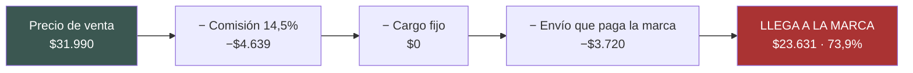
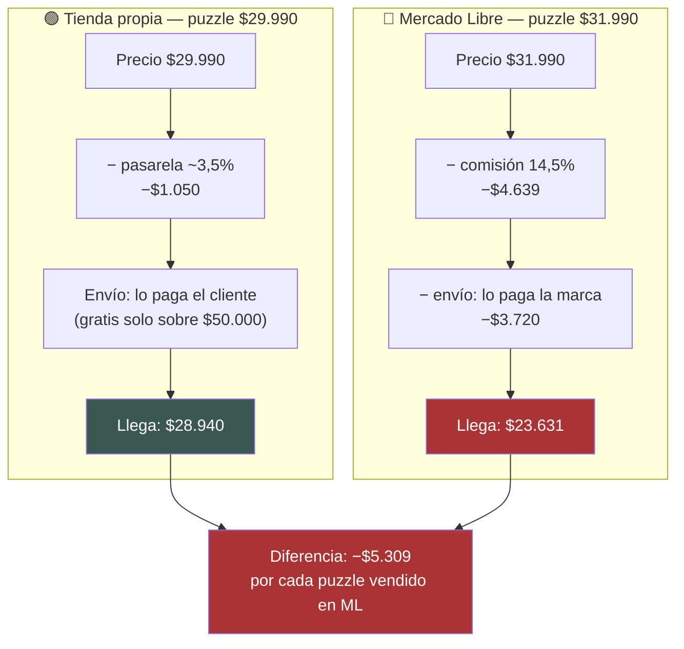

# Canal Mercado Libre Chile — costos reales y política de precio

**Fecha de trabajo:** 10 de agosto de 2026
**Alcance:** qué cuesta vender en Mercado Libre Chile, cuánto llega al vendedor, y si la política de precio decidida el 1-ago-2026 se sostiene.

---

## ⚠️ Advertencia de método — leer antes que nada

**No se pudo abrir ninguna página oficial de Mercado Libre.** Todos los dominios de Mercado Libre están bloqueados por la política de red del entorno de trabajo:

| Dominio | Resultado |
|---|---|
| `www.mercadolibre.cl` | ❌ Bloqueado por el proxy (EGRESS_BLOCKED) |
| `vendedores.mercadolibre.cl` | ❌ Bloqueado por el proxy |
| `listado.mercadolibre.cl` | ❌ Bloqueado (403 al CONNECT) |
| `api.mercadolibre.com` (API pública, endpoint `listing_prices`) | ❌ Bloqueado (403 al CONNECT) |
| `developers.mercadolibre.cl` | ❌ Bloqueado |
| `web.archive.org` (respaldo) | ❌ No disponible |
| Blogs especializados (`nubimetrics`, `profitar`, `upseller`, `jaguarsheet`) | ❌ Bloqueados para lectura directa |

Esto **no** es un bloqueo anti-robot de Mercado Libre: es la política de egreso de esta sesión. El mismo diagnóstico ya está documentado en `docs/research/tienda.md` (sección 7) para una ronda anterior.

**Consecuencia:** la única herramienta que funcionó fue la búsqueda web, que devuelve **resúmenes de las páginas oficiales**, no las páginas mismas. Por lo tanto:

- 🟢 = dato citado desde una página oficial de Mercado Libre a través del resumen de búsqueda (la URL oficial se indica, pero **no se pudo leer directamente**).
- 🟡 = estimación, supuesto, o dato de fuente secundaria (blog/consultora).
- ❌ = no encontrado.

**Ningún número de este documento debe pasar a un entregable de cliente sin antes correr el simulador oficial** (`www.mercadolibre.cl/simulador-de-costos`) desde la cuenta real de Pedraza, con la categoría real de cada producto. Ese simulador entrega el número exacto y cierra casi todos los vacíos de aquí.

---

## 1. Tabla de costos del canal

### 1.1 Comisión por venta (cargo por venta)

| Concepto | Dato encontrado | Confianza | Fuente |
|---|---|---|---|
| Rango de comisión, Chile | **12,5% a 17%** del precio de venta | 🟡 Fuente secundaria, específica de Chile | [Profitar — Comisiones MercadoLibre Chile 2026](https://profitar.app/cl/blog/comisiones-mercadolibre-chile-rentabilidad) |
| Rango de comisión, multi-país | 13% a 20% | 🟡 Fuente secundaria, **no separa Chile** | [Wivo Analytics](https://www.wivoanalytics.com/blog/cuanto-cobra-mercado-libre-por-venta-en-2025-guia-completa-de-comisiones-envios-y-mas) |
| Clásica vs Premium | Clásica = porcentaje menor + hasta **6 cuotas** sin interés. Premium = porcentaje mayor + hasta **12 cuotas** sin interés y más visibilidad | 🟢 Página oficial (vía resumen) | [ML Chile — Costos de publicar y vender](https://www.mercadolibre.cl/ayuda/Costos-de-publicar-y-vender_867) |
| Brecha Clásica → Premium | 3 a 5 puntos porcentuales | 🟡 Fuente secundaria | [Rapiboy — Guía 2026](https://blog.rapiboy.com/comisiones-sobre-ventas-en-la-plataforma-meli/) |
| Comisión de **Juegos y Juguetes** (puzzles, naipes) | ❌ **No se obtuvo el porcentaje exacto de Chile** | ❌ | Existe una página oficial con la tabla por categoría — [ML Chile — Cargo por venta por categoría](https://www.mercadolibre.cl/landing/costos-venta-producto) — pero está bloqueada |
| Comisión de **Hogar / Decoración** (lámina, botella) | ❌ **No se obtuvo** | ❌ | Misma página bloqueada |
| Comisión de **Accesorios / Moda** (totebag) | ❌ **No se obtuvo** | ❌ | Misma página bloqueada |

> 🔴 **Este es el vacío más importante del informe.** No se debe generalizar un porcentaje a todas las categorías: Mercado Libre cobra distinto por categoría y por subcategoría. Los cinco productos de Pedraza caen en **al menos tres categorías distintas** (juguetes, hogar/deco, accesorios), así que muy probablemente pagan **tres comisiones distintas**.

### 1.2 Cargo fijo por unidad

Aquí las fuentes **se contradicen**. Las dos versiones coinciden en el techo ($19.990) pero no en el monto:

| Versión | Qué dice | Confianza | Fuente |
|---|---|---|---|
| **A — monto único** | Cargo fijo de **$400** por unidad, **solo** para productos de **menos de $19.990**. Sobre $19.990 no se cobra | 🟢 Página oficial (vía resumen) | [ML Chile — Costos de publicar y vender](https://www.mercadolibre.cl/ayuda/Costos-de-publicar-y-vender_867) |
| **B — por tramos** | Hasta $9.990 → **$700**. Entre $9.990 y $19.990 → **$1.000**. Sobre $19.990 → **$0** | 🟡 Resumen de búsqueda, se presenta como "información más reciente" pero sin fecha | Mismo resumen de búsqueda sobre páginas de ML |
| Versión "≈$600" | Cargo fijo "alrededor de $600" bajo el umbral | 🟡 Fuente secundaria, cifra aproximada | [Wivo Analytics](https://www.wivoanalytics.com/blog/cuanto-cobra-mercado-libre-por-venta-en-2025-guia-completa-de-comisiones-envios-y-mas) |

**Lo que sí está firme:** 🟢 **el umbral es $19.990.** Sobre ese precio, el cargo fijo desaparece.

**Por qué importa para Pedraza:** de los cinco productos, **solo el totebag ($18.990) queda bajo el umbral** y paga cargo fijo. Los otros cuatro no pagan nada de cargo fijo. Volveremos a esto en la sección 4 — el totebag está a $1.000 de un acantilado.

**Dato suelto relacionado:** el precio mínimo para publicar en Mercado Libre Chile es **$650**. 🟢 Página oficial (vía resumen) — [ML Chile — Novedades en los costos de tus publicaciones y envíos gratis](https://vendedores.mercadolibre.cl/novedad/novedades-en-los-costos-de-tus-publicaciones-y-envios-gratis/)

### 1.3 Costo de envío — el costo escondido, y el más grande

| Concepto | Dato | Confianza | Fuente |
|---|---|---|---|
| Desde qué precio se activa el envío gratis | **$19.990**. Sobre ese precio el envío gratis se activa automáticamente para el comprador | 🟢 Páginas oficiales (vía resumen) | [ML Chile — Costos de envíos](https://www.mercadolibre.cl/ayuda/Costos-de-envios_3667) · [ML Chile — Mi beneficio de envíos gratis](https://www.mercadolibre.cl/ayuda/4603) |
| Quién paga ese envío | **El vendedor**, total o parcialmente. "Envío gratis" es gratis para el comprador, no para la marca | 🟢 Página oficial (vía resumen) | [ML Chile — Costos de envíos](https://www.mercadolibre.cl/ayuda/Costos-de-envios_3667) |
| Cuánto cubre Mercado Libre | **Descuento de hasta 50%** del costo de envío, según la **reputación** del vendedor. El resto lo paga la marca | 🟢 Página oficial (vía resumen) | [ML Chile — Costos de envíos](https://www.mercadolibre.cl/ayuda/Costos-de-envios_3667) |
| Cómo se calcula el costo | Por **peso del paquete**, tomando el mayor entre peso físico y peso volumétrico (largo × alto × ancho ÷ 5000). Mientras más grande o pesado, más caro | 🟢 Página oficial (vía resumen) | [ML Chile — Costos de envíos](https://www.mercadolibre.cl/ayuda/Costos-de-envios_3667) |
| Costo nominal de 1 kg | **$6.200** | 🟡 Fuente secundaria (ejemplo trabajado en un blog de consultora) | [UpSeller — Qué es el envío gratis](https://www.upseller.com/es/blog-article-444) |
| Lo que paga un vendedor sin reputación (1 kg) | **$3.720** (40% de descuento sobre $6.200) | 🟡 Misma fuente secundaria | [UpSeller](https://www.upseller.com/es/blog-article-444) |
| Tabla oficial de costo de envío por tramo de peso, Chile 2026 | ❌ **No se obtuvo** | ❌ | Páginas oficiales bloqueadas |

> 🔴 **Este es el punto ciego más caro.** Los productos de Pedraza son voluminosos: un puzzle de 1.000 piezas y una lámina de 42×60 pagan por **peso volumétrico**, no por peso físico. Es muy posible que el envío real esté **por encima** de los $3.720 del ejemplo de 1 kg. 🟡

### 1.4 Mercado Envíos Full

| Concepto | Dato | Confianza | Fuente |
|---|---|---|---|
| Almacenamiento | La tarifa depende del **tamaño del producto** y del **tiempo que lleve en bodega**. Existe un cargo por "stock antiguo" | 🟢 Página oficial (vía resumen), **sin cifras** | [ML Chile — Cuánto cuesta operar en Full](https://vendedores.mercadolibre.cl/nota/cuales-son-los-costos-por-almacenar-stock-en-full) |
| Colecta (recepción) | Se calcula por **volumen total enviado** y **distancia** hasta el centro Full. A mayor volumen, menor costo por m³ | 🟢 Página oficial (vía resumen), **sin cifras** | Misma página |
| Retiro de stock | Tiene costo | 🟢 Página oficial (vía resumen), **sin cifras** | Misma página |
| **Tarifas exactas en CLP para Chile 2026** | ❌ **No se obtuvo ninguna cifra** | ❌ | Página bloqueada |

**Lectura para Pedraza:** Full es justamente el mecanismo que compra la "velocidad de entrega" en la que se apoya el razonamiento de la política de precio. Pero **hoy no sabemos qué cuesta**, y suma tres cobros nuevos (almacenar, recibir, retirar) que no están en ningún cálculo de esta ronda.

### 1.5 Otros costos

| Concepto | Dato | Confianza | Fuente |
|---|---|---|---|
| IVA sobre la comisión | Mercado Libre factura **IVA sobre la comisión y el cargo fijo**. En Chile la tasa es **19%** | 🟡 Los resúmenes mezclan el 21% de Argentina con el 19% de Chile; el 19% es la tasa legal chilena | Resumen de búsqueda sobre páginas de ML |
| ¿Ese IVA es un costo real? | **Depende.** Si Pedraza está registrada con IVA (factura), ese IVA es **crédito fiscal recuperable** y no es costo. Si no, es costo puro | 🟡 SUPUESTO — hay que confirmarlo con el contador | — |
| Cuotas sin interés | Recargo adicional de **3% a 10%** si se ofrecen cuotas sin interés | 🟡 Fuente secundaria | [Profitar](https://profitar.app/cl/blog/comisiones-mercadolibre-chile-rentabilidad) |
| ⚠️ Cuotas en la ficha actual de Pedraza | La ficha del puzzle en ML **menciona "cuotas sin interés"** — o sea, este recargo **podría estar aplicándose hoy** y no está en ningún cálculo | 🟡 VERIFICAR con urgencia | `docs/research/tienda.md` sección 3 · [Ficha del puzzle](https://www.mercadolibre.cl/puzzle-pedraza-ilustracion-flora-y-fauna-1000-piezas/up/MLCU2815220982) |
| Publicidad dentro de la plataforma (Product Ads) | ❌ **No se obtuvo** tarifa ni modelo de cobro para Chile | ❌ | — |
| Comisión de Mercado Pago (3,99% + $990) | ⛔ **No aplica.** Esa es la tarifa de Mercado Pago como pasarela externa. En una venta dentro del marketplace, el procesamiento del pago **ya está incluido** en el cargo por venta. Aparece en fuentes secundarias y es un error clásico de doble conteo | 🟡 Advertencia | [Wivo Analytics](https://www.wivoanalytics.com/blog/cuanto-cobra-mercado-libre-por-venta-en-2025-guia-completa-de-comisiones-envios-y-mas) menciona ambos juntos |

---

## 2. Cuánto llega efectivamente al vendedor

### Supuestos del cálculo (todos 🟡 — cámbialos cuando llegue el dato del simulador)

| Parámetro | Valor base usado | Por qué |
|---|---|---|
| Comisión | **14,5%** | Punto medio del rango chileno 12,5%–17%. **No es el dato real de ninguna categoría** |
| Cargo fijo | **$0** sobre $19.990 · **$1.000** entre $9.990 y $19.990 | Versión B (por tramos), la más conservadora |
| Envío que paga el vendedor | **$3.720** cuando el precio es ≥ $19.990 (envío gratis obligatorio) · **$0** bajo $19.990 | Ejemplo de 1 kg con 40% de descuento por reputación |
| IVA sobre comisión | **No se resta** (se asume recuperable como crédito fiscal) | Escenario base. Abajo está también la variante sin recuperar |

### Cálculo línea por línea



**A) $31.990 — puzzle 1.000 piezas, precio ML actual**

| Línea | Monto |
|---|---|
| Precio de venta | $31.990 |
| − Comisión 14,5% | −$4.639 |
| − Cargo fijo (precio ≥ $19.990) | $0 |
| − Envío gratis obligatorio ✅ | −$3.720 |
| **= Llega a la marca** | **$23.631** — **73,9%** del precio |

**B) $22.990 — precio de los naipes en la tienda propia**

| Línea | Monto |
|---|---|
| Precio de venta | $22.990 |
| − Comisión 14,5% | −$3.334 |
| − Cargo fijo (precio ≥ $19.990) | $0 |
| − Envío gratis obligatorio ✅ | −$3.720 |
| **= Llega a la marca** | **$15.936** — **69,3%** del precio |

**C) $17.990 — precio del totebag en la tienda propia**

| Línea | Monto |
|---|---|
| Precio de venta | $17.990 |
| − Comisión 14,5% | −$2.609 |
| − Cargo fijo (precio < $19.990) | −$1.000 |
| − Envío gratis **no** obligatorio ❌ | $0 |
| **= Llega a la marca** | **$14.381** — **79,9%** del precio |

**D) $56.990 — lámina 42×60, precio ML actual**

| Línea | Monto |
|---|---|
| Precio de venta | $56.990 |
| − Comisión 14,5% | −$8.264 |
| − Cargo fijo (precio ≥ $19.990) | $0 |
| − Envío gratis obligatorio ✅ | −$3.720 |
| **= Llega a la marca** | **$45.006** — **79,0%** del precio |

### Resumen y sensibilidad

Como la comisión real no se pudo confirmar, aquí está el neto para todo el rango posible. **Busca tu caso en la tabla en vez de quedarte con un solo número.**

| Precio | Comisión | Envío $0 | Envío $3.100 | Envío $3.720 | Envío $6.200 |
|---|---|---|---|---|---|
| **$31.990** | 13,0% | $27.831 (87%) | $24.731 (77%) | $24.111 (75%) | $21.631 (68%) |
| | 14,5% | $27.351 (86%) | $24.251 (76%) | **$23.631 (74%)** | $21.151 (66%) |
| | 17,0% | $26.552 (83%) | $23.452 (73%) | $22.832 (71%) | $20.352 (64%) |
| **$22.990** | 13,0% | $20.001 (87%) | $16.901 (74%) | $16.281 (71%) | $13.801 (60%) |
| | 14,5% | $19.656 (86%) | $16.556 (72%) | **$15.936 (69%)** | $13.456 (59%) |
| | 17,0% | $19.082 (83%) | $15.982 (70%) | $15.362 (67%) | $12.882 (56%) |
| **$17.990** | 13,0% | $14.651 (81%) | $11.551 (64%) | $10.931 (61%) | $8.451 (47%) |
| | 14,5% | **$14.381 (80%)** | $11.281 (63%) | $10.661 (59%) | $8.181 (45%) |
| | 17,0% | $13.932 (77%) | $10.832 (60%) | $10.212 (57%) | $7.732 (43%) |
| **$56.990** | 13,0% | $49.581 (87%) | $46.481 (82%) | $45.861 (80%) | $43.381 (76%) |
| | 14,5% | $48.726 (86%) | $45.626 (80%) | **$45.006 (79%)** | $42.526 (75%) |
| | 17,0% | $47.302 (83%) | $44.202 (78%) | $43.582 (76%) | $41.102 (72%) |

*(En negrita, el escenario base. El totebag a $17.990 no tiene envío gratis obligatorio, así que su caso real es la columna "Envío $0".)*

**Variante: si el IVA de la comisión NO es recuperable** (restando 19% sobre comisión + cargo fijo):

| Precio | Neto | % |
|---|---|---|
| $31.990 | $22.750 | 71,1% |
| $22.990 | $15.303 | 66,6% |
| $17.990 | $13.696 | 76,1% |
| $56.990 | $43.436 | 76,2% |

**La conclusión gruesa:** de cada $100 que paga un comprador en Mercado Libre, a la marca le llegan entre **$56 y $87**, dependiendo sobre todo de **cuánto pesa y abulta el paquete**. El envío pesa más que la comisión en los productos baratos.

---

## 3. Precios de la competencia en Mercado Libre

### ❌ No se pudo hacer

**No hay ni una sola fila que reportar con vendedor, precio, envío gratis y Full verificados.** El motivo es el bloqueo descrito arriba:

- `listado.mercadolibre.cl` y `www.mercadolibre.cl` están bloqueados para lectura directa.
- La búsqueda web **sí devolvió las URL** de las páginas de resultados de Mercado Libre Chile (puzzles 1.000 piezas, láminas, botellas, termos), pero **no extrajo ningún precio, vendedor, ni etiqueta Full** de ellas. Se intentaron varias formulaciones, incluida la búsqueda por montos exactos.

**Páginas de Mercado Libre Chile identificadas y listas para revisar a mano** (basta abrirlas desde un navegador normal):

| Producto buscado | URL de resultados en ML Chile |
|---|---|
| Puzzles 1.000 piezas | https://listado.mercadolibre.cl/puzzle-1000-piezas |
| Puzzles 1.000 piezas (variante) | https://listado.mercadolibre.cl/rompecabezas-1000-piezas |
| Puzzles Ravensburger 1.000 pz (filtro exacto) | https://listado.mercadolibre.cl/juegos-mesa-cartas-puzzles/nuevo/ravensburger/1000-a-1001-piezas/ |
| Láminas para cuadros | https://listado.mercadolibre.cl/lamina-para-cuadros |
| Botellas decorativas | https://listado.mercadolibre.cl/botellas-decorativas |
| Ficha actual del puzzle Pedraza | https://www.mercadolibre.cl/puzzle-pedraza-ilustracion-flora-y-fauna-1000-piezas/up/MLCU2815220982 |

**Naipes de diseño** y **totebags de diseño**: no se llegó a URL de listado útil. ❌

### Señal lateral (🟡 — NO es Mercado Libre)

Lo único que sí apareció con precio fueron tiendas chilenas especializadas en puzzles, **fuera** de Mercado Libre. Sirve como referencia de mercado, no como comparación de canal:

| Tienda | Producto | Precio 🟡 | Fecha | URL |
|---|---|---|---|---|
| La Puzzlera | Puzzle 1.000 piezas | $24.990 | 10-ago-2026 | https://lapuzzlera.cl/collections/1000-piezas |
| Puzles.cl | Puzzles 1.000 piezas (desde) | $17.990 · también $19.990 y $20.990 | 10-ago-2026 | https://www.puzles.cl/collections/1000-piezas |

🟡 Ambos precios vienen de un resumen de búsqueda, sin verificación directa de la ficha. Úsalos solo como orden de magnitud.

**Si esta referencia se confirma, es incómoda:** el puzzle de Pedraza cuesta $29.990 en la tienda propia y $31.990 en Mercado Libre. Contra los $24.990 de La Puzzlera, eso es **$5.000 más caro en la tienda propia y $7.000 más caro en Mercado Libre**, para el mismo formato de 1.000 piezas. Puede estar perfectamente justificado por diseño de autor y marca — pero es una brecha que conviene conocer antes de activar los puzzles en el canal. 🟡 VERIFICAR

---

## 4. Veredicto sobre la política de canal

### El razonamiento original

> "La tienda propia ofrece más variedad y mejor precio; Mercado Libre se diferencia por velocidad de entrega."

**El razonamiento como argumento de posicionamiento está bien. Como política de precio, se queda corto.** Y falla por una razón que no estaba en la mesa el 1-ago: **en Mercado Libre la marca paga el envío, y en la tienda propia lo paga el cliente.**



La asimetría clave: en la tienda propia el envío gratis parte en **$50.000**, así que en cuatro de los cinco productos **el cliente paga el despacho**. En Mercado Libre el envío gratis se dispara en **$19.990**, así que en cuatro de los cinco productos **lo paga la marca**.

### La diferencia mínima que iguala el margen

Fórmula usada (verificada con script independiente):

```
Precio ML de equilibrio = (neto de la tienda propia + envío que paga la marca) ÷ (1 − comisión)

Premio mínimo = Precio ML de equilibrio − precio de tienda propia
```

Supuestos 🟡: comisión 14,5% · pasarela de la tienda propia 3,5% · envío gratis en tienda propia sobre $50.000 · IVA recuperable.

| Producto | Tienda | ML hoy | Premio hoy | **Premio mínimo si el envío cuesta $0** | **Premio mínimo si el envío cuesta $3.720** | Resultado hoy vs tienda |
|---|---|---|---|---|---|---|
| Puzzle 1.000 pz | $29.990 | $31.990 | $2.000 | **$3.858** | **$8.209** | 🔴 −$5.309 |
| Botella | $32.990 | $35.990 | $3.000 | **$4.244** | **$8.595** | 🔴 −$4.784 |
| Naipes | $22.990 | $24.990 | $2.000 | **$2.958** | **$7.309** | 🔴 −$4.539 |
| Lámina 42×60 | $52.990 | $56.990 | $4.000 | **$2.467** | **$6.817** | 🔴 −$2.409 |
| Totebag | $17.990 | $18.990 | $1.000 | **$2.315** | **$6.665** | 🔴 −$2.124 |

### Las cuatro conclusiones

**1️⃣ La banda de $1.000–$4.000 no alcanza. Ni cerca.**
Con el envío incluido, el premio necesario está entre **$6.700 y $8.600** — entre **dos y cuatro veces** lo que se aplicó. Hoy **los cinco productos rinden menos en Mercado Libre que en la tienda propia**, entre $2.124 y $5.309 menos por unidad.

**2️⃣ Aun ignorando el envío por completo, tres de cinco están mal.**
Si el envío fuera gratis para la marca (no lo es), el puzzle necesitaría $3.858 de premio y tiene $2.000; la botella necesitaría $4.244 y tiene $3.000; el totebag necesitaría $2.315 y tiene $1.000. **Solo la lámina y los naipes quedarían bien** en ese escenario irreal. O sea: el problema **no es solo el envío**, la comisión sola ya se come el premio.

**3️⃣ 🔴 El totebag está parado justo al borde de un acantilado.**
A **$18.990** está $1.000 bajo el umbral de $19.990. Eso significa: paga cargo fijo, pero **no** paga envío. Si alguien le sube el precio a $19.990 "para redondear":

| Precio | Comisión | Cargo fijo | Envío | Neto |
|---|---|---|---|---|
| $18.990 | −$2.754 | −$1.000 | $0 | **$15.236** |
| $19.990 | −$2.899 | $0 | −$3.720 | **$13.371** |

**Subir $1.000 el precio hace perder $1.865 por unidad.** Para recuperar el neto de $18.990, el totebag tendría que costar **$22.171** en Mercado Libre. No hay tierra de nadie entre $18.990 y $22.171: es un salto o nada.

**4️⃣ El argumento de "velocidad de entrega" todavía no está pagado.**
La velocidad viene de Mercado Envíos Full, y **no conseguimos ninguna tarifa de Full para Chile**. Almacenar, recibir y retirar stock son tres cobros adicionales que **no están en ninguna tabla de arriba**. Si Pedraza entra a Full, todos los premios mínimos de esta sección **suben**.

### Qué haría con esto

- **No es "subir precios en Mercado Libre" a ciegas.** Los precios de equilibrio ($38.199 para el puzzle, $41.585 para la botella) probablemente sacan a la marca de mercado. La decisión real es **si el canal se sostiene**.
- **Hay una salida elegante:** el canal se arregla solo si sube el **valor del carro**. Un comprador que se lleva dos o tres piezas reparte un solo envío entre varios productos, y ahí Mercado Libre sí funciona. Packs y combos son la palanca correcta, no el precio unitario.
- **Los puzzles todavía no están activados en Mercado Libre** — y el puzzle es justo el producto con peor economía de canal de los cinco (bulto alto, precio medio). Vale la pena hacer el número antes de activarlos, no después.
- **El primer movimiento no es de precio, es de dato:** correr el simulador oficial con la categoría real de cada producto y el peso/volumen real de cada caja. Eso convierte todo este documento de 🟡 a 🟢 en una tarde.

---

## 5. Vacíos — qué no se encontró y por qué

| # | Vacío | Por qué | Cómo se cierra |
|---|---|---|---|
| 1 | 🔴 **Comisión exacta por categoría** (juguetes, hogar/deco, accesorios) para Chile | La página oficial con la tabla (`mercadolibre.cl/landing/costos-venta-producto`) está bloqueada por el proxy. Las fuentes secundarias dan rangos que no coinciden entre sí (12,5–17% vs 13–20%) y ninguna separa Chile por categoría | Simulador oficial, con la categoría real de cada producto. 15 minutos |
| 2 | 🔴 **Monto exacto del cargo fijo** | Dos versiones oficiales contradictorias ($400 único vs $700/$1.000 por tramos) y una tercera secundaria (~$600). Solo el umbral de $19.990 es consistente | Simulador oficial. Solo afecta al totebag |
| 3 | 🔴 **Tabla de costo de envío por peso, Chile 2026** | Página oficial bloqueada. El único número ($6.200/kg nominal, $3.720 con 40% de descuento) es de un blog de consultora, no de Mercado Libre | Pesar y medir las cajas reales de los 5 productos y meterlas al simulador. **Es el dato más urgente**, porque es el costo más grande |
| 4 | 🔴 **Tarifas de Mercado Envíos Full en CLP** | Página oficial bloqueada. Solo se obtuvo la *lógica* del cobro (por tamaño, tiempo en bodega, volumen, distancia), sin una sola cifra | Panel de vendedor de Mercado Libre, sección Full |
| 5 | 🔴 **Toda la sección de precios de competencia dentro de Mercado Libre** | Todos los dominios de Mercado Libre bloqueados. La búsqueda devolvió URLs de listados pero no extrajo precios, vendedores ni etiquetas Full | Abrir a mano las 6 URLs de la sección 3 y anotar 5 fichas por categoría |
| 6 | 🟡 **Publicidad dentro de Mercado Libre (Product Ads)** | No se encontró tarifa ni modelo de cobro para Chile | Panel de vendedor |
| 7 | 🟡 **Si el IVA de la comisión es recuperable** | Depende del régimen tributario de Pedraza, no es un dato público | Preguntar al contador. Mueve el neto ~3 puntos |
| 8 | 🟡 **Si la ficha del puzzle tiene cuotas sin interés activadas** | La ficha menciona "cuotas sin interés" (según `docs/research/tienda.md`), lo que sumaría 3–10% adicional que no está en ningún cálculo | Revisar la publicación. **Urgente** |
| 9 | 🟡 **Comisión de la pasarela de pago de la tienda propia** | Fuera del alcance de esta investigación; se usó 3,5% como supuesto para poder comparar | Revisar la liquidación de Shopify/Transbank |
| 10 | 🟡 **Peso y volumen reales de cada producto** | No están en el repositorio | Pesar y medir. Alimenta el vacío #3 |

---

### Cómo verificar los cálculos

Toda la aritmética de las secciones 2 y 4 se verificó con un script independiente, guardado junto a este documento en `calc.py`. Si cambia cualquier supuesto (comisión, envío, cargo fijo, pasarela), se edita ahí arriba y se vuelve a correr.
