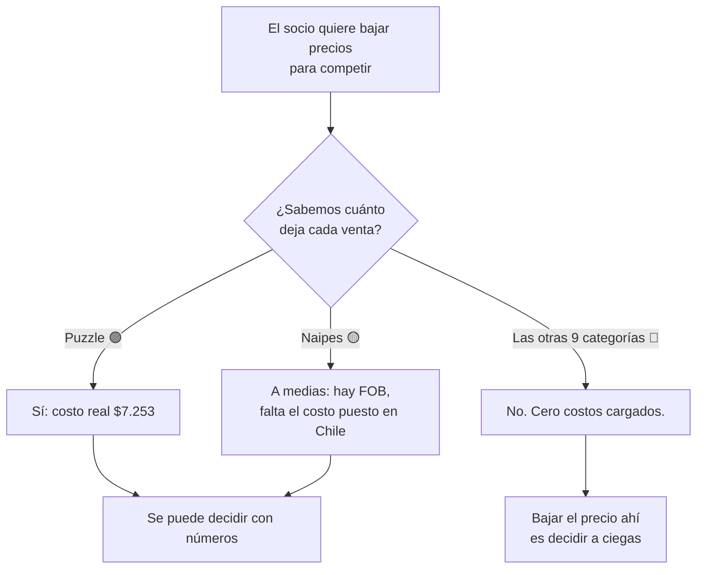
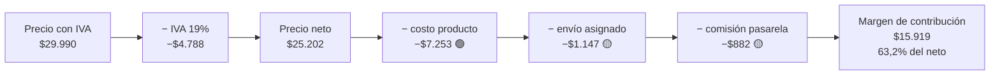

# Economía unitaria de Pedraza Ilustración — cuánto deja cada venta y qué pasa si bajamos el precio

**Fecha:** 10 de agosto de 2026 · **Fuentes:** solo lo que ya existe en el repositorio (ningún archivo fue modificado).
**Toda la aritmética está verificada con** `verificacion-economia.py` (mismo directorio). Cada número de este documento sale de ese script.

**Convención de todo el documento:**
- 🟢 dato real, con archivo y línea que lo respalda
- 🟡 supuesto marcado — se usa para poder seguir el cálculo, no es un dato
- 🔴 falta el dato

**Convención de plata:** el precio publicado lleva IVA. El análisis de margen va **siempre sobre neto** (precio ÷ 1,19). Cada tabla dice si el monto lleva IVA o no.

---

## Lo que hay que saber antes de seguir leyendo



Tres hechos que cambian la conversación:

1. **De 11 categorías, solo 1 tiene el costo real cargado.** El puzzle. Los naipes tienen el precio de fábrica pero no el costo puesto en Chile. Las otras 9 no tienen nada. La propia calculadora del proyecto (`descargas/calculadora-pedraza.xlsx`, hoja *Escala de valor*) trae la columna "Costo unitario" **vacía a propósito** en 10 de 11 filas.
2. **Los precios de las láminas ya se bajaron el 5 de agosto** — 19% menos que la lista del 1 de agosto, y 11% menos que el precio de julio, o sea *más barato que antes del alza*. Se hizo **sin saber cuánto cuesta imprimir una lámina**. Es exactamente lo que el socio pide hacer con el resto del catálogo.
3. **El alza del 1 de agosto aguanta una caída de 11% a 14% en las unidades vendidas** antes de dejar de convenir. Todavía no ha pasado ni una semana y media: nadie tiene aún el dato de si cayó o no.

---

## 1. Costo unitario por producto (costo puesto en bodega)

### 1.1 Lo que sí se sabe 🟢

| Producto | Costo puesto en bodega | Estado | De dónde sale |
|---|---:|---|---|
| **Puzzle** (promedio 47% aves / 37% cetáceos / 16% hongos) | **$7.253** | 🟢 dato real | `docs/correcciones-felipe-2026-08-01.md` L153: *"Puesto en bodega en Santiago. Incluye FOB, provisión, seguro de carga, forwarder, desconsolidación y flete."* Y `docs/forecast-pedido-2026-08-02.md` L126 (1.000 unidades = $7.253.000) |

**Cómo se descompone ese $7.253** (verificado en el script, sección 1):

| Componente | Monto | Nota |
|---|---:|---|
| FOB ponderado de fábrica (USD 5,4388 × $950) | $5.167 | 🟢 `correcciones-felipe` L114-119 y `forecast-pedido` L121-126 |
| Logística local (seguro, forwarder, desconsolidación, flete) | $2.086 | 🟢 diferencia, implícita en el dato de Felipe |
| **Total puesto en bodega Santiago** | **$7.253** | equivale a **1,404 veces el FOB** |

FOB por modelo 🟢 (`correcciones-felipe` L114-118): aves USD 4,80 · cetáceos USD 5,80 · hongos USD 6,48 · **naipes USD 2,75**.

### 1.2 Lo que se puede estimar, marcado como estimación 🟡

| Producto | Costo estimado | Método | Estado |
|---|---:|---|---|
| **Naipes** | $3.667 | FOB $2.612 × 1,404 (mismo factor logístico del puzzle) | 🟡 SUPUESTO |
| **Naipes** | $4.699 | FOB $2.612 + $2.086 (misma logística por unidad que el puzzle) | 🟡 SUPUESTO |

Los dos métodos son defendibles y dan una diferencia de **$1.032 por unidad**, o sea 5,3 puntos de margen. El multiplicativo es el más razonable porque una baraja pesa y ocupa mucho menos que un puzzle de 1.000 piezas, y el flete se cobra por volumen y peso. Pero **ninguno de los dos es un dato**: el costo real de los naipes puestos en Chile 🔴 no está en el repositorio.

### 1.3 Lo que falta 🔴

| Producto | Costo | Comentario |
|---|---|---|
| Botellas | 🔴 falta | Producto importado. No hay FOB ni costo puesto en bodega en ningún archivo. |
| Calcetines | 🔴 falta | |
| Libretas | 🔴 falta | |
| Totebag | 🔴 falta | |
| Postales | 🔴 falta | |
| Llavero | 🔴 falta | |
| Pins | 🔴 falta | Es el producto con la mayor alza (+45,5%) y no hay con qué evaluarla. |
| **Lámina 42×60** | 🔴 falta | Caso especial, ver abajo. |
| **Lámina 33×50** | 🔴 falta | Caso especial, ver abajo. |

Lo único que se dice en todo el repositorio sobre estos costos es que hay que ir a buscarlos: `pedido.html` L933 — *"Las celdas de costo unitario están vacías a propósito, para que cargues los costos reales de tinta, papel y packaging."*

### 1.4 Las láminas: el caso más grave

Las láminas se imprimen en Chile con impresora propia, así que su costo es **papel + tinta + packaging**, y escala distinto que un producto importado: no hay flete internacional, no hay pedido mínimo, y el costo por unidad no depende de un contenedor.

**En todo el repositorio no hay ni un solo número de costo de lámina.** Lo que sí hay:
- 🟢 Se imprimen con técnica Giclée sobre papel Hahnemühle (`sop-dm.html` L995). Es papel de arte, o sea de los caros.
- 🟢 El inventario de láminas está en mínimos: "entre 1 y 6 unidades por formato" (`docs/datos-financieros-2025-2026.md` L112).
- 🟢 El 5 de agosto se les bajó el precio 19% (`campanas.html` L915-916).
- 🔴 Cuánto cuesta imprimir una.

**Esto importa más que el resto** porque las láminas son el producto de ticket más alto del catálogo ($42.990 y $32.990 hoy), porque son el destino del 80% del presupuesto de publicidad mientras dure el quiebre de puzzles (`campanas.html` L1008), y porque **ya se les bajó el precio**. Es el único producto donde la decisión que discute el socio ya se tomó, y se tomó sin el dato.

### 1.5 El costo promedio del canal — qué es y qué no es

`docs/modelo-ofertas-2026-08-02.md` L6 usa un costo de **$7.834 por pedido** sobre un ticket neto de $27.980. Eso es **28,0% de la venta neta**, que es simplemente el complemento del margen bruto corregido del canal (72%).

Es un promedio de toda la tienda, **no el costo de ningún producto**. Repartido entre las 1,64 unidades que lleva un pedido, da $4.777 por unidad — muy por debajo de los $7.253 que cuesta un puzzle. Sirve para pensar el pedido promedio; **no sirve para decidir el precio de un producto en particular**.

---

## 2. Cascada del precio al margen

### 2.1 Los dos costos que el repositorio no descuenta

Antes de la cascada hay que resolver dos piezas.

**a) El envío.** El envío gratis sobre $50.000 es un costo real.

| Dato | Valor | Estado |
|---|---:|---|
| Tarifa que se le cobra al cliente hasta 6 kg | $5.990 con IVA = **$5.034 netos** | 🟢 `docs/auditoria-tienda-correo-2026-08-02.md` L112 |
| Pedidos que cruzan los $50.000 y se llevan el envío gratis | **37,4%** (157 de ~420) | 🟢 misma línea |
| Costo esperado por pedido | $1.882 netos | 🟡 calculado: 37,4% × $5.034 |
| Costo esperado por unidad | **$1.147 netos** | 🟡 calculado: ÷ 1,64 unidades por pedido |
| **Lo que cobra Packner por despachar cada pedido** | **🔴 FALTA** | ver abajo |

⚠️ **Ojo con esta distinción, porque el repositorio la pasa por alto.** Los $5.034 son lo que la tienda *deja de cobrar* cuando regala el envío. Eso está bien calculado. Pero **lo que Packner le cobra a la empresa por preparar y despachar cada pedido no aparece en ningún archivo** — y ese costo existe en el 100% de los pedidos, no solo en el 37% que cruza el umbral. El único registro es $966.537 en 18 meses, que sobre 2.950 pedidos da **$328 por pedido**, una cifra que el propio repositorio declara imposible (`docs/datos-financieros-2025-2026.md` L82: *"para $202M de venta es imposible"*).

**Consecuencia: todos los márgenes de este documento están sobrestimados** en lo que sea que cobre Packner. Con una tarifa parecida a la que se le cobra al cliente, serían unos $3.000 netos por pedido (~$1.800 por unidad) menos de margen.

**b) La comisión de la pasarela de pago.** 🔴 **Confirmado que falta.** Tres lugares del repositorio lo dicen:
- `docs/datos-financieros-2025-2026.md` L83: *"Comisiones de pasarela de pago: no aparecen en ninguna parte"*
- `docs/correcciones-felipe-2026-08-01.md` L155: *"🟡 Pendiente. Felipe confirmó que faltan y las va a buscar."*
- `pedido.html` L1163-1166 y `bitacora.html` L1152: sigue como tarea abierta

Además la tienda no usa Shopify Payments: corren en paralelo **Mercado Pago Tarjetas, Checkout Flow y Mercado Pago Checkout Pro** (`docs/auditoria-tienda-correo-2026-08-02.md` L110), o sea que hay **tres tasas distintas**, no una.

Para poder seguir el cálculo se usa un **🟡 SUPUESTO de 3,5% sobre el precio neto**. No es un dato del repositorio ni una tarifa verificada. Sensibilidad sobre el puzzle a $29.990:

| Comisión supuesta | Margen de contribución |
|---:|---:|
| 0% (o sea, ignorarla como hace el repo hoy) | $16.801 |
| 2,0% | $16.297 |
| **3,5% 🟡 (el que se usa acá)** | **$15.919** |
| 5,0% | $15.541 |

El rango completo mueve el margen $1.260, o sea **5% del margen**. Importa, pero no es lo que decide la discusión.

### 2.2 La cascada, producto por producto



**PUZZLE — el único producto con costo real.** Montos en pesos; la primera línea lleva IVA, todas las demás son netas.

| Paso | Precio viejo (hasta el 31-jul) | Precio nuevo (desde el 1-ago) |
|---|---:|---:|
| Precio con IVA | $27.290 | $29.990 |
| − IVA 19% | −$4.357 | −$4.788 |
| **= precio neto** | **$22.933** | **$25.202** |
| − costo del producto 🟢 | −$7.253 | −$7.253 |
| − envío asignado 🟡 | −$1.147 | −$1.147 |
| − comisión de pasarela 🟡 (3,5%) | −$803 | −$882 |
| **= margen de contribución** | **$13.730** | **$15.919** |
| **margen sobre el precio neto** | **59,9%** | **63,2%** |

**NAIPES — con el costo estimado, no medido.** Precio sin cambio en el alza del 1-ago.

| Paso | Con costo 🟡 multiplicativo | Con costo 🟡 aditivo |
|---|---:|---:|
| Precio con IVA | $22.990 | $22.990 |
| **= precio neto** | **$19.319** | **$19.319** |
| − costo del producto 🟡 | −$3.667 | −$4.699 |
| − envío asignado 🟡 | −$1.147 | −$1.147 |
| − comisión de pasarela 🟡 | −$676 | −$676 |
| **= margen de contribución** | **$13.829** | **$12.797** |
| **margen sobre el precio neto** | **71,6%** | **66,2%** |

**Las otras 9 categorías: no se puede armar la cascada.** Sin costo, cualquier margen que se publique sería inventado.

### 2.3 ¿El repositorio maneja bien el IVA? Sí en las páginas, no en la planilla

**✅ Bien:** `precios.html` L1049-1051 hace la cadena correcta — $27.290 ÷ 1,19 = $22.933, $29.990 ÷ 1,19 = $25.202, y compara contra el costo de $7.253. Verificado al peso. La calculadora de esa misma página (`precios.html` L1362-1371) también divide por 1,19 antes de calcular el margen, y su fórmula de tolerancia (`alzaNeta / margenNuevo`) es matemáticamente la correcta.

**✅ Bien:** `docs/modelo-ofertas-2026-08-02.md` y `ofertas.html` trabajan con el ticket neto de $27.980 y la tabla del cupón reconstruye exacto (verificado en el script, chequeo *e*).

**❌ Mal, y con consecuencia directa sobre la decisión que se está discutiendo:** la calculadora `descargas/calculadora-pedraza.xlsx`, hoja *Escala de valor*, calcula el margen con la fórmula `=F7/C7`, donde C es el **precio con IVA**. El mismo error se arrastra a la hoja *Simulador de descuento*.

| Puzzle a $29.990, costo $7.253 | Margen |
|---|---:|
| Fórmula del archivo (sobre precio **con IVA**) | 75,8% |
| Cálculo correcto (sobre precio **neto**) | 71,2% |
| **Margen inflado** | **4,6 puntos** |

Y como el archivo trae un **piso de margen de 60% fijado por Felipe** que se evalúa con esa fórmula:

| Pregunta | Respuesta |
|---|---:|
| Descuento máximo que el simulador marca "✅ OK" | **39,5%** |
| Descuento máximo real para no bajar del 60% sobre neto | **28,1%** |
| Descuento máximo real si además se descuentan envío y comisión | **8,7%** |

🔴 **El simulador de descuentos da luz verde a rebajas 11,5 puntos más profundas de lo que corresponde.** Si el socio abre ese archivo para decidir cuánto bajar, va a leer que puede descontar casi 40% y quedar sobre el piso. No puede.

---

## 3. La pregunta que decide todo: el breakeven de una baja de precio

### 3.1 La tabla maestra — sirve para cualquier producto

Solo hace falta un número: **el margen de contribución como porcentaje del precio neto**. No hace falta el costo exacto.

**Si BAJO el precio, ¿cuánto tienen que subir las unidades para ganar la misma plata?**

| Margen actual | Baja 5% | Baja 10% | Baja 15% | Baja 20% |
|---:|---:|---:|---:|---:|
| 40% | +13,7% | +31,8% | +56,7% | +93,2% |
| 45% | +12,0% | +27,3% | +47,4% | +75,1% |
| 50% | +10,7% | +23,9% | +40,7% | +62,9% |
| 55% | +9,6% | +21,3% | +35,7% | +54,1% |
| **60%** | **+8,7%** | **+19,2%** | **+31,8%** | **+47,4%** |
| **65%** | **+8,0%** | **+17,4%** | **+28,6%** | **+42,2%** |
| **70%** | **+7,4%** | **+16,0%** | **+26,1%** | **+38,1%** |
| 75% | +6,9% | +14,8% | +23,9% | +34,6% |
| 80% | +6,4% | +13,7% | +22,1% | +31,8% |

**Si SUBO el precio, ¿cuántas unidades puedo perder sin perder plata?**

| Margen actual | Alza 5% | Alza 10% | Alza 15% | Alza 20% |
|---:|---:|---:|---:|---:|
| 40% | −10,8% | −19,4% | −26,6% | −32,5% |
| 45% | −9,7% | −17,7% | −24,3% | −30,0% |
| 50% | −8,8% | −16,2% | −22,5% | −27,8% |
| 55% | −8,1% | −14,9% | −20,8% | −26,0% |
| **60%** | **−7,4%** | **−13,9%** | **−19,4%** | **−24,3%** |
| **65%** | **−6,9%** | **−12,9%** | **−18,2%** | **−22,9%** |
| **70%** | **−6,4%** | **−12,1%** | **−17,1%** | **−21,6%** |
| 75% | −6,0% | −11,4% | −16,2% | −20,5% |
| 80% | −5,7% | −10,8% | −15,3% | −19,4% |

**La lectura en una frase:** las dos tablas no son simétricas, y esa asimetría es todo el argumento. Con un margen de 65%, **subir 10% aguanta perder 12,9% de las unidades**, pero **bajar 10% exige ganar 17,4% de unidades**. Bajar el precio siempre pide más de lo que el alza tenía que defender.

Fórmula usada (verificada en el script): `unidades extra = margen_viejo / margen_nuevo − 1`, con `margen = precio_neto × (1 − comisión) − costo − envío`.

### 3.2 Producto por producto — solo donde hay costo

**PUZZLE** (margen 63,2% del neto, con costo real 🟢):

| Si bajo | Precio quedaría en | Margen quedaría en | Necesito vender |
|---:|---:|---:|---:|
| −5% | $28.490 | $14.703 | **+8,3%** de unidades |
| −10% | $26.991 | $13.487 | **+18,0%** de unidades |
| −15% | $25.492 | $12.271 | **+29,7%** de unidades |
| −20% | $23.992 | $11.055 | **+44,0%** de unidades |

Traducido a la realidad: el puzzle vende unas **102 unidades al mes en Shopify** (1.837 en 18 meses). Bajarle 10% el precio obliga a vender **18 unidades más al mes** solo para quedar igual. Bajarle 20% obliga a vender **45 más al mes**.

**NAIPES** (margen 66,2% a 71,6% del neto, con costo 🟡 estimado):

| Si bajo | Precio quedaría en | Necesito vender (costo aditivo) | Necesito vender (costo multiplicativo) |
|---:|---:|---:|---:|
| −5% | $21.840 | +7,9% | +7,2% |
| −10% | $20.691 | +17,1% | +15,6% |
| −15% | $19.542 | +28,0% | +25,3% |
| −20% | $18.392 | +41,1% | +36,9% |

**Las otras 9 categorías:** usar la tabla maestra de arriba **en cuanto llegue el costo**. Sin ese dato no hay número que dar.

### 3.3 La baja de láminas que ya se hizo

Esto ya ocurrió el 5 de agosto y nadie calculó el breakeven.

| Lámina | Precio julio | Precio 1-ago | Precio 5-ago (hoy) | Baja vs. 1-ago | Baja vs. julio |
|---|---:|---:|---:|---:|---:|
| 42×60 | $48.390 | $52.990 | **$42.990** | **−18,9%** | **−11,2%** |
| 33×50 | $36.980 | $40.990 | **$32.990** | **−19,5%** | **−10,8%** |

Cuánto volumen extra exige esa baja, según el margen que resulte tener la lámina (🔴 no se sabe cuál es):

| Si el margen de la lámina es… | 42×60 (baja 18,9%) | 33×50 (baja 19,5%) |
|---:|---:|---:|
| 55% | +49,5% de unidades | +52,1% de unidades |
| 60% | +43,6% | +45,8% |
| 65% | +38,9% | +40,8% |
| 70% | +35,2% | +36,8% |
| 75% | +32,1% | +33,5% |
| 80% | +29,5% | +30,8% |

🔴 **Aunque las láminas tuvieran un margen altísimo de 80%, esa baja exige vender 30% más láminas solo para empatar.** Y el 5 de agosto había **3 láminas de aves en stock** (`campanas.html` L924). O sea: el precio se bajó un 19% justo cuando no había casi nada que vender, para un producto cuyo costo nadie conoce.

Con 🟡 el margen del canal (72%) como referencia, la baja exige **+34% en 42×60** y **+35% en 33×50**.

---

## 4. El alza del 1 de agosto, cuantificada

### 4.1 Cuánta plata genera si el volumen no cae

Base: unidades reales de Shopify de 18 meses llevadas a un año (× 12/18). Fuente de unidades: `docs/correcciones-felipe-2026-08-01.md` L66-76.

| Categoría | Unidades/año 🟡 | Sube por unidad (con IVA) | Utilidad adicional/año (con IVA) |
|---|---:|---:|---:|
| Puzzle | 1.225 | $2.700 | $3.306.600 |
| Botellas | 213 | $4.000 | $853.333 |
| Pins | 199 | $2.500 | $496.667 |
| Calcetines | 455 | $600 | $272.800 |
| Llavero | 179 | $1.200 | $214.400 |
| Totebag | 109 | $1.500 | $164.000 |
| Libretas | 103 | $1.500 | $154.000 |
| Postales | 96 | $1.000 | $96.000 |
| Naipes | 443 | $0 | $0 |
| **Total (con IVA)** | **3.021** | — | **$5.557.800** |
| **Total neto (÷ 1,19)** | — | — | **$4.670.420** |

✅ **Reproduce exacto** la tabla publicada en `precios.html` (diferencia: $0). Deja fuera las láminas y el resto de "Otros" (566 unidades en 18 meses, 11,1% del total), que no vienen desglosadas. **Solo cuenta Shopify** — Mercado Libre también subió y no está acá.

**El alza vale ~$4,7 millones netos al año, si el volumen no se mueve.** Es aproximadamente el sueldo anual de la diseñadora ($4.350.000 en 18 meses según `docs/datos-financieros-2025-2026.md` L108) o cuatro meses de servicio de deuda.

### 4.2 El número que zanja la discusión

**¿Cuánto puede caer el volumen antes de que el alza deje de convenir?**

| Supuesto de margen de contribución | Utilidad antes | Utilidad después | El volumen puede caer hasta |
|---:|---:|---:|---:|
| 60% del precio neto | $30.941.173 | $35.611.593 | **−13,1%** |
| 65% | $33.519.604 | $38.190.024 | **−12,2%** |
| **72% 🟡 (el margen bruto corregido del canal)** | **$37.129.408** | **$41.799.828** | **−11,2%** |
| 80% | $41.254.897 | $45.925.318 | **−10,2%** |

Y para el puzzle, **con el costo real y todos los costos variables incluidos** (el cálculo más sólido de todo el documento):

| Puzzle | Valor |
|---|---:|
| Utilidad de contribución/año con el precio viejo | $16.814.430 |
| Utilidad de contribución/año con el precio nuevo | $19.495.832 |
| Ganancia | **+$2.681.403/año** |
| **Caída de unidades que la deja en cero** | **−13,8%** |

```
Caída de volumen tolerable por el alza del 1-ago

  0%        5%        10%       13,8%     20%
  |---------|---------|----------|---------|
  ██████████████████████████████ el alza sigue conviniendo
                                 ▲
                                 aquí queda igual que antes
                                            ░░░░░ acá sí conviene revisar
```

### 4.3 La conclusión

🟢 **El alza del 1 de agosto aguanta que las unidades caigan entre 11% y 14% y el negocio igual queda mejor que en julio.**

Además, el número real es **más generoso** que el publicado: `precios.html` calcula 12,6% de tolerancia para el puzzle porque no descuenta envío ni comisión de pasarela. Al descontarlos, el margen base baja, y **cuanto más chico es el margen base, más tolerancia da un alza**. El número correcto es 13,8%.

⚠️ **Y aquí está lo importante: hoy, 10 de agosto, nadie tiene el dato de si las unidades cayeron.** El alza lleva 9 días. Diciembre vende 3,3 veces un mes normal (`correcciones-felipe` L104), agosto es un mes flojo (0,9× según `forecast-pedido` L25), y el producto estrella está agotado desde antes del alza. **Cualquier caída de venta que se vea hoy tiene por lo menos tres explicaciones que no son el precio.**

### 4.4 El ejercicio inverso, por categoría

Si el socio quiere volver a los precios de julio, esto es lo que cuesta (🟡 con margen base de 72%):

| Categoría | Alza aplicada | Volumen que puede caer antes de perder | Volver atrás exige vender |
|---|---:|---:|---:|
| Pins | +45,5% | −38,7% | **+63,2%** |
| Botellas | +13,8% | −16,1% | **+19,2%** |
| Llavero | +13,7% | −15,9% | **+19,0%** |
| Puzzle | +9,9% | −12,1% | **+13,7%** |
| Totebag | +9,1% | −11,2% | **+12,6%** |
| Postales | +9,1% | −11,2% | **+12,6%** |
| Libretas | +8,6% | −10,6% | **+11,9%** |
| Calcetines | +6,4% | −8,2% | **+8,9%** |
| Naipes | 0% | — | — |

**Los pins son el caso a mirar primero**, no porque el alza sea mala, sino porque es donde el número tiene más juego: subieron 45,5% y toleran perder casi 4 de cada 10 unidades. Es también donde una caída de venta se detecta antes.

---

## 5. Datos que faltan para cerrar el análisis

Ordenados por cuánto cambian la conclusión.

| # | Qué falta | Por qué cambia la conclusión | A quién se le pide |
|---|---|---|---|
| **1** | 🔴 **Costo unitario de las 9 categorías sin dato** (botellas, calcetines, libretas, totebag, postales, llavero, pins y las dos láminas) | Sin esto, **el 64% de las unidades vendidas no tiene margen calculable**. Es literalmente imposible decir si una baja de precio conviene. Es el dato que bloquea todo lo demás. | **Felipe** — la columna "Costo unitario" de `calculadora-pedraza.xlsx` está esperándolos |
| **2** | 🔴 **Costo de imprimir una lámina** (papel Hahnemühle + tinta + packaging + mano de obra) | Ya se les bajó el precio 19% sin saberlo. Es el producto de ticket más alto y se lleva el 80% del presupuesto de publicidad esta semana. | **Cote / Felipe** — es producción propia, el dato está en las facturas de papel y tinta |
| **3** | 🔴 **Lo que cobra Packner por pedido** | Es un costo de **todos** los pedidos, no solo del 37% que cruza los $50.000. Hoy no está restado de ningún margen del proyecto. El registro actual ($328/pedido) es imposible. | **Felipe** — facturas o liquidaciones mensuales de Packner |
| **4** | 🔴 **Comisiones de las tres pasarelas** (Mercado Pago Tarjetas, Checkout Flow, Mercado Pago Checkout Pro) | Mueve el margen del puzzle en ~5%. Confirmado pendiente desde el 1-ago. | **Felipe** — paneles de Flow y Mercado Pago |
| **5** | 🔴 **Unidades vendidas del 1 al 10 de agosto, por categoría** | Es el único dato que contesta de verdad la pregunta del socio. Con 13,8% de tolerancia medida, hace falta saber si la caída real está sobre o bajo ese número. Y hay que aislar el efecto del quiebre de puzzles. | **Felipe** — informe de Shopify por producto, comparado con las mismas fechas de julio |
| **6** | 🔴 **Desglose de las 566 unidades de "Otros"** | Incluye las láminas. Sin separarlas, el 11% de las unidades queda fuera de todo cálculo de precio. | **Felipe** — base de Shopify por línea de producto |
| **7** | 🟡 **Confirmar que el $7.253 del puzzle es neto de IVA** | El IVA de importación es crédito fiscal para la empresa, así que debería ser neto. Todo el análisis lo asume. Si viniera con IVA, el margen del puzzle sube ~4 puntos. | **Felipe** |
| **8** | 🔴 **Costo de los naipes puesto en Chile** | Se llegó a estimar por dos caminos con $1.032 de diferencia por unidad. Los naipes son el 13% de las unidades y llegan 1.000 el 15 de agosto. | **Felipe** — misma factura del forwarder del pedido que llega |
| **9** | 🔴 **Precios de la competencia, escritos** | El alza se decidió por comparación con la competencia y esa comparación no está documentada en ninguna parte del repositorio. Si el socio dice que quedamos "muy pasados", el desacuerdo es sobre datos que nadie puede revisar. | **Felipe** — capturas o planilla del benchmark que usó |
| **10** | 🔴 **FOB del mini-puzzle** | 300 unidades pedidas sin costo ni margen calculado. Ya está en el checklist de `pedido.html`. | **Tina (fábrica)** |

---

## 6. Inconsistencias encontradas en el repositorio

Nueve hallazgos, ordenados por gravedad. Todos verificados con el script.

### 🔴 1. La calculadora en Excel calcula el margen sobre el precio con IVA

**Dónde:** `descargas/calculadora-pedraza.xlsx`, hoja *Escala de valor*, columna G (`=IF(E7="","",F7/C7)`), y hoja *Simulador de descuento*, columna G.

**Qué pasa:** C es el precio de venta al público, que lleva IVA. El margen queda inflado 4,6 puntos. Sobre el puzzle: la fórmula dice 75,8% cuando el margen real sobre neto es 71,2%.

**Por qué importa:** el archivo trae un piso de margen de 60% que se evalúa con esa fórmula. **El simulador aprueba descuentos de hasta 39,5% cuando el límite real es 28,1%** — y solo 8,7% si además se descuentan envío y comisión. Es la herramienta que el socio usaría para decidir cuánto bajar.

**Arreglo:** cambiar `F7/C7` por `F7/(C7/1,19)`, o mejor, agregar una columna de precio neto y calcular todo ahí.

### 🔴 2. El precio "antes" de la lámina 33×50 no existe en ningún documento

**Dónde:** `campanas.html` L916 dice *"Mediana (33×50) · precio nuevo $32.990 · antes $49.990 · −34%"*. Lo mismo en `calculadora-pedraza.xlsx`, celda D11.

**Qué pasa:** la lista final de precios (`docs/correcciones-felipe-2026-08-01.md` L186) dice que la lámina 33×50 pasó de **$36.980 a $40.990**. El $49.990 **no aparece en ningún otro archivo del repositorio**.

**Por qué importa:** el descuento real contra la lista vigente es **−19,5%**, no −34%. El precio tachado que ve el cliente muestra un ahorro que es casi el doble del real. Es un problema de credibilidad frente al cliente y de cálculo interno.

### 🔴 3. La tabla del cupón de $10.000 no descuenta el envío gratis que ella misma gatilla

**Dónde:** `docs/modelo-ofertas-2026-08-02.md` L14-20 y `ofertas.html` L1001-1008.

**Qué pasa:** la tabla concluye que con un mínimo de $50.000 el cupón *"no cuesta margen: lo genera"*, con $21.849 contra $20.146 de un pedido normal. Pero **$50.000 es exactamente el umbral del envío gratis**: ese pedido se lleva el envío regalado, que la misma página valora en $5.034 netos.

| Compra de $50.000 con cupón | Cálculo |
|---|---:|
| Margen según la tabla publicada | $21.849 |
| − envío gratis que ese pedido gatilla | −$5.034 |
| **Margen real** | **$16.815** |
| Contra un pedido normal ($20.146) | **−$3.331** |

**El mínimo real para empatar no es $47.186 sino $55.505.** Con el mínimo en $50.000, cada uso del cupón cuesta $3.331 de margen en vez de generar $1.703. La recomendación se invierte.

### 🟡 4. Las dos bases de pedidos del mismo período no coinciden

**Dónde:** `docs/correcciones-felipe-2026-08-01.md`, sección 1 (L12) habla de **2.950 pedidos pagados**; la sección 2 (L54) habla de **3.101 pedidos pagados**. Mismo período de 18 meses.

Verificado:

| Cálculo | Resultado | Comentario |
|---|---:|---|
| $111.045.111 ÷ 2.950 | $37.642 | cerca del $37.450 publicado |
| $111.045.111 ÷ 3.101 | $35.809 | lejos |
| Pedidos implícitos en el $37.450 publicado | **2.965** | no es ninguno de los dos |
| $82.548.371 ÷ 2.950 | $27.982 | ✅ el $27.980 publicado sale de 2.950 |
| 5.097 unidades ÷ 3.101 | 1,6437 | ✅ el 1,64 publicado sale de 3.101 |

**Consecuencia:** el ticket promedio de $37.450 y las 1,64 unidades por pedido **no salen de la misma base**. Multiplicados entre sí (como los usa el modelo de ofertas para calcular el costo por pedido) arrastran ese desajuste. El efecto es chico (~5%), pero conviene fijar una sola base.

### 🟡 5. El ticket promedio aparece con dos valores distintos

`docs/correcciones-felipe-2026-08-01.md` L43 dice **$37.900 bruto**; la sección 2 (L58) dice **$37.450 bruto**. El $37.900 viene de la captura de Shopify de julio (que da $4,17M ÷ 110 = $37.909, `CLAUDE.md`), y el $37.450 de los 18 meses. Son dos cosas distintas presentadas como la misma. Conviene decir cuál es cuál.

### 🟡 6. `precios.html` quedó desactualizada respecto de la baja de láminas del 5-ago

`campanas.html` L919 dice *"Detalle completo en precios.html"*, pero `precios.html` L950-951 sigue mostrando $52.990 y $40.990 como precios finales, sin ninguna mención de la baja del 5 de agosto. Un lector que siga el link no encuentra el detalle prometido.

### 🟡 7. Las decisiones de la llamada del 5 de agosto no están documentadas en `docs/`

`pedido.html` L1198 y la propia planilla citan *"lo decidido en la llamada del 5 de agosto de 2026 (rango del pedido 2.000-2.500, mini-puzzles, precios FOB, piso de margen 60%, precios nuevos de láminas)"*, pero **no existe un `docs/reunion-2026-08-05.md`**. Las decisiones más recientes y más caras del proyecto viven solo dentro de las páginas HTML y del Excel. Ahí es donde se coló el $49.990 sin trazabilidad.

### 🟡 8. La lámina grande quedó más barata que antes del alza, y nadie lo dice

$48.390 (julio) → $52.990 (1-ago) → $42.990 (5-ago) = **−11,2% contra el precio de julio**. El proyecto lo comunica como "descuento del 19%" respecto del precio nuevo, cuando en la práctica es una **reversión completa del alza y algo más**. Lo mismo con la 33×50 (−10,8% contra julio). Los dos productos de ticket más alto del catálogo hoy están más baratos que antes del alza que se está discutiendo.

### 🟡 9. Redondeos menores en `precios.html`

La tabla de utilidad adicional muestra "1.225 unidades × $2.700 = $3.306.600". El producto exacto de esos dos números es $3.307.500. La diferencia viene de que el cálculo interno usa 1.224,67 (sin redondear) y la tabla muestra el redondeo. **El total publicado es correcto** ($5.557.800 con IVA / $4.670.420 netos, reproducidos al peso). Es cosmético, pero se ve como un error de suma.

---

## Cierre: qué contestarle al socio

**Lo que sí se puede afirmar hoy con números:**

1. 🟢 **El alza del 1 de agosto aguanta perder entre 11% y 14% de las unidades** y el negocio igual queda mejor que en julio. En el puzzle, el único producto con costo real, el número es **13,8%**.
2. 🟢 **Bajar el precio siempre cuesta más de lo que el alza tenía que defender.** Con un margen de 65%, subir 10% aguanta perder 12,9% de unidades; bajar 10% exige ganar 17,4%.
3. 🟢 **Bajar 20% el puzzle obliga a vender 44% más puzzles** — 45 unidades más al mes solo para quedar igual.
4. 🔴 **En 9 de 11 categorías no se puede contestar la pregunta**, porque no hay costo cargado. Eso es el 64% de las unidades que vende la tienda.
5. ⚠️ **La baja ya empezó sin números**: las dos láminas están hoy más baratas que antes del alza, y su costo es el dato que más falta de todos.

**Lo que hay que hacer antes de bajar un solo precio más:**

- Cargar los costos unitarios en `calculadora-pedraza.xlsx` (Felipe) — desbloquea todo.
- Arreglar la fórmula de margen de esa planilla, que hoy aprueba descuentos de 39,5% cuando el techo real es 28,1%.
- Sacar el informe de Shopify del 1 al 10 de agosto por categoría, comparado con julio, **separando los productos agotados** — es el único dato que contesta si el alza espantó gente o no.
- Poner el mínimo del cupón en $55.505 (o redondeado, $55.000), no en $50.000.

---

*Verificación aritmética: `verificacion-economia.py` en este mismo directorio. Ningún archivo del repositorio fue modificado.*
